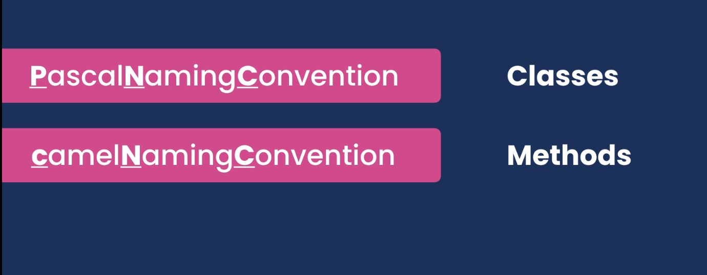
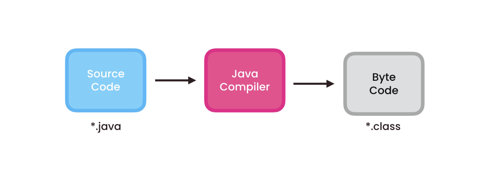
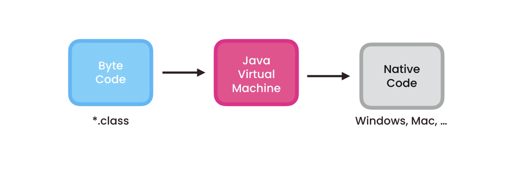
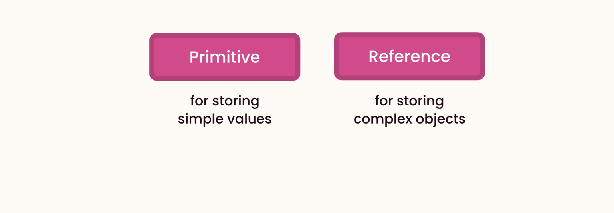
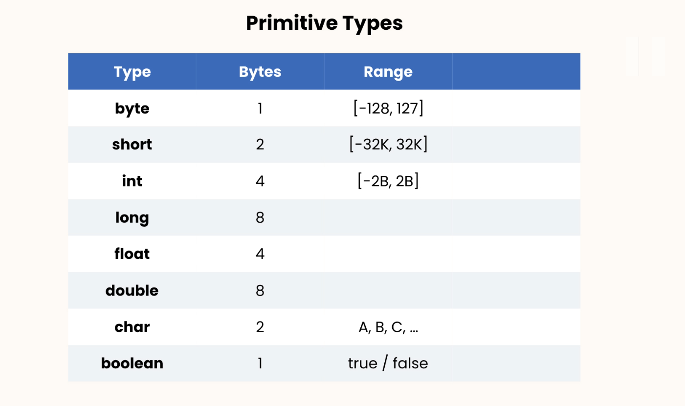
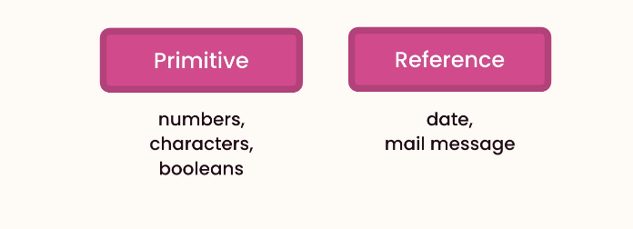
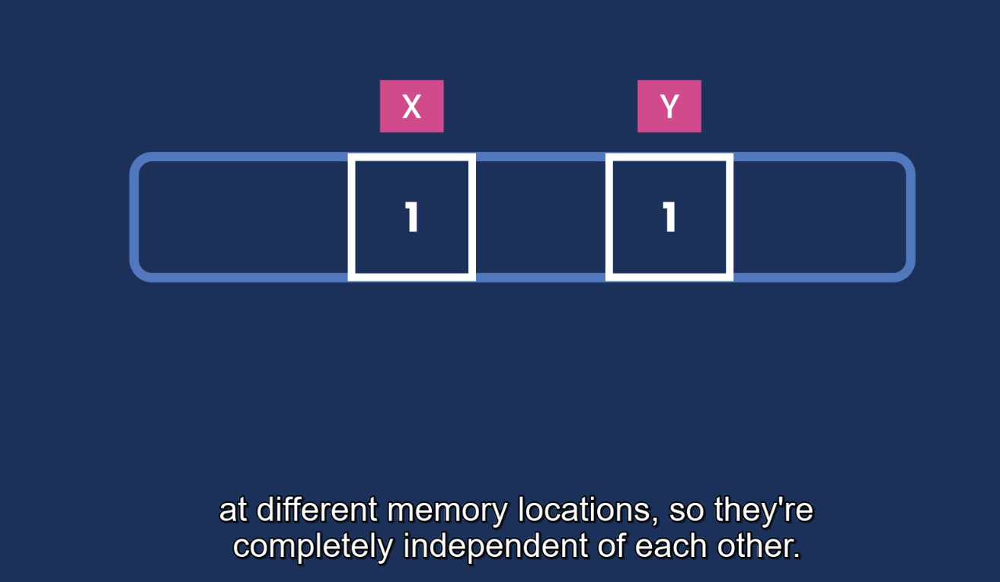
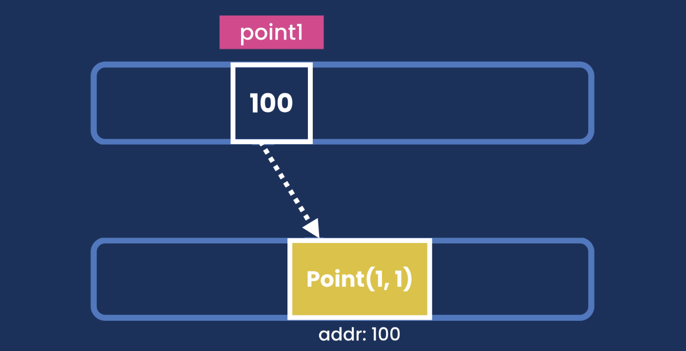
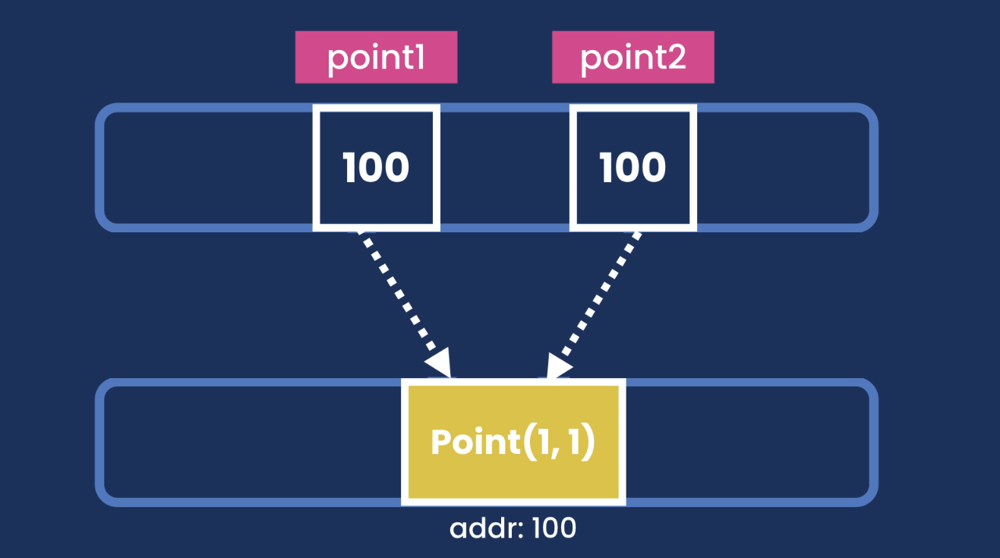
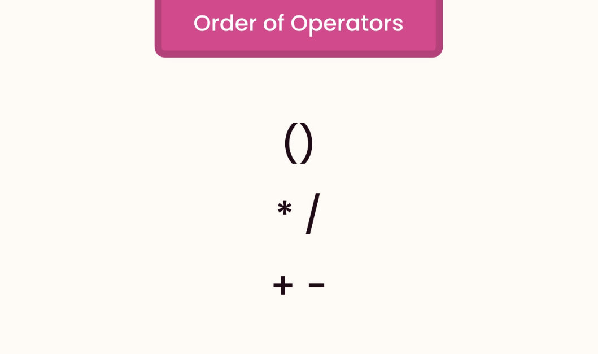

# Java

# Table of Contents
1. [Fundamentals](#fundamentals)
    1. [Getting Started](#getting-started)
    2. [How Java Code executed](#how-java-code-executed)
    3. [Types](#types)
        1. [Variables and Constants](#variables-and-constants)
        2. [Primitive Types](#primitive-types)
        3. [Reference Types](#reference-types)
        4. [Primitive vs Reference Types](#primitive-vs-reference-types)
        5. [Strings](#strings)
        6. [Arrays](#arrays)
        7. [Constants](#constants)
        8. [Arithmetic Expressions](#arithmetic-expressions)
        9. [Casting](#casting)
       10. [Math class](#math-class)
       11. [Format Numbers](#format-numbers)
       12. [Reading Input](#reading-input)
   4. [Control Flow](#control-flow)
        1. [If Statements](#if-statements)
        2. [Teranry Operator](#ternary-operator)
        3. [Switch Statements](#switch-statement)
        4. [For Loops](#for-loops)
        5. [While Loops](#while-loops)
        6. [Do-While Loops](#do-while-loops)
        7. [Break and Continue Statements](#break-and-continue-statements)
        8. [For Each Loop](#for-each-loop)
   5. [Clean Coding](#clean-coding)


# Fundamentals
## Getting Started
**Function** - Block of code that performs a specific task

**Class** - A container for related functions

**Method** - A function that is a part of the class



### How Java Code executed


Java code execution involves several steps:

1. **Compilation**: The Java source code (`.java` files) is compiled by the Java Compiler (`javac`) into bytecode (`.class` files).
2. **Class Loading**: The Java Class Loader loads the compiled bytecode into the Java Virtual Machine (JVM).
3. **Bytecode Verification**: The JVM verifies the bytecode to ensure it is valid and does not violate Java's security constraints.
4. **Execution**: The JVM's Just-In-Time (JIT) compiler translates the bytecode into native machine code, which is then executed by the host machine's processor.

This process allows Java to be platform-independent, as the same bytecode can run on any machine with a compatible JVM.

Here is a brief explanation of JVM, JRE, and JDK:

- **JVM (Java Virtual Machine)**: The JVM is a virtual machine that runs Java bytecode. It provides a runtime environment in which Java bytecode can be executed, enabling Java's platform independence.

- **JRE (Java Runtime Environment)**: The JRE includes the JVM and the standard libraries and other components necessary to run Java applications. It does not include development tools like compilers or debuggers.

- **JDK (Java Development Kit)**: The JDK includes the JRE and development tools such as the Java compiler (`javac`), debuggers, and other tools necessary for Java development. It is used for developing and compiling Java applications.

Here is a simple diagram to illustrate the relationship:

```
JDK = JRE + Development Tools
JRE = JVM + Libraries
```



Java is platform-independent because of the Java Virtual Machine (JVM). Here is a brief explanation:

1. **Compilation to Bytecode**: Java source code is compiled into bytecode by the Java compiler (`javac`). This bytecode is a platform-independent intermediate representation.

2. **JVM Execution**: The bytecode is executed by the JVM, which is available for many different operating systems and hardware platforms. The JVM interprets or compiles the bytecode into native machine code specific to the host machine.

This means that the same Java program can run on any device that has a compatible JVM, making Java platform-independent.


To execute the Main.java file, you can use the following commands:
```bash
javac Main.java
java Main
```

 {
        // Declare variables and constants
        int myAge = 25;
        int herAge = myAge;  // copying only value, since its primitive
        System.out.println(herAge);
    }
}
```

###  Primitive Types

Java has several primitive types, which are the most basic data types in the language. These types represent simple values like numbers, characters, and booleans. Here are the eight primitive types in Java:
1. **byte**: 8-bit integer
2. **short**: 16-bit integer
3. **int**: 32-bit integer
4. **long**: 64-bit integer
5. **float**: 32-bit floating-point number
6. **double**: 64-bit floating-point number
7. **char**: 16-bit Unicode character
8. **boolean**: true or false




```java
public class Main {
    public static void main(String[] args) {
        byte age = 30;
        long viewsCount = 123_456_789L;
        float price = 10.99F;
        char letter = 'A'; // single quote for char, double quote for string
        boolean isEligible = true;
    }
}
```

### Reference Types


- When declare primitive types, we don't need to allocate memory. Memory is allocated automatically by Java (JRE).
- When dealing with reference types, we should always allocate memory. Now we don't have to release this memory, Java JRE will take care of it.

```java
import java.util.Date;

Date now = new Date();
// variable 'now' is the instance of Date class.
// So these classes define templates or blueprints for creating new objects, new instances.
// So, an object is an instance of a class.
// we can access the methods and properties of the Date class using dot notation through now variable.
// Primtive types dont have members
```

NOTE:

In Java, a function and a method are not exactly the same, although they are similar concepts.

- **Function**: A block of code that performs a specific task. In many programming languages, functions can exist independently of classes.

- **Method**: A function that is associated with an object or class. In Java, all functions are methods because they are always defined within a class.

Here is an example to illustrate the difference:

```java
public class Example {
    // This is a method because it is defined within a class
    public void myMethod() {
        System.out.println("This is a method.");
    }

    public static void main(String[] args) {
        Example example = new Example();
        example.myMethod(); // Calling the method
    }
}
```

In Java, you always define functions as methods within a class.

### Primitive vs Reference Types


```java
public static void main(String[] args) {
    byte x = 1;
    byte y = x;
    x = 2;
    System.out.println(y); // 1
}
```
If I changed the value of `x` to 10, it will not affect the value of `y`. Because `x` and `y` are independent of each other. They are stored in different memory locations.

```java
import java.awt.*;

public static void main(String[] args) {
   Point point1 = new Point(1, 1);
   Point point2 = point1; // actually reference point1 location/object
   point1.x = 2;
   System.out.println(point2); // java.awt.Point[x=2,y=1]
}
```




- Reference type copied by their reference, not by their value.
- Primitive types copied by their value. Values are completely independent of each other.

### Strings
```java
  public static void main(String[] args) {
        String message = "   Hello, World!   "; // Reference type
        System.out.println(message.endsWith("!!"));  // true
        System.out.println(message.startsWith("!!")); // false
        System.out.println(message.length()); // 13
        System.out.println(message.indexOf("e")); // 1
        System.out.println(message.replace("Hello", "Hola")); // 1
        // Strings are immutable, so it will return a new string.
        System.out.println(message.toLowerCase()); // hello, world!
        System.out.println(message.toUpperCase()); // HELLO, WORLD!
        System.out.println(message.trim()); // get rid of white spaces
    }
```

- Parameters are the holes. that we define in our method. // target,replacement
- Arguments are the actual values that we pass to the method. // Hello, Hola

### Escape Sequences
1. Double Quote: `\"`

```java
public static void main(String[] args) {
    String message = "Hello \"Mosh\"";
    System.out.println(message); // Hello "Mosh"
}
```

2. Backslash: `\\`

```java
public static void main(String[] args) {
        // c:\windows\..
        String path = "c:\\windows\\.. ";
        System.out.println(path);
    }
```

3. Backslash n (new Line)
4. Backslash t (tab)


### Arrays

```java
public static void main(String[] args) {
        // Old method and tedious
        int[] numbers = new int[5];
        numbers[0] = 1;
        numbers[1] = 2;

        System.out.println(Arrays.toString(numbers));
    }
```

Newer way to initialize arrays if we know the values upfront.

```java
import java.lang.reflect.Array;
import java.util.Arrays;

public static void main(String[] args) {
    int[] numbers = {5, 4, 8, 1, 9};
    System.out.println(numbers.length);
    System.out.println(Arrays.sort(numbers));

    System.out.println(Arrays.toString(numbers));
}
```

- Arrays have fixed size. Once we create an array, we cannot change its size.

### Multi-Dimensional Arrays

```java
public static void main(String[] args) {
       int[][] numbers = {{3,5,7}, {10,4,5} };

       System.out.println(Arrays.deepToString(numbers));
    }
```

```java
public static void main(String[] args) {
    // 2 rows and 3 columns
        int[][] numbers = new int[2][3];
        numbers[0][0] = 1;

        System.out.println(Arrays.deepToString(numbers));
    }
```

### Constants
```java
public static void main(String[] args) {
    // Constants are declared with the final keyword, and by convention, they are written in uppercase.
        final float PI = 3.14F;
        System.out.println(PI);
    }
```

### Arithmetic Expressions

```java
public static void main(String[] args) {
    int result = 10 + 3;
    System.out.println(result); // 13

    int result = 10 / 3;
    System.out.println(result); // 3

    double result = (double)10 / (double)3;
    System.out.println(result); // 3.3333333333333335

    int x = 1;
    x++;
    System.out.println(x); // 2

    int x = 1;
    int y = x++;
    System.out.println(x); // 2
    System.out.println(y); // 1

    int x = 1;
    int y = ++x;
    System.out.println(x); // 2
    System.out.println(y); // 2
    
    int x = 1;
//    x = x + 2;
    x += 2; // compound or augmented assignment operator

    // Order of Expressions
    int x = 10 + 3 * 2;
    System.out.println(x); // 16

    int x = (10 + 3) * 2;
    System.out.println(x); // 26
}
```


### Casting
```java
// Implicit casting (No chance of lose data)
// byte > short > int > long > float > double
short x = 1;  // 2 bytes
int y = x + 2; // 4 bytes
System.out.println(y); // 3
// Under the hood, Java converts x short value to an int value.

double x = 1.1;
double y = x + 2; // it converts 2 as 2.0 here
System.out.println(y); // 3.1
```

Explicit casting
```java
double x = 1.1;
int y = int(x) + 2;
System.out.println(y); // 3
```

```java
// Wrapper class to convert string to integer
String x = "1";
int y = Integer.parseInt(x) + 2;
System.out.println(y); // 3

//Integer.parseInt(x) , takes an String and returns an integer
// Short.parseShort(x)

    String x = "1.1";
    double y = Double.parseDouble(x) + 2;
    System.out.println(y);

```

### Math class

```java
int result = Math.round(1.1F);
Math.ceil(1.1F); // 2.0
Math.floor(1.1F); // 1.0
Math.max(1,2);
Math.min(1,2);
Math.random(); // 0.0 to 1.0
System.out.println(result);
```

// Generate 1 - 100
```java
public static void main(String[] args) {
        int result = (int) (Math.random() * 100);
        System.out.println(result);
    }
```

### Format Numbers

- Cannot use new Operator to create an instance(Object) of NumberFormat class. Since it's an abstract class.
- Factory method, because it's like a factory to create objects.
- `NumberFormat.getCurrencyInstance()`

```java
    NumberFormat currency = NumberFormat.getCurrencyInstance();
    String result = currency.format(123456.891);
    System.out.println(result); // $123,456.89

    NumberFormat percent = NumberFormat.getPercentInstance();
    String result = percent.format(0.1);
    System.out.println(result); // 10%
   

// Method chaining
        String result = NumberFormat.getPercentInstance().format(0.1);
        System.out.println(result);
```

### Reading Input

```java
        Scanner scanner = new Scanner(System.in);
        System.out.print("Enter your age: ");
        byte age = scanner.nextByte();
        System.out.println("You are " + age);

        Scanner scanner = new Scanner(System.in);
        System.out.print("Enter your name: ");
        String name = scanner.nextLine();
        System.out.println("Your are " + name);
```

#### Exercise - Mortgage Calculator

```java
public class Main {
    public static void main(String[] args) {
        final byte MONTHS_IN_YEAR = 12;
        final byte PERCENT = 100;

        Scanner scanner = new Scanner(System.in);
        System.out.print("Principal: ");
        int principal = scanner.nextInt();   // p

        System.out.print("Annual Interest Rate: ");
        float annualInterest = scanner.nextFloat();
        float monthlyInterest = annualInterest / PERCENT / MONTHS_IN_YEAR; // r

        System.out.print("Period (Years): ");
        int years = scanner.nextInt();
        int numberOfPayments = years * MONTHS_IN_YEAR; // n

        double mortgage = principal
                * (monthlyInterest * Math.pow((1+ monthlyInterest), numberOfPayments)
                / (Math.pow((1+ monthlyInterest), numberOfPayments) - 1) );

        String mortgageInDollar = NumberFormat.getCurrencyInstance().format(mortgage);
        System.out.println("Mortgage: " + mortgageInDollar);
    }
}
```

## Control Flow
1. Comparison Operators
2. Logical Operators
3. Conditional Statements
4. Loops

### Comparison Operators

```java
    public static void main(String[] args) {
        int x = 1;
        int y = 1;
        // This uses for primitive types
        // boolean expression produces a boolean value
        System.out.println(x == y); // true
        System.out.println(x != y); // false
        System.out.println(x > y); // false
        System.out.println(x >= y); // true
        System.out.println(x <= y); // false
    }
```

### Logical Operators

```java
    public static void main(String[] args) {
        int temperature = 22;
        boolean isWarm = temperature > 20 && temperature < 30;
        System.out.println(isWarm); // true

        boolean hasHighIncome = true;
        boolean hasGoodCredit = true;
        boolean hasCriminalRecord = false;
        boolean isEligible = (hasHighIncome || hasGoodCredit) && !hasCriminalRecord;
        System.out.println(isEligible); // true
    }
```

### If Statements

```java
    public static void main(String[] args) {
        int temp = 32;
        if (temp > 30){
            System.out.println("It's a hot day!");
            System.out.println("Drink plenty of water");
        }
        else if(temp > 20)
            System.out.println("It's a nice day!");
        else
            System.out.println("It's cold!");

    }
```

### Simplifying If Statements

```java
    public static void main(String[] args) {
        int income = 120_000;
        boolean hasHighIncome = (income > 100_000);
    }
    
    
    
```

### Ternary Operator

```java
    public static void main(String[] args) {
        int income = 120_000;
        String className = income > 100_000 ? "First" : "Economy";
    }
```

### Switch Statement

```java
    public static void main(String[] args) {
        String role = "admin";
        switch (role){
            case "admin":
                System.out.println("You're admin");
                break;
            case "moderator":
                System.out.println("You're moderator");
                break;
            default:
                System.out.println("You're a guest");
        }
    }

```

### Exercise - Fizzbuzz

```java
    public static void main(String[] args) {
        Scanner scanner = new Scanner(System.in);
        System.out.print("Number: ");
        int number = scanner.nextInt();

        if (number % 3 == 0 && number % 5 == 0)
            System.out.println("FizzBuzz");
        else if (number % 5 == 0)
            System.out.println("Fizz");
        else if (number % 3 == 0)
            System.out.println("Buzz");
        else
            System.out.println(number);
    }
```

### For Loops

For loop is used when we know the number of iterations in advance.
```java
public static void main(String[] args){
    for (int i = 0; i < 5; i++){
        System.out.println("Hello, World! " + i);
    }

    for (int i = 5; i > 0; i--) {
        System.out.println("Hello, World! " + j);
    }
}
```

### While Loops
While loop is used when we don't know the number of iterations in advance.

```java
public static void main(String[] args){
    int i = 5;
    while (i > 0){
        System.out.println("Hello, World! " + i);
        i--;
    }

    int i = 1;
    while (i <= 5){
        System.out.println("Hello, World! " + i);
        i++;
    }
}

```

NOTE:
- We cannot use comparison operator between referene type. Because this operator compare the address or string objects, not their values. 
- Instead we can use `equals` method to compare the values of reference types.


```java
// Work until quit
public static void main(String[] args) {
        String input = "";
        Scanner scanner = new Scanner(System.in);

        while (!input.equals("quit")){
            System.out.print("Input: ");
            input = scanner.next().toLowerCase();
            System.out.println(input);
        }
    }
}
```

### Do while loops

Do while loops, executed at least once.

```java
    public static void main(String[] args) {
    String input = "";
    Scanner scanner = new Scanner(System.in); 

    do {
        System.out.print("Input: ");
        input = scanner.next().toLowerCase();
        System.out.println(input);
    } while (!input.equals(("quit")));
}

```

### Break and Continue Statements

```java
    public static void main(String[] args) {
        String input = "";
        Scanner scanner = new Scanner(System.in);

        while (!input.equals("quit")){
            System.out.print("Input: ");
            input = scanner.next().toLowerCase();
            if (input.equals("pass"))
                continue;
            if (input.equals("quit"))
                break;
            System.out.println(input);
        }
    }

```

### For Each loop

We use iterate over Arrays or collections.

Limitations
- We cannot get the index of the current item.
- Always Forward only

```java
    public static void main(String[] args) {
        String[] fruits = {"Apple", "Mango", "Orange"};

        // forEach 
        for (String fruit: fruits)
            System.out.println(fruit);
    }

```

### Exercise - Mortagege Calc V2 

```java
import java.text.NumberFormat;
import java.util.Scanner;

public class Main {
    public static void main(String[] args) {
        final byte MONTHS_IN_YEAR = 12;
        final byte PERCENT = 100;

        int principal = 0;
        float annualInterest = 0;
        int years  = 0;

        Scanner scanner = new Scanner(System.in);

        while (true) {
            System.out.print("Principal ($1K - $1M): ");
            principal = scanner.nextInt();   // p
            if (principal < 1_000_000_0 && principal > 1000)
                break;

            System.out.println("Enter a number between 1,000 and 1,000,000.");
        }

        while(true) {
            System.out.print("Annual Interest Rate: ");
            annualInterest = scanner.nextFloat();
            if (annualInterest > 0 && annualInterest < 30)
                break;

            System.out.println("Enter a value greater than 0 and less than 30.");

        }
        float monthlyInterest = annualInterest / PERCENT / MONTHS_IN_YEAR; // r

        while (true) {
            System.out.print("Period (Years): ");
            years = scanner.nextInt();
            if (years > 0 && years <= 30)
                break;

            System.out.println("Enter a value between 1 and 30");
        }
        int numberOfPayments = years * MONTHS_IN_YEAR; // n

        double mortgage = principal
                * (monthlyInterest * Math.pow((1+ monthlyInterest), numberOfPayments)
                / (Math.pow((1+ monthlyInterest), numberOfPayments) - 1) );

        String mortgageInDollar = NumberFormat.getCurrencyInstance().format(mortgage);
        System.out.println("Mortgage: " + mortgageInDollar);
    }
}

```

## Clean Coding

```java
// Void
public class Main {
    public static void main(String[] args) {
        greet("John");
        greet("Mary");
    }
    
    public static void greet(String name){
        System.out.println("Hello " + name);
    }
}
```

// Return value
```java
    public static void main(String[] args) {
        String message = greet("John");
        System.out.println(message);
    }

    public static String greet(String name){
        return "Hello " + name;
    }

```

### Refactoring 

Changing the structure of the code without changing its behavior.

