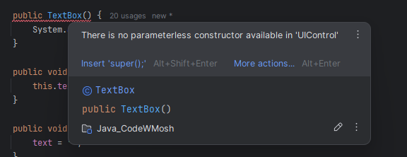

# Java

# Table of Contents
1. [Fundamentals](#fundamentals)
    1. [Getting Started](#getting-started)
    2. [How Java Code executed](#how-java-code-executed)
    3. [Types](#types)
        1. [Variables and Constants](#variables-and-constants)
        2. [Primitive Types](#primitive-types)
        3. [Reference Types](#reference-types)
        4. [Primitive vs Reference Types](#primitive-vs-reference-types)
        5. [Strings](#strings)
        6. [Arrays](#arrays)
        7. [Constants](#constants)
        8. [Arithmetic Expressions](#arithmetic-expressions)
        9. [Casting](#casting)
       10. [Math class](#math-class)
       11. [Format Numbers](#format-numbers)
       12. [Reading Input](#reading-input)
   4. [Control Flow](#control-flow)
        1. [If Statements](#if-statements)
        2. [Teranry Operator](#ternary-operator)
        3. [Switch Statements](#switch-statement)
        4. [For Loops](#for-loops)
        5. [While Loops](#while-loops)
        6. [Do-While Loops](#do-while-loops)
        7. [Break and Continue Statements](#break-and-continue-statements)
        8. [For Each Loop](#for-each-loop)
   5. [Clean Coding](#clean-coding)
   6. [Debugging and Deploying Applications](#debugging-and-deploying-applications)
      1. [Type of Errors](#types-of-errors)
      2. [Packaging Java Applications](#packaging-java-applications)

2. [Object Oriented Programming](#object-oriented-programming)
    1. [Classes and Objects](#classes-and-objects)
    2. [Encapsulation](#encapsulation)
    3. [Getters and Setters](#getters-and-setters)
    4. [Abstraction](#abstraction)
       1. [Constructors](#constructors)
       2. [Method Overloading](#method-overloading)
       3. [Constructor Overloading](#constructor-overloading)
       4. [Static Members](#static-members)
       5. [Notes](#notes)
    5. [Inheritance](#inheritance)
       1. [The Object Class](#the-object-class)
       2. [Constructor and Inheritance](#constructor-and-inheritance)
       3. [Access Modifiers](#access-modifiers)
       4. [Method Overriding](#method-overriding)
       5. [Upcasting and Downcasting](#upcasting-and-downcasting)
       6. [Comparing Objects](#comparing-objects)
       7. [Polymorphism](#polymorphism)
       8. [Abstract Classes and Methods](#abstract-classes-and-methods)
       9. [Final Classes and Methods](#final-classes-and-methods)
       10. [Deep Inheritance Hierarchies](#deep-inheritance-hierarchies)
       11. [Summary](#summary)
    6. [Interfaces](#interfaces)
       7. [Creating Interfaces](#creating-interface)
       8. [Dependency Injection](#dependency-injection)
          9. [Constructor Injection](#constructor-injection)
          10. [Setter Injection](#setter-injection)
          11. [Method Injection](#method-injection)
       12. [Interface Segregation Principle](#interface-segregation-principle)
       13. [MyTube Video Platform - Project](#mytube-video-platform---project)
       14. [Fields in Interfaces](#fields)
       15. [Static Methods in Interfaces](#static-methods)
       16. [Private Methods in Interfaces](#private-methods)
       17. [Interface and Abstract Methods](#interfaces-and-abstract-methods)
       18. [When to use Interface](#when-to-use-interfaces)
       19. [Summary in Interfaces](#summary-)

3. [Advanced Topics](#advanced-topics)
   1. [Exceptions](#exceptions)


# Fundamentals
## Getting Started
**Function** - Block of code that performs a specific task

**Class** - A container for related functions

**Method** - A function that is a part of the class


### How Java Code executed


Java code execution involves several steps:

1. **Compilation**: The Java source code (`.java` files) is compiled by the Java Compiler (`javac`) into bytecode (`.class` files).
2. **Class Loading**: The Java Class Loader loads the compiled bytecode into the Java Virtual Machine (JVM).
3. **Bytecode Verification**: The JVM verifies the bytecode to ensure it is valid and does not violate Java's security constraints.
4. **Execution**: The JVM's Just-In-Time (JIT) compiler translates the bytecode into native machine code, which is then executed by the host machine's processor.

This process allows Java to be platform-independent, as the same bytecode can run on any machine with a compatible JVM.

Here is a brief explanation of JVM, JRE, and JDK:

- **JVM (Java Virtual Machine)**: The JVM is a virtual machine that runs Java bytecode. It provides a runtime environment in which Java bytecode can be executed, enabling Java's platform independence.

- **JRE (Java Runtime Environment)**: The JRE includes the JVM and the standard libraries and other components necessary to run Java applications. It does not include development tools like compilers or debuggers.

- **JDK (Java Development Kit)**: The JDK includes the JRE and development tools such as the Java compiler (`javac`), debuggers, and other tools necessary for Java development. It is used for developing and compiling Java applications.

Here is a simple diagram to illustrate the relationship:

```
JDK = JRE + Development Tools
JRE = JVM + Libraries
```


Java is platform-independent because of the Java Virtual Machine (JVM). Here is a brief explanation:

1. **Compilation to Bytecode**: Java source code is compiled into bytecode by the Java compiler (`javac`). This bytecode is a platform-independent intermediate representation.

2. **JVM Execution**: The bytecode is executed by the JVM, which is available for many different operating systems and hardware platforms. The JVM interprets or compiles the bytecode into native machine code specific to the host machine.

This means that the same Java program can run on any device that has a compatible JVM, making Java platform-independent.


To execute the Main.java file, you can use the following commands:
```bash
javac Main.java
java Main
```


## Types
1. Variables and constants
2. Primitive and reference types
3. Casting
4. Numbers, String and Arrays
5. Read Input

### Variables and Constants
```java
public class Main {
    public static void main(String[] args) {
        // Declare variables and constants
        int myAge = 25;
        int herAge = myAge;  // copying only value, since its primitive
        System.out.println(herAge);
    }
}
```

###  Primitive Types

Java has several primitive types, which are the most basic data types in the language. These types represent simple values like numbers, characters, and booleans. Here are the eight primitive types in Java:
1. **byte**: 8-bit integer
2. **short**: 16-bit integer
3. **int**: 32-bit integer
4. **long**: 64-bit integer
5. **float**: 32-bit floating-point number
6. **double**: 64-bit floating-point number
7. **char**: 16-bit Unicode character
8. **boolean**: true or false


```java
public class Main {
    public static void main(String[] args) {
        byte age = 30;
        long viewsCount = 123_456_789L;
        float price = 10.99F;
        char letter = 'A'; // single quote for char, double quote for string
        boolean isEligible = true;
    }
}
```

### Reference Types


- When declare primitive types, we don't need to allocate memory. Memory is allocated automatically by Java (JRE).
- When dealing with reference types, we should always allocate memory. Now we don't have to release this memory, Java JRE will take care of it.

```java
import java.util.Date;

Date now = new Date();
// variable 'now' is the instance of Date class.
// So these classes define templates or blueprints for creating new objects, new instances.
// So, an object is an instance of a class.
// we can access the methods and properties of the Date class using dot notation through now variable.
// Primtive types dont have members
```

NOTE:

In Java, a function and a method are not exactly the same, although they are similar concepts.

- **Function**: A block of code that performs a specific task. In many programming languages, functions can exist independently of classes.

- **Method**: A function that is associated with an object or class. In Java, all functions are methods because they are always defined within a class.

Here is an example to illustrate the difference:

```java
public class Example {
    // This is a method because it is defined within a class
    public void myMethod() {
        System.out.println("This is a method.");
    }

    public static void main(String[] args) {
        Example example = new Example();
        example.myMethod(); // Calling the method
    }
}
```

In Java, you always define functions as methods within a class.

### Primitive vs Reference Types


```java
public static void main(String[] args) {
    byte x = 1;
    byte y = x;
    x = 2;
    System.out.println(y); // 1
}
```
If I changed the value of `x` to 10, it will not affect the value of `y`. Because `x` and `y` are independent of each other. They are stored in different memory locations.

```java
import java.awt.*;

public static void main(String[] args) {
   Point point1 = new Point(1, 1);
   Point point2 = point1; // actually reference point1 location/object
   point1.x = 2;
   System.out.println(point2); // java.awt.Point[x=2,y=1]
}
```


- Reference type copied by their reference, not by their value.
- Primitive types copied by their value. Values are completely independent of each other.

### Strings
```java
  public static void main(String[] args) {
        String message = "   Hello, World!   "; // Reference type
        System.out.println(message.endsWith("!!"));  // true
        System.out.println(message.startsWith("!!")); // false
        System.out.println(message.length()); // 13
        System.out.println(message.indexOf("e")); // 1
        System.out.println(message.replace("Hello", "Hola")); // 1
        // Strings are immutable, so it will return a new string.
        System.out.println(message.toLowerCase()); // hello, world!
        System.out.println(message.toUpperCase()); // HELLO, WORLD!
        System.out.println(message.trim()); // get rid of white spaces
    }
```

- Parameters are the holes. that we define in our method. // target,replacement
- Arguments are the actual values that we pass to the method. // Hello, Hola

### Escape Sequences
1. Double Quote: `\"`

```java
public static void main(String[] args) {
    String message = "Hello \"Mosh\"";
    System.out.println(message); // Hello "Mosh"
}
```

2. Backslash: `\\`

```java
public static void main(String[] args) {
        // c:\windows\..
        String path = "c:\\windows\\.. ";
        System.out.println(path);
    }
```

3. Backslash n (new Line)
4. Backslash t (tab)


### Arrays

```java
public static void main(String[] args) {
        // Old method and tedious
        int[] numbers = new int[5];
        numbers[0] = 1;
        numbers[1] = 2;

        System.out.println(Arrays.toString(numbers));
    }
```

Newer way to initialize arrays if we know the values upfront.

```java
import java.lang.reflect.Array;
import java.util.Arrays;

public static void main(String[] args) {
    int[] numbers = {5, 4, 8, 1, 9};
    System.out.println(numbers.length);
    System.out.println(Arrays.sort(numbers));

    System.out.println(Arrays.toString(numbers));
}
```

- Arrays have fixed size. Once we create an array, we cannot change its size.

### Multi-Dimensional Arrays

```java
public static void main(String[] args) {
       int[][] numbers = {{3,5,7}, {10,4,5} };

       System.out.println(Arrays.deepToString(numbers));
    }
```

```java
public static void main(String[] args) {
    // 2 rows and 3 columns
        int[][] numbers = new int[2][3];
        numbers[0][0] = 1;

        System.out.println(Arrays.deepToString(numbers));
    }
```

### Constants
```java
public static void main(String[] args) {
    // Constants are declared with the final keyword, and by convention, they are written in uppercase.
        final float PI = 3.14F;
        System.out.println(PI);
    }
```

### Arithmetic Expressions

```java
public static void main(String[] args) {
    int result = 10 + 3;
    System.out.println(result); // 13

    int result = 10 / 3;
    System.out.println(result); // 3

    double result = (double)10 / (double)3;
    System.out.println(result); // 3.3333333333333335

    int x = 1;
    x++;
    System.out.println(x); // 2

    int x = 1;
    int y = x++;
    System.out.println(x); // 2
    System.out.println(y); // 1

    int x = 1;
    int y = ++x;
    System.out.println(x); // 2
    System.out.println(y); // 2
    
    int x = 1;
//    x = x + 2;
    x += 2; // compound or augmented assignment operator

    // Order of Expressions
    int x = 10 + 3 * 2;
    System.out.println(x); // 16

    int x = (10 + 3) * 2;
    System.out.println(x); // 26
}
```


### Casting
```java
// Implicit casting (No chance of lose data)
// byte > short > int > long > float > double
short x = 1;  // 2 bytes
int y = x + 2; // 4 bytes
System.out.println(y); // 3
// Under the hood, Java converts x short value to an int value.

double x = 1.1;
double y = x + 2; // it converts 2 as 2.0 here
System.out.println(y); // 3.1
```

Explicit casting
```java
double x = 1.1;
int y = int(x) + 2;
System.out.println(y); // 3
```

```java
// Wrapper class to convert string to integer
String x = "1";
int y = Integer.parseInt(x) + 2;
System.out.println(y); // 3

//Integer.parseInt(x) , takes an String and returns an integer
// Short.parseShort(x)

    String x = "1.1";
    double y = Double.parseDouble(x) + 2;
    System.out.println(y);

```

### Math class

```java
int result = Math.round(1.1F);
Math.ceil(1.1F); // 2.0
Math.floor(1.1F); // 1.0
Math.max(1,2);
Math.min(1,2);
Math.random(); // 0.0 to 1.0
System.out.println(result);
```

// Generate 1 - 100
```java
public static void main(String[] args) {
        int result = (int) (Math.random() * 100);
        System.out.println(result);
    }
```

### Format Numbers

- Cannot use new Operator to create an instance(Object) of NumberFormat class. Since it's an abstract class.
- Factory method, because it's like a factory to create objects.
- `NumberFormat.getCurrencyInstance()`

```java
    NumberFormat currency = NumberFormat.getCurrencyInstance();
    String result = currency.format(123456.891);
    System.out.println(result); // $123,456.89

    NumberFormat percent = NumberFormat.getPercentInstance();
    String result = percent.format(0.1);
    System.out.println(result); // 10%
   

// Method chaining
        String result = NumberFormat.getPercentInstance().format(0.1);
        System.out.println(result);
```

### Reading Input

```java
        Scanner scanner = new Scanner(System.in);
        System.out.print("Enter your age: ");
        byte age = scanner.nextByte();
        System.out.println("You are " + age);

        Scanner scanner = new Scanner(System.in);
        System.out.print("Enter your name: ");
        String name = scanner.nextLine();
        System.out.println("Your are " + name);
```

#### Exercise - Mortgage Calculator

```java
public class Main {
    public static void main(String[] args) {
        final byte MONTHS_IN_YEAR = 12;
        final byte PERCENT = 100;

        Scanner scanner = new Scanner(System.in);
        System.out.print("Principal: ");
        int principal = scanner.nextInt();   // p

        System.out.print("Annual Interest Rate: ");
        float annualInterest = scanner.nextFloat();
        float monthlyInterest = annualInterest / PERCENT / MONTHS_IN_YEAR; // r

        System.out.print("Period (Years): ");
        int years = scanner.nextInt();
        int numberOfPayments = years * MONTHS_IN_YEAR; // n

        double mortgage = principal
                * (monthlyInterest * Math.pow((1+ monthlyInterest), numberOfPayments)
                / (Math.pow((1+ monthlyInterest), numberOfPayments) - 1) );

        String mortgageInDollar = NumberFormat.getCurrencyInstance().format(mortgage);
        System.out.println("Mortgage: " + mortgageInDollar);
    }
}
```

## Control Flow
1. Comparison Operators
2. Logical Operators
3. Conditional Statements
4. Loops

### Comparison Operators

```java
    public static void main(String[] args) {
        int x = 1;
        int y = 1;
        // This uses for primitive types
        // boolean expression produces a boolean value
        System.out.println(x == y); // true
        System.out.println(x != y); // false
        System.out.println(x > y); // false
        System.out.println(x >= y); // true
        System.out.println(x <= y); // false
    }
```

### Logical Operators

```java
    public static void main(String[] args) {
        int temperature = 22;
        boolean isWarm = temperature > 20 && temperature < 30;
        System.out.println(isWarm); // true

        boolean hasHighIncome = true;
        boolean hasGoodCredit = true;
        boolean hasCriminalRecord = false;
        boolean isEligible = (hasHighIncome || hasGoodCredit) && !hasCriminalRecord;
        System.out.println(isEligible); // true
    }
```

### If Statements

```java
    public static void main(String[] args) {
        int temp = 32;
        if (temp > 30){
            System.out.println("It's a hot day!");
            System.out.println("Drink plenty of water");
        }
        else if(temp > 20)
            System.out.println("It's a nice day!");
        else
            System.out.println("It's cold!");

    }
```

### Simplifying If Statements

```java
    public static void main(String[] args) {
        int income = 120_000;
        boolean hasHighIncome = (income > 100_000);
    }
    
    
    
```

### Ternary Operator

```java
    public static void main(String[] args) {
        int income = 120_000;
        String className = income > 100_000 ? "First" : "Economy";
    }
```

### Switch Statement

```java
    public static void main(String[] args) {
        String role = "admin";
        switch (role){
            case "admin":
                System.out.println("You're admin");
                break;
            case "moderator":
                System.out.println("You're moderator");
                break;
            default:
                System.out.println("You're a guest");
        }
    }

```

### Exercise - Fizzbuzz

```java
    public static void main(String[] args) {
        Scanner scanner = new Scanner(System.in);
        System.out.print("Number: ");
        int number = scanner.nextInt();

        if (number % 3 == 0 && number % 5 == 0)
            System.out.println("FizzBuzz");
        else if (number % 5 == 0)
            System.out.println("Fizz");
        else if (number % 3 == 0)
            System.out.println("Buzz");
        else
            System.out.println(number);
    }
```

### For Loops

For loop is used when we know the number of iterations in advance.
```java
public static void main(String[] args){
    for (int i = 0; i < 5; i++){
        System.out.println("Hello, World! " + i);
    }

    for (int i = 5; i > 0; i--) {
        System.out.println("Hello, World! " + j);
    }
}
```

### While Loops
While loop is used when we don't know the number of iterations in advance.

```java
public static void main(String[] args){
    int i = 5;
    while (i > 0){
        System.out.println("Hello, World! " + i);
        i--;
    }

    int i = 1;
    while (i <= 5){
        System.out.println("Hello, World! " + i);
        i++;
    }
}

```

NOTE:
- We cannot use comparison operator between referene type. Because this operator compare the address or string objects, not their values. 
- Instead we can use `equals` method to compare the values of reference types.


```java
// Work until quit
public static void main(String[] args) {
        String input = "";
        Scanner scanner = new Scanner(System.in);

        while (!input.equals("quit")){
            System.out.print("Input: ");
            input = scanner.next().toLowerCase();
            System.out.println(input);
        }
    }
}
```

### Do while loops

Do while loops, executed at least once.

```java
    public static void main(String[] args) {
    String input = "";
    Scanner scanner = new Scanner(System.in); 

    do {
        System.out.print("Input: ");
        input = scanner.next().toLowerCase();
        System.out.println(input);
    } while (!input.equals(("quit")));
}

```

### Break and Continue Statements

```java
    public static void main(String[] args) {
        String input = "";
        Scanner scanner = new Scanner(System.in);

        while (!input.equals("quit")){
            System.out.print("Input: ");
            input = scanner.next().toLowerCase();
            if (input.equals("pass"))
                continue;
            if (input.equals("quit"))
                break;
            System.out.println(input);
        }
    }

```

### For Each loop

We use iterate over Arrays or collections.

Limitations
- We cannot get the index of the current item.
- Always Forward only

```java
    public static void main(String[] args) {
        String[] fruits = {"Apple", "Mango", "Orange"};

        // forEach 
        for (String fruit: fruits)
            System.out.println(fruit);
    }

```

### Exercise - Mortagege Calc V2 

```java
import java.text.NumberFormat;
import java.util.Scanner;

public class Main {
    public static void main(String[] args) {
        final byte MONTHS_IN_YEAR = 12;
        final byte PERCENT = 100;

        int principal = 0;
        float annualInterest = 0;
        int years  = 0;

        Scanner scanner = new Scanner(System.in);

        while (true) {
            System.out.print("Principal ($1K - $1M): ");
            principal = scanner.nextInt();   // p
            if (principal < 1_000_000_0 && principal > 1000)
                break;

            System.out.println("Enter a number between 1,000 and 1,000,000.");
        }

        while(true) {
            System.out.print("Annual Interest Rate: ");
            annualInterest = scanner.nextFloat();
            if (annualInterest > 0 && annualInterest < 30)
                break;

            System.out.println("Enter a value greater than 0 and less than 30.");

        }
        float monthlyInterest = annualInterest / PERCENT / MONTHS_IN_YEAR; // r

        while (true) {
            System.out.print("Period (Years): ");
            years = scanner.nextInt();
            if (years > 0 && years <= 30)
                break;

            System.out.println("Enter a value between 1 and 30");
        }
        int numberOfPayments = years * MONTHS_IN_YEAR; // n

        double mortgage = principal
                * (monthlyInterest * Math.pow((1+ monthlyInterest), numberOfPayments)
                / (Math.pow((1+ monthlyInterest), numberOfPayments) - 1) );

        String mortgageInDollar = NumberFormat.getCurrencyInstance().format(mortgage);
        System.out.println("Mortgage: " + mortgageInDollar);
    }
}

```

## Clean Coding

```java
// Void
public class Main {
    public static void main(String[] args) {
        greet("John");
        greet("Mary");
    }
    
    public static void greet(String name){
        System.out.println("Hello " + name);
    }
}
```

// Return value
```java
    public static void main(String[] args) {
        String message = greet("John");
        System.out.println(message);
    }

    public static String greet(String name){
        return "Hello " + name;
    }

```

### Refactoring 

Changing the structure of the code without changing its behavior.

```java
// V3 - Create a method
import java.text.NumberFormat;
import java.util.Scanner;

public class Main {
    public static void main(String[] args){
        int principal = 0;
        float annualInterest = 0;
        byte years  = 0;

        Scanner scanner = new Scanner(System.in);

        while (true) {
            System.out.print("Principal ($1K - $1M): ");
            principal = scanner.nextInt();   // p
            if (principal < 1_000_000_0 && principal > 1000)
                break;

            System.out.println("Enter a number between 1,000 and 1,000,000.");
        }

        while(true) {
            System.out.print("Annual Interest Rate: ");
            annualInterest = scanner.nextFloat();
            if (annualInterest > 0 && annualInterest < 30)
                break;

            System.out.println("Enter a value greater than 0 and less than 30.");
        }

        while (true) {
            System.out.print("Period (Years): ");
            years = scanner.nextByte();
            if (years > 0 && years <= 30)
                break;

            System.out.println("Enter a value between 1 and 30");
        }

        double mortgage = calculateMortgage(annualInterest, principal, years);

        String mortgageInDollar = NumberFormat.getCurrencyInstance().format(mortgage);
        System.out.println("Mortgage: " + mortgageInDollar);
    }

    public static double calculateMortgage(
            float annualInterest,
            int principal,
            byte years){
        final byte MONTHS_IN_YEAR = 12;
        final byte PERCENT = 100;

        float monthlyInterest = annualInterest / PERCENT / MONTHS_IN_YEAR; // r
        short numberOfPayments = (short)(years * MONTHS_IN_YEAR); // n

        return principal
                * (monthlyInterest * Math.pow((1+ monthlyInterest), numberOfPayments)
                / (Math.pow((1+ monthlyInterest), numberOfPayments) - 1) );
    }
}

```

Refactor Repetitive patters (While loop)
- We cannot reuse read input logic, because one is nextInt(), nextFloat() and nextByte(). So creating separate functions for this is no use.
- So we can create a generic function to read input that returns double then we can cast it to int, float or byte.

```java
import java.text.NumberFormat;
import java.util.Scanner;

// v4
public class Main {
    public static void main(String[] args){
        int principal = (int) readNumber("Principal ($1K - $1M): ", 1000, 1_000_000);
        float annualInterest = (float) readNumber("Annual Interest Rate: ", 0, 30);
        byte years = (byte) readNumber("Period (Years): ", 0, 30);

        double mortgage = calculateMortgage(annualInterest, principal, years);

        String mortgageInDollar = NumberFormat.getCurrencyInstance().format(mortgage);
        System.out.println("Mortgage: " + mortgageInDollar);
    }

    public static double readNumber(String prompt, double min, double max){
        Scanner scanner = new Scanner(System.in);
        double value;
        while (true) {
            System.out.print(prompt);
            value = scanner.nextFloat();   // p
            if (value < max && value > min)
                break;

            System.out.println("Enter a number between " + min + " and "+ max);
        }
        return value;
    }

    public static double calculateMortgage(
            float annualInterest,
            int principal,
            byte years){
        final byte MONTHS_IN_YEAR = 12;
        final byte PERCENT = 100;

        float monthlyInterest = annualInterest / PERCENT / MONTHS_IN_YEAR; // r
        short numberOfPayments = (short)(years * MONTHS_IN_YEAR); // n

        return principal
                * (monthlyInterest * Math.pow((1+ monthlyInterest), numberOfPayments)
                / (Math.pow((1+ monthlyInterest), numberOfPayments) - 1) );
    }
}

```

### Exercise - Project Payment Schedule

```java
import java.text.NumberFormat;
import java.util.Scanner;

public class Main {
    // make static since all methods in this class are static and they can only access static variables.
    // in this case, this variable are called as fields. so the field define at the class level and its accessible to all methods in the class
    final static byte MONTHS_IN_YEAR = 12;
    final static byte PERCENT = 100;

    public static void main(String[] args){
        int principal = (int) readNumber("Principal ($1K - $1M): ", 1000, 1_000_000);
        float annualInterest = (float) readNumber("Annual Interest Rate: ", 0, 30);
        byte years = (byte) readNumber("Period (Years): ", 0, 30);

        double mortgage = calculateMortgage(annualInterest, principal, years);
        String mortgageInDollar = NumberFormat.getCurrencyInstance().format(mortgage);
        System.out.println();
        System.out.println("MORTGAGE");
        System.out.println("--------");
        System.out.println("Monthly Payments: " + mortgageInDollar);
        System.out.println();

        System.out.println("PAYMENT SCHEDULE");
        System.out.println("----------------");
        for (short month = 1; month <= years * MONTHS_IN_YEAR; month++) {
            double balance = calculateBalance(annualInterest, principal, years, month);
            System.out.println(NumberFormat.getCurrencyInstance().format(balance));
        }

    }

    public static double readNumber(String prompt, double min, double max){
        Scanner scanner = new Scanner(System.in);
        double value;
        while (true) {
            System.out.print(prompt);
            value = scanner.nextFloat();   // p
            if (value < max && value > min)
                break;

            System.out.println("Enter a number between " + min + " and "+ max);
        }
        return value;
    }

    public static double calculateBalance(float annualInterest,
                                          int principal,
                                          byte years,
                                          short numberOfPaymentsMade){


        float monthlyInterest = annualInterest / PERCENT / MONTHS_IN_YEAR; // r
        int numberOfPayments = (years * MONTHS_IN_YEAR); // n
        
        double balance = principal
                * (Math.pow(1 + monthlyInterest, numberOfPayments) - Math.pow(1 + monthlyInterest, numberOfPaymentsMade))
                / (Math.pow(1 + monthlyInterest, numberOfPayments) - 1 );

        return balance;
    }

    public static double calculateMortgage(
            float annualInterest,
            int principal,
            byte years){

        float monthlyInterest = annualInterest / PERCENT / MONTHS_IN_YEAR; // r
        short numberOfPayments = (short)(years * MONTHS_IN_YEAR); // n

        double mortgage = principal
                * (monthlyInterest * Math.pow((1+ monthlyInterest), numberOfPayments)
                / (Math.pow((1+ monthlyInterest), numberOfPayments) - 1) );

        return mortgage;
    }
}

// monthlyInterest and numberOfPayments is gonna change in the future. so duplicate 2 times is not a big deal. 
// we can get rid when we go through OOP
```

-----------After Refactor--------
```java
// Procedurel way - Not OOP this one. Need to refactor in OOP
import java.text.NumberFormat;
import java.util.Scanner;

public class Main {
    final static byte MONTHS_IN_YEAR = 12;
    final static byte PERCENT = 100;

    public static void main(String[] args){
        int principal = (int) readNumber("Principal ($1K - $1M): ", 1000, 1_000_000);
        float annualInterest = (float) readNumber("Annual Interest Rate: ", 0, 30);
        byte years = (byte) readNumber("Period (Years): ", 0, 30);

        printMortgage(principal, annualInterest, years);
        printPaymentSchedule(principal, annualInterest, years);
    }

    private static void printMortgage(int principal, float annualInterest, byte years) {
        double mortgage = calculateMortgage(annualInterest, principal, years);
        String mortgageInDollar = NumberFormat.getCurrencyInstance().format(mortgage);
        System.out.println();
        System.out.println("MORTGAGE");
        System.out.println("--------");
        System.out.println("Monthly Payments: " + mortgageInDollar);
        System.out.println();
    }

    private static void printPaymentSchedule(int principal, float annualInterest, byte years) {
        System.out.println("PAYMENT SCHEDULE");
        System.out.println("----------------");
        for (short month = 1; month <= years * MONTHS_IN_YEAR; month++) {
            double balance = calculateBalance(annualInterest, principal, years, month);
            System.out.println(NumberFormat.getCurrencyInstance().format(balance));
        }
    }

    public static double readNumber(String prompt, double min, double max){
        Scanner scanner = new Scanner(System.in);
        double value;
        while (true) {
            System.out.print(prompt);
            value = scanner.nextFloat();   // p
            if (value < max && value > min)
                break;

            System.out.println("Enter a number between " + min + " and "+ max);
        }
        return value;
    }

    public static double calculateBalance(float annualInterest,
                                          int principal,
                                          byte years,
                                          short numberOfPaymentsMade){


        float monthlyInterest = annualInterest / PERCENT / MONTHS_IN_YEAR; // r
        int numberOfPayments = (years * MONTHS_IN_YEAR); // n

        double balance = principal
                * (Math.pow(1 + monthlyInterest, numberOfPayments) - Math.pow(1 + monthlyInterest, numberOfPaymentsMade))
                / (Math.pow(1 + monthlyInterest, numberOfPayments) - 1 );

        return balance;
    }

    public static double calculateMortgage(
            float annualInterest,
            int principal,
            byte years){

        float monthlyInterest = annualInterest / PERCENT / MONTHS_IN_YEAR; // r
        short numberOfPayments = (short)(years * MONTHS_IN_YEAR); // n

        double mortgage = principal
                * (monthlyInterest * Math.pow((1+ monthlyInterest), numberOfPayments)
                / (Math.pow((1+ monthlyInterest), numberOfPayments) - 1) );

        return mortgage;

    }

}

```

## Debugging and Deploying Applications

### Types of Errors

1. **Compile-time Errors**:
    - These errors occur when you compile your code.
    - They are usually syntax errors, such as missing semicolons, incorrect use of keywords, or mismatched parentheses.
    - The compiler detects these errors and provides error messages to help you fix them.
- Use google or stackoverflow if that not understandable

2. **Runtime Errors**:
    - These errors occur while the program is running.
    - They are often caused by illegal operations, such as dividing by zero, accessing invalid array indices, or null pointer dereferences.
    - Runtime errors cause the program to terminate abnormally.
- Use debugger

3. **Logical Errors**:
    - These errors occur when the program runs without crashing but produces incorrect results.
    - They are often due to mistakes in the program's logic, such as incorrect calculations or flawed algorithms.
    - Logical errors are the hardest to detect because the compiler and runtime do not provide error messages for them.

### Packaging Java Applications

Packaging Java applications involves bundling your compiled code and resources into a format that can be easily distributed and executed. The most common format for packaging Java applications is the JAR (Java ARchive) file. Here are the steps to package a Java application into a JAR file:

### GUI 
1. File -> Project Structure -> Artifacts -> + -> JAR -> From modules with dependencies
2. Select the main class
3. Build -> Build Artifacts -> Build
4. The JAR file will be generated in the `out/artifacts` directory.
5. If you want to run the JAR file with a double click, you can associate the `.jar` extension with the Java runtime with open with terminal
6. Run the JAR file using the `java -jar jarFileName` command.

-----
### CMD
1. **Compile the Java Code**: Ensure all your `.java` files are compiled into `.class` files.

   ```cmd
   javac -d out src\*.java
   ```

2. **Create a Manifest File**: The manifest file (`MANIFEST.MF`) contains metadata about the JAR file, including the main class to be executed.

   ```plaintext
   Manifest-Version: 1.0
   Main-Class: Main
   ```

3. **Package into a JAR File**: Use the `jar` command to create the JAR file, including the compiled classes and the manifest file.

   ```cmd
   jar cfm MyApplication.jar MANIFEST.MF -C out .
   ```

4. **Run the JAR File**: You can run the packaged JAR file using the `java -jar` command.

   ```cmd
   java -jar MyApplication.jar
   ```

This process creates a self-contained JAR file that can be distributed and executed on any machine with a compatible JVM.

# Object Oriented Programming

## Getting Started
### Programming Paradigms


1. **Procedural Programming**: Focuses on procedures or functions that operate on data.
2. **Object-Oriented Programming (OOP)**: Focuses on objects that encapsulate data and behavior.
3. **Functional Programming**: Focuses on functions that take input and produce output without side effects.
4. **Event-Driven Programming**: Focuses on events that trigger actions or behaviors.
5. **Logic Programming**: Focuses on rules and facts that define relationships and constraints.
6. **Aspect-Oriented Programming**: Focuses on aspects or concerns that cut across multiple modules.


Depends on the **problem**, **context** and **budget**, we can choose the programming paradigm.

### Benefits of OOP
- Reduced Complexity
- Easier Maintenance
- Code Reuse
- Faster Development

Both functional and OOP are great, but OOP is more popular because of the benefits mentioned above.


## Classes
1. Encapsulation
2. Abstraction
3. Constructors
4. Getters and setters
5. Method Overloading

### Classes and Objects


We can create multiple objects using same class.


```java
// TextBox.java
public class TextBox {
    public String text = "";

    public void setText(String text){
        this.text = text;
    }

    public void clear(){
        text = "";
    }
}

// Main.java

public class Main {
    public static void main(String[] args) {
        var textBox1 = new TextBox();
        textBox1.setText("Box 1");
        System.out.println(textBox1.text.toUpperCase());

        var textBox2 = new TextBox();
        textBox2.setText("Box 2");
        System.out.println(textBox2.text);
    }
}

```

### Memory Allocation


```java
public static void main(String[] args) {
    var textBox1 = new TextBox();
    var textBox2 = textBox1;
    textBox2.setText("Hello World");
    System.out.println(textBox1.text);
}

```

- Here textBox1 and textBox2 are pointing to the same object in memory.
- If we change the value of textBox2, it will reflect in textBox1 as well.

Deallocation
- Java has a garbage collector that automatically deallocates memory when an object is no longer in use.
- After the execution of the main method, the garbage collector will deallocate the memory used by the TextBox objects.

### Procedural Programming

```java
 public static void main(String[] args) {
    int baseSalary = 50_000;
    int extraHours = 10;
    int hourlyRate = 20;

    int wage = calculateWage(baseSalary, extraHours, hourlyRate);
    System.out.println(wage);
}

public static int calculateWage(
        int baseSalary,
        int extraHours,
        int hourlyRate
){
    return baseSalary + (extraHours * hourlyRate);
}
```

The provided code is procedural because it focuses on functions (or procedures) that operate on data, rather than encapsulating data and behavior within objects. In procedural programming, the data and functions are separate, and the functions operate on the data passed to them as arguments.

In contrast, Object-Oriented Programming (OOP) encapsulates data and behavior within objects. In OOP, you would define a class to represent the concept of an employee or a job, and the methods to calculate the wage would be part of that class.

### Encapsulation

- Bundle the data and methods that operate on the data into a single unit called a class.

```java
// Employee.java
public class Emplyee {
    public int baseSalary;
    public int hourlyRate;

    public int calculateWage(int extraHours){
        return baseSalary + (extraHours * hourlyRate);
    }
}

// Main.java

public static void main(String[] args) {
    var employee = new Emplyee();
    employee.baseSalary = 50_000;
    employee.hourlyRate = 20;
    int wage = employee.calculateWage(10);
    System.out.println(wage);
}

// This code not complete yet, we still have issues
```

### Getters and Setters

- What if we put -1 for baseSalary, so we have to do validation, instead of doing if validation there, we use setBasicSalary and put validation there.
- Use IntelliJ to create getters and setters by clicking hint over `public int hourlyRate`

```java
// Employee.java
public class Employee {
    private int baseSalary;
    private int hourlyRate;

    public void setBaseSalary(int baseSalary){
        if (baseSalary <= 0)
            throw new IllegalArgumentException("Salary cannot be 0 or less");
        this.baseSalary = baseSalary;
    }

    public int getBaseSalary(){
        return baseSalary;
    }

    public int calculateWage(int extraHours){
        return baseSalary + (extraHours * getHourlyRate());
    }

    public int getHourlyRate() {
        return hourlyRate;
    }

    public void setHourlyRate(int hourlyRate) {
        if (hourlyRate <= 0)
            throw new IllegalArgumentException("Hourly rate cannot be 0 or less");
        this.hourlyRate = hourlyRate;
    }
}

// Main.java
public static void main(String[] args) {
    var employee = new Employee();
    employee.setBaseSalary(50_000);
    employee.setHourlyRate(20);
    int wage = employee.calculateWage(10);
    System.out.println(wage);
}
```


### Abstraction

- Reduce complexity by hiding unnecessary details
- Remote Controller example (we dont know how the transistors of remote working internally, we only know just changing the channel etc)
- Hiding implementation details

**Coupling** - the level of dependency between classes. If we change one class, it should not affect the other class.


The more coupling between classes, the more difficult it is to maintain and extend the codebase.

```java
private int getBaseSalary(){
        return baseSalary;
}

private int getHourlyRate() {
        return hourlyRate;
}

// Main.java
var employee = new Employee();
        employee.setBaseSalary(50_000);
        employee.setHourlyRate(20);
int wage = employee.calculateWage(10);
        System.out.println(wage);

// employee class have 3 coupling here. so inorder to reduce we are going to make public getters to private getters. so we can only see 3 methods there
    }
```

### Reduce Coupling

```java
// Browser.java
public class Browser {
    public void navigate(String address){
        // to navigate we need find ip address, then request httpReq
        String ip = findIpAddress(address);
        String html = sendHttpRequest(ip);
        System.out.println(html);
    }

    private String sendHttpRequest(String ip) {
        return "<html></html>";
    }

    private String findIpAddress(String address) {
        return "127.0.0.1";
    }

}

// Main.java
public class Main {
    public static void main(String[] args) {
        var browser = new Browser();
        browser.navigate("");
    }
}
```


We can see only navigate, bcz that's only we need to see.


### Constructors
- Special method that is called when an instance of a class is created.
- Used to initialize the object.
- Automatically called when we create an object called default constructor. And it will initialize the fields with default values.
- We can create our own custom constructor as well.
- In previous example, what if the user forget to put the baseSalary and hourlyRate, where constructor comes in.


```java
// Employee.java
public class Employee {
    private int baseSalary;
    private int hourlyRate;

    public Employee(int baseSalary, int hourlyRate){
//        this.baseSalary = baseSalary; // here we don't have validation so
        setBaseSalary(baseSalary);
        setHourlyRate(hourlyRate);
    }

    private void setBaseSalary(int baseSalary){
        if (baseSalary <= 0)
            throw new IllegalArgumentException("Salary cannot be 0 or less");
        this.baseSalary = baseSalary;
    }

    private int getBaseSalary(){
        return baseSalary;
    }

    public int calculateWage(int extraHours){
        return baseSalary + (extraHours * getHourlyRate());
    }

    private int getHourlyRate() {
        return hourlyRate;
    }

    private void setHourlyRate(int hourlyRate) {
        if (hourlyRate <= 0)
            throw new IllegalArgumentException("Hourly rate cannot be 0 or less");
        this.hourlyRate = hourlyRate;
    }
}

// Main.java
public class Main {
    public static void main(String[] args) {
        var employee = new Employee(50_000, 20);
        int wage = employee.calculateWage(10);
        System.out.println(wage);
    }
}

```

### Method Overloading

- Defining multiple methods with the same name but different parameters.
- Java will automatically determine which method to call based on the arguments passed.
- In prev example, what if we don't want to pass the extraHours, so we can create another method with same name but different parameters.

```java
// Employee.java
public int calculateWage(int extraHours){
        return baseSalary + (extraHours * getHourlyRate());
    }

    // here don't need to overload the method, just call the method with 0 since it's the simple case
    public int calculateWage(){
//        return baseSalary;
        return calculateWage(0);
    }
```

### Constructor overloading

- Ctrl + D - Duplicate Code
- Ctrl + B - Go to Declaration (Navigate to the method)
- Ctrl + P - Parameter Info

```java
// Employee.java

// M1
public Employee(int baseSalary){
    setBaseSalary(baseSalary);
    setHourlyRate(0);
}

// M2
// this is a reference to the current Object.
// reusing logic from another constructor (2nd constructor)
public Employee(int baseSalary){
    this(baseSalary, 0);
}

public Employee(int baseSalary, int hourlyRate){
    setHourlyRate(hourlyRate);
    setBaseSalary(baseSalary);
}

```

### Static Members

- In OOP, we have instance members and static members.
- Instance members belong to an object/instance, whereas static members belong to the class.
- Static members are shared among all instances of a class.
- Static members are accessed using the class name, not the object reference.
- Static members are initialized when the class is loaded into memory and are destroyed when the class is unloaded.
- We use static, where value is independent of the object state.

like the concept `Employee.numberOfEmployees`

```java
// Employee.java

public static int numberOfEmployees;

// M2
// reusing logic from another constructor (2nd constructor)
public Employee(int baseSalary){
    this(baseSalary, 0);
}

public Employee(int baseSalary, int hourlyRate){
    setHourlyRate(hourlyRate);
    setBaseSalary(baseSalary);
    numberOfEmployees++;
}

public static void printNumberOfEmployees() {
    System.out.println(numberOfEmployees);

    // if we need to access calculateWage, we cannot use directly here
//       new Employee().calculateWage()

}

// Main.java
public static void main(String[] args) {
    var employee = new Employee(50_000, 20);
    var employee2 = new Employee(50_000);
//    System.out.println(Employee.numberOfEmployees); // 2
    Employee.printNumberOfEmployees();
    
    
//    Integer.parseInt() // static method
}

```

### NOTES

In Java, memory is divided into two main areas: the stack and the heap.

### Stack
- **Purpose**: The stack is used for static memory allocation and the execution of threads.
- **Storage**: It stores primitive data types (e.g., int, char) and references to objects.
- **Lifetime**: Variables stored in the stack are short-lived and are automatically deallocated when the method call ends.
- **Access**: Stack memory is accessed in a last-in, first-out (LIFO) manner.
- **Size**: The size of the stack is limited and determined at runtime.

### Heap
- **Purpose**: The heap is used for dynamic memory allocation for Java objects and JRE classes.
- **Storage**: It stores objects and arrays.
- **Lifetime**: Objects in the heap have a longer lifetime and are managed by the garbage collector.
- **Access**: Heap memory is accessed via references stored in the stack.
- **Size**: The size of the heap is larger and can grow as needed, limited by the available memory.

### Example
```java
public class Example {
    public static void main(String[] args) {
        int x = 10; // Stored in stack
        Example obj = new Example(); // obj reference stored in stack, actual object stored in heap
    }
}
```

In this example:
- The variable `x` is stored in the stack.
- The reference `obj` is stored in the stack, but the actual `Example` object is stored in the heap.


**Class** - blueprint or template for creating objects.

**Object** -  instance of a class

**Instantiating** means creating an Object OR instance of a class: `new
Customer()`

**Encapsulation** - bundle the data and operations on the data inside a single unit (class). 

**Abstraction** - should reduce complexity by hiding the unnecessary implementation details. implementation details. As a metaphor, think of the remote control of 
a TV. You don't need to know how the remote control works internally, you just need to know how to use it.  our objects to be like our remote controls.

**Coupling** - the level of dependency between software entities (eg classes).

**Constructors** - Constructors are called when we instantiate our class. We use them
to initialize our objects. Initialization means putting an object into an
early or initial state (eg giving it initial values).

**Method overloading** - Method overloading means declaring a method with the same name
but with different signatures. The number, type and order of its
parameters will be different

**Static Methods** - Static methods are accessible via classes, not objects.


#### Moving away from Static Members
// MortgageCalc
- We use constructor to initialize instances. But `calculator` object declared as static field. and `printMortgage` and `printPaymentSchedule` are declared as static.
- Having too many static members is not a good practice. troublesome to maintain and test.
  - Only for situation the place concept dealing with the single place. In real application, we need to use multiple window, where we that display each report. Each report display multiple calculater.
- **Create property** - Getter and Setter
- **Create read-only property** - Getter only

```java

// to remove the duplicate, 1. make the variable as a field (private), and initialize with constructor. this is not a good option in future, if annualInterest changes.
// 2. extract as a private method in this class to calculate Monthly Interest
float monthlyInterest = annualInterest / PERCENT / MONTHS_IN_YEAR; // r
short numberOfPayments = (short) (years * MONTHS_IN_YEAR); // n
```

#### Extracting getRemainingBalance Method

```java
// MortgageReport.java
for (short month = 1; month <= calculator.getYears() * MortgageCalculator.MONTHS_IN_YEAR; month++) {
            double balance = calculator.calculateBalance(month);
            System.out.println(NumberFormat.getCurrencyInstance().format(balance));
        }
```

- Once its set to constructor, it cannot be reset

```java
// cannot be reset once is set to constructor
    private final NumberFormat currency;
    private MortgageCalculator calculator;

    public MortgageReport(MortgageCalculator calculator) {
        this.calculator = calculator;
        currency = NumberFormat.getCurrencyInstance();
    }

```

--- After refactoring as OOP ----

```java
// MortgageCalculator.java

public class MortgageCalculator {
    private final static byte MONTHS_IN_YEAR = 12;
    private final static byte PERCENT = 100;

    private int principal;
    private float annualInterest;
    private byte years;

    public MortgageCalculator(byte years, float annualInterest, int principal) {
        this.years = years;
        this.annualInterest = annualInterest;
        this.principal = principal;
    }

    public double calculateBalance(short numberOfPaymentsMade) {

        float monthlyInterest = getMonthlyInterest(); // r
        int numberOfPayments = getNumberOfPayments(); // n

        double balance = principal
                * (Math.pow(1 + monthlyInterest, numberOfPayments) - Math.pow(1 + monthlyInterest, numberOfPaymentsMade))
                / (Math.pow(1 + monthlyInterest, numberOfPayments) - 1);

        return balance;
    }


    public double calculateMortgage() {
        float monthlyInterest = getMonthlyInterest(); // r
        int numberOfPayments = getNumberOfPayments(); // n

        double mortgage = principal
                * (monthlyInterest * Math.pow((1 + monthlyInterest), numberOfPayments)
                / (Math.pow((1 + monthlyInterest), numberOfPayments) - 1));

        return mortgage;
    }

    public double[] getRemainingBalances(){
        var balances = new double[getNumberOfPayments()];
        for (short month = 1; month <= balances.length; month++) {
            balances[month -1] = calculateBalance(month);
        }
        return balances;
    }

    private int getNumberOfPayments() {
        return years * MONTHS_IN_YEAR;
    }

    private float getMonthlyInterest() {
        return annualInterest / PERCENT / MONTHS_IN_YEAR;
    }
}

```

```java
// MortgageReport.java
import java.text.NumberFormat;

public class MortgageReport {

    // cannot be reset once is set to constructor
    private final NumberFormat currency;
    private MortgageCalculator calculator;

    public MortgageReport(MortgageCalculator calculator) {
        this.calculator = calculator;
        currency = NumberFormat.getCurrencyInstance();
    }

    public void printPaymentSchedule() {
//        calculator = new MortgageCalculator(years,annualInterest, principal);
        System.out.println("PAYMENT SCHEDULE");
        System.out.println("----------------");
        for (double balance : calculator.getRemainingBalances())
            System.out.println(currency.format(balance));

    }

    public void printMortgage() {
        double mortgage = calculator.calculateMortgage();
        String mortgageInDollar = currency.format(mortgage);
        System.out.println();
        System.out.println("MORTGAGE");
        System.out.println("--------");
        System.out.println("Monthly Payments: " + mortgageInDollar);
        System.out.println();
    }
}

//        for (short month = 1; month <= calculator.getYears() * MortgageCalculator.MONTHS_IN_YEAR; month++) {
//            double balance = calculator.calculateBalance(month);
//            System.out.println(NumberFormat.getCurrencyInstance().format(balance));
//        }

```

```java
// Console.java
import java.util.Scanner;

public class Console {
    private static Scanner scanner = new Scanner(System.in);

    public static double readNumber(String prompt){
        return scanner.nextDouble();
    }
    public static double readNumber(String prompt, double min, double max) {
        double value;
        while (true) {
            System.out.print(prompt);
            value = scanner.nextDouble();   // p
            if (value < max && value > min)
                break;

            System.out.println("Enter a number between " + min + " and " + max);
        }
        return value;
    }
}

// we don't need to expose Scanner class here, so hide the implementation details by making private.
// also make static to use in both static methods
```

```java
// Main.java
public class Main {

    public static void main(String[] args){
        int principal = (int) Console.readNumber("Principal ($1K - $1M): ", 1000, 1_000_000);
        float annualInterest = (float) Console.readNumber("Annual Interest Rate: ", 0, 30);
        byte years = (byte) Console.readNumber("Period (Years): ", 0, 30);

        var calculator = new MortgageCalculator(years, annualInterest, principal);

        var report = new MortgageReport(calculator);
        report.printMortgage();
        report.printPaymentSchedule();
    }

}
```

## Inheritance
1. Constructors
2. Access Modifiers
3. Overriding Methods
4. Comparing Objects
5. Polymorphism

Inheritance is a fundamental concept in object-oriented programming (OOP) that allows a class to inherit properties and behaviors (methods) from another class. The class that inherits is called the **subclass** or **derived class**, and the class from which it inherits is called the **superclass** or **base class**.

### Key Points:
- **Reusability**: Inheritance promotes code reusability by allowing common properties and methods to be defined in a base class and reused in derived classes.
- **Hierarchy**: It helps in creating a hierarchical classification of classes.
- **Method Overriding**: Subclasses can provide specific implementations of methods that are already defined in their superclasses.
- **Polymorphism**: Inheritance enables polymorphism, where a subclass object can be treated as an instance of its superclass.

 

- **Base Class** - Parent class or superclass.
- **Derived Class** - Child class or subclass
- **Inheritance** - Mechanism where a new class inherits properties and behavior from an existing class.
- **is A relationship** - A derived class is a type of the base class.

```java
// Main.java

public class Main {
    public static void main(String[] args) {
        var control = new TextBox();
        control.disable();
        System.out.println(control.isEnabled());
    }
}

// UIControl.java
public class UIControl {
    private boolean isEnabled = true;

    public void enable(){
        isEnabled = true;
    }

    public void disable(){
        isEnabled = false;
    }

    public boolean isEnabled(){
        return isEnabled;
    }
}

// TextBox.java
public class TextBox extends UIControl {
    private String text = "";

    public void setText(String text){
        this.text = text;
    }

    public void clear(){
        text = "";
    }
}
```

### The Object Class

```java
public static void main(String[] args) {
    var obj = new Object();
    obj.
}
```


```java
    public static void main(String[] args) {
        var Box1 = new TextBox();
        var Box2 = Box1;
        var Box3 = new TextBox();
        System.out.println(Box1.hashCode()); //  1072408673-  Hashcode
        System.out.println(Box2.hashCode()); //  1072408673 -  Hashcode
        System.out.println(Box1.equals(Box2)); // true
        System.out.println(Box1.equals(Box3)); // false
        System.out.println(Box1.toString()); // TextBox@3feba861 , hashcode in Object represented in hexadecimal.
        // This integer based on the address of this object in memory.
        // address of this Object can get by HashFunction.
    }
    
```

In Java, the `Object` class is the root of the class hierarchy. Every class has `Object` as a superclass. All objects, including arrays, implement the methods of this class. Here are some key methods provided by the `Object` class:

### Key Methods of the `Object` Class

1. **`clone()`**: Creates and returns a copy of the object.
2. **`equals(Object obj)`**: Indicates whether some other object is "equal to" this one.
3. **`finalize()`**: Called by the garbage collector on an object when garbage collection determines that there are no more references to the object.
4. **`getClass()`**: Returns the runtime class of the object.
5. **`hashCode()`**: Returns a hash code value for the object.
6. **`notify()`**: Wakes up a single thread that is waiting on this object's monitor.
7. **`notifyAll()`**: Wakes up all threads that are waiting on this object's monitor.
8. **`toString()`**: Returns a string representation of the object.
9. **`wait()`**: Causes the current thread to wait until another thread invokes the `notify()` method or the `notifyAll()` method for this object.

### Example Usage

Here is an example demonstrating some of these methods:

```java
public class Example {
    private int id;
    private String name;

    public Example(int id, String name) {
        this.id = id;
        this.name = name;
    }

    @Override
    public boolean equals(Object obj) {
        if (this == obj) return true;
        if (obj == null || getClass() != obj.getClass()) return false;
        Example example = (Example) obj;
        return id == example.id && name.equals(example.name);
    }

    @Override
    public int hashCode() {
        return Objects.hash(id, name);
    }

    @Override
    public String toString() {
        return "Example{" +
                "id=" + id +
                ", name='" + name + '\'' +
                '}';
    }

    public static void main(String[] args) {
        Example obj1 = new Example(1, "Object1");
        Example obj2 = new Example(1, "Object1");

        System.out.println(obj1.equals(obj2)); // true
        System.out.println(obj1.hashCode()); // hash code of obj1
        System.out.println(obj1.toString()); // Example{id=1, name='Object1'}
    }
}
```

In this example:
- The `equals` method is overridden to compare the `id` and `name` fields.
- The `hashCode` method is overridden to return a hash code based on the `id` and `name` fields.
- The `toString` method is overridden to return a string representation of the object.


### Constructor and Inheritance

```java
// UIControl.java
public class UIControl {
    private boolean isEnabled = true;

    public UIControl() {
        System.out.println("UIControl");
    }

    public void enable(){
        isEnabled = true;
    }

    public void disable(){
        isEnabled = false;
    }

    public boolean isEnabled() {
        return isEnabled;
    }
}

// TextBox.java
public class TextBox extends UIControl {
    private String text = "";

    public TextBox() {
        System.out.println("TextBox");
    }

    public void setText(String text){
        this.text = text;
    }

    public void clear(){
        text = "";
    }
}

// Main.java

public class Main {
    public static void main(String[] args) {
        var textBox = new TextBox();
    }
}

// ---Output---
// UIControl
// TextBox
```

When we add parameter to the UIControl constructor,
TextBox Constructor will say There is no parameterless constructor in the UIControl class.
```java
public UIControl(boolean isEnabled) {
        this.isEnabled = isEnabled;
        System.out.println("UIControl");
    }
```


because TextBox class don't know what to pass in the parameter of UIControl.
For that we are calling super() and pass argument as true or false.

```java
public TextBox() {
        super(true);
        System.out.println("TextBox");
    }
    
//Output for Main class
// UIControl 
// TextBox
```

Then it will work as expected.

### Access Modifiers


| Access Modifier | Class | Package | Subclass | World |
|-----------------|-------|---------|----------|-------|
| `public`        | Yes   | Yes     | Yes      | Yes   |
| `protected`     | Yes   | Yes     | Yes      | No    |
| (default)       | Yes   | Yes     | No       | No    |
| `private`       | Yes   | No      | No       | No    |

### Explanation:
- **`public`**: The member is accessible from any other class.
- **`protected`**: The member is accessible within its own package and by subclasses.
- **(default)**: If no access modifier is specified, the member is accessible only within its own package.
- **`private`**: The member is accessible only within its own class.


- `private` members are not inherited by subclasses. They are only accessible within the class where they are declared.
- `protected` is like public within the package and by its subclasses. This is kinda bad practice, because it's hard to maintain the app.
- stay away from `protected` and `default` access modifiers.
- stick to `public` and `private` access modifiers.

### Method Overriding

Method overriding occurs when a subclass provides a specific implementation for a method that is already defined in its superclass. The overridden method in the subclass should have the same name, return type, and parameters as the method in the superclass.

### Key Points:
- **Purpose**: To provide a specific implementation of a method that is already defined in the superclass.
- **Signature**: The method in the subclass must have the same name, return type, and parameters as the method in the superclass.
- **Annotation**: The `@Override` annotation is used to indicate that a method is being overridden. This helps to catch errors at compile time.

### Example:

Here is an example demonstrating method overriding:

```java
// Superclass - Object Class (java.lang)
 

// Subclass
public class TextBox extends UIControl {
    private String text = "";

    public TextBox() {
        super(true);
        System.out.println("TextBox");
    }
    
    @Override
    public String toString(){
        return text;
    }

    public void setText(String text){
        this.text = text;
    }

    public void clear(){
        text = "";
    }

}


// Main class to test the overriding
public class Main {
    public static void main(String[] args) {
        var textBox = new TextBox();
        textBox.setText("Hello, World!");
        System.out.println(textBox.toString());
    }
}
```

In this example:
- The `toString` method is defined in the `Object` class.
- The `TextBox` class overrides the `toString` method to provide a specific implementation.
- When the `toString` method is called on an instance of `TextBox`, the overridden method in the `TextBox` class is executed.

### Upcasting and Downcasting


```java

public class Main {
    public static void main(String[] args) {
        var control = new UIControl(true);
        var textBox = new TextBox();
        show(textBox);  // Upcasting, textBox is technically a UIControl (derived from UIControl)
        // we can give UIControl or any derivatives of UIControl to show method

    }

    public static void show(UIControl control){
//        control. //  can only see control methods
        if (control instanceof TextBox) {
            TextBox textBox = (TextBox) control;  // Explicitly casting - Downcasting
            textBox.setText("Hello, World!");
        }
        System.out.println(control);
    }
}

// UIControl - Base
// TextBox - Subclass

// Every Text is a UIControl, but not every UIControl is a TextBox
```


### Comparing Objects

- **`==`**: Compares the references of two objects. It checks if the two references point to the same object in memory.
- **`equals`**: Compares the contents of two objects. It checks if the two objects have the same values for their fields.

Equals
1. Check if the two objects are same
2. Check if the object is instance of an Object
3. if the same instance, check if the fields are same. (Convert to Point and check )

HashCode
1. return Objects.hash(point1, point2)

- Can generate `equals and hashCode` using generators
```java
// Point.java
import java.util.Objects;

public class Point {
    private int x;
    private int y;

    public Point(int x, int y) {
        this.x = x;
        this.y = y;
    }

    @Override
    public boolean equals(Object o) {
        if (this == o) return true;
        if (!(o instanceof Point point)) return false;
        return x == point.x && y == point.y;
    }

    @Override
    public int hashCode() {
        return Objects.hash(x, y);
    }
    //    @Override
//    public boolean equals(Object obj) {
//        if (this == obj)
//            return true;
//
//        if (!(obj instanceof Point))
//            return false;
//
//        var other = (Point) obj;
//        return other.x == x && other.y == y;
//    }
//
//    @Override
//    public int hashCode() {
//        return Objects.hash(x, y);
//    }
}

// Main.java
public class Main {
    public static void main(String[] args) {
        var point1 = new Point(1,2);
        var point2 = new Point(1,2);
        System.out.println(point1.equals(point2));
//        System.out.println(point1 == point2); // address of the memory not values
    }
}

```

### `instanceof` vs `getClass` in `equals` Method

#### `instanceof`:
- **Purpose**: Checks if the object is an instance of a specific class or its subclasses.
- **Usage**: Allows for polymorphic behavior, meaning it can handle objects of the specified class and its subclasses.
- **Example**:
  ```java
  @Override
  public boolean equals(Object o) {
      if (this == o) return true;
      if (!(o instanceof Point)) return false;
      Point point = (Point) o;
      return x == point.x && y == point.y;
  }
  ```

#### `getClass`:
- **Purpose**: Checks if the object is exactly of the specified class.
- **Usage**: Ensures that the objects being compared are of the exact same class, not allowing subclass comparisons.
- **Example**:
  ```java
  @Override
  public boolean equals(Object o) {
      if (this == o) return true;
      if (o == null || getClass() != o.getClass()) return false;
      Point point = (Point) o;
      return x == point.x && y == point.y;
  }
  ```

### Summary
- **`instanceof`**: More flexible, allows comparison with subclasses.
- **`getClass`**: Stricter, only allows comparison with the exact same class.

### Polymorphism


```java
// UIControl.java
public class UIControl {
    private boolean isEnabled = true;

    public void render(){
    }

    public void enable(){
        isEnabled = true;
    }

    public void disable(){
        isEnabled = false;
    }

    public boolean isEnabled() {
        return isEnabled;
    }
}


// TextBox.java
public class TextBox extends UIControl {
    private String text = "";
    
    @Override
    public void render() {
        System.out.println("Render TextBox");
    }

    @Override
    public String toString(){
        return text;
    }

    public void setText(String text){
        this.text = text;
    }

    public void clear(){
        text = "";
    }
}

// CheckBox.java
public class CheckBox extends UIControl{
    @Override
    public void render() {
        System.out.println("Render CheckBox");
    }
}

// Main.java

public class Main {
    public static void main(String[] args) {
        // we have bunch of controls in Array
        UIControl[] controls = { new TextBox(), new CheckBox()};
        for (var control: controls)
            control.render();
    }
}


//for (var control: controls){
//        // if control is TextBox
//        //    renderTextBox
//        // if control is CheckBox
//        //    renderCheckBox
//        // this is grow and will be fat
//        }

// Instead of doing that, simply call render of their own.
// This is Polymorphism in action.

/*
 * ---Output---
 * Render TextBox
 * Render CheckBox
 * */
```


### Abstract Classes and Methods

- **Abstract Class**: A class that cannot be instantiated and is used as a base class for other classes.

Imagine a situation like this
```java
public class Main {
    public static void main(String[] args) {
        UIControl[] controls = { new UIControl(), new TextBox(), new CheckBox()};
        for (var control: controls)
            control.render();
    }
}

```

Here what is UIControl???
It's not a real thing,  We cannot use render UIControl. it's just a concept.So we can make it as abstract class.
Abstract class means we cannot create an instance of it. but can declare.

So,

```java
// UIControl.java
public abstract class UIControl {
    private boolean isEnabled = true;
    
    public abstract void render();

    public void enable(){
        isEnabled = true;
    }

    public void disable(){
        isEnabled = false;
    }

    public boolean isEnabled() {
        return isEnabled;
    }
}
 
```

 Now, cannot instantiate UIControl.


If I dont have a render method in CheckBox, it will give an error. So we have to implement the render method in CheckBox or make abstract class.
SO, make sure to implement the render method in CheckBox.
You can only extend Abstract Classes.


### Final Classes and Methods

- **Final Class**: A class that cannot be instantiated
- It prevents us from using Inheritance, Polymorphism, and Method Overriding.

In Java, the `final` keyword can be used to define classes and methods that cannot be extended or overridden.

#### Final Classes
A final class cannot be subclassed. This is useful when you want to prevent inheritance for security reasons or to ensure the integrity of the class. We don't use this. bad practice. When you do, make sure you know 100% What you are doing.

```java
public final class FinalClass {
    // Class implementation
}
```


Ex: We cannot extend String class. String is immutable. So, that is as final Class.

 - String is final class.

#### Final Methods
A final method cannot be overridden by subclasses. This is useful when you want to prevent a method from being modified in any subclass.

```java
public class BaseClass {
    public final void finalMethod() {
        // Method implementation
    }
}
```


 - You can't see the enable method


### Deep Inheritance Hierarchies

Don't create deep inheritance hierarchies. It's a bad practice. It makes the code difficult to maintain and understand. Instead, use composition over inheritance.


If there any changes in Entity class, it will affect all the classes. So, it has to recomplie all the classes. also tight coupling.


When lastlogin common with Instructor and Student,

### Multiple Inheritance


Diamond Problem
 

That's why Java doesn't support multiple inheritance. Instead, it supports multiple interfaces.

### Summary

- The `super` keyword is a reference to the base or parent class. We can
use it to access the members (fields and methods) or call the
constructors of the base class. In contrast, the `this` keyword returns a
reference to the current object.  


- Method overriding means changing the implementation of an
  inherited method in a subclass. For example, we can override the
  equals() or hashCode() methods of the Object class. Method
  overloading means declaring a method with different signatures
  (different number, type and order of parameters).  
- The `@Override` annotation is used to indicate that a method is
  being overridden. It helps the compiler catch errors at compile time.  It signals the Java compiler that were overriding a method in the
  base class and this helps the compiler check our code for correctness. It
  will ensure the signature of the method in the subclass matches the on
  declared in the base class. Also, if we remove this method from the base
  class, the compiler will let us know and we can remove the method in
  the subclass as well. 


- `instanceof` - It tells us if an object is an instance of a class. We use it before
  casting an object to a different type to make sure we dont get a casting
  exception.


- **Encapsulation**: bundling the data and operations on the data inside
  a single unit (class).  
- **Abstraction**: reducing complexity by hiding unnecessary details
  (metaphor: the implementation detail of a remote control is hidden
  from us. We only work with its public interface.)  
- **Inheritance**: a mechanism for reusing code.  
- **Polymorphism**: a mechanism that allows an object to take many
  forms and behave differently. This will help us build extensible
  applications. 


- An **abstract class** is a partially-implemented (half-cooked) class. We
  cannot instantiate them. But we use them to share some common code
  across their subclasses. 


- Can we have an abstract class without any abstract methods?
  Yes, we can have an abstract class without any abstract methods. But if we
  mark a method as abstract, we should mark the class as abstract as well. 


- Final Class -  Final classes cannot be inherited. We use them when weve made
  certain assumptions about a class and we want to prevent other classes
  extending our class and break those assumptions. 


- The diamond problem happens in languages that support multiple
  inheritance. If two classes (B, C) derive from A and are also the parents
  of another class (D), we see a diamond. If the top class (A) declares a
  method (eg toString) and its children (B and C) override this method,
  its not clear which implementation will be inherited by D.  


## Interfaces
- What interfaces are
- Why we need them
- How to use them 'properly'
- Dependency Injection

- We use interface to build loosely-coupled, extensible, testable applications.


If A class is dependent on B class, then it's tightly coupled. If there any changes in B, have to change in A as well. If not any breaking changes there, it has to recompile all the classes. 
This is not an issue in small applications. But in Large applications, it's a big issue.


 - In Interface, If there any changes in B, it will not affect A. 

Abstract - hide the implementation details. 
Interface - hide the implementation details and also hide the dependencies.

- Only define method declaration. No implementation.


#### Tightly coupled code

```java
// TaxCalculator2018.java
public class TaxCalculator2018 {
    private double taxableIncome;

    public TaxCalculator2018(double taxableIncome) {
        this.taxableIncome = taxableIncome;
    }

    public double calculateTax() {
        return taxableIncome * 0.4;
    }
}

// TaxReport.java
public class TaxReport {
    private TaxCalculator2018 calculator;

    public TaxReport() {
        calculator = new TaxCalculator2018(100_000);
    }

    public void show() {
        var tax = calculator.calculateTax();
        System.out.println(tax);
    }
}

// if we add another paramter to taxCalculator, it will broke
// if we change the tax percentage, it will recompile
```

### Creating Interface

```java
// TaxCalculator.java
public interface TaxCalculator {
    double calculateTax();
}

// TaxCalculator2018.java
public class TaxCalculator2018 implements TaxCalculator {
    private double taxableIncome;

    public TaxCalculator2018(double taxableIncome) {
        this.taxableIncome = taxableIncome;
    }

    @Override
    public double calculateTax() {
        return taxableIncome * 0.4;
    }
}
```

### Dependency Injection

Our classes should not instantiate their dependencies. Instead, they should be passed in. This is called dependency injection.
 
In TaxReport.java, we instantiate Taxcalulator


**Dependency Injection** principal says Should not worry about creating about calculator Object. We should only use it.
1. creating calculator object 
2. using it

are two different concerns. That's what we call **separation of concerns**.


1. Constructor Injection
2. Setter Injection
3. Method Injection

### Constructor Injection

We don't need TaxReport class depend on concrete implementation of TaxCalculator. Instead, we can depend on the interface.

Poormans Dependency InjectionWe can pass the object in the constructor. When we pass multiple dependencies, where we use Dependency Injection FrameworkSpring...

Poormans Dependency Injection refers to a simple way of injecting dependencies into a class without using a DI framework. This can be done using constructor injection, setter injection, or method injection.

In this approach, the dependency is passed to the class via its constructor. This ensures that the dependency is provided when the class is instantiated.

Here is an example using the provided context:

#### `TaxCalculator.java`
```java
public interface TaxCalculator {
    double calculateTax();
}
```

#### `TaxCalculator2018.java`
```java
public class TaxCalculator2018 implements TaxCalculator {
    private double taxableIncome;

    public TaxCalculator2018(double taxableIncome) {
        this.taxableIncome = taxableIncome;
    }

    @Override
    public double calculateTax() {
        return taxableIncome * 0.4;
    }
}
```

#### `TaxReport.java`
```java
public class TaxReport {
    private TaxCalculator calculator;

    // Constructor Injection
    public TaxReport(TaxCalculator calculator) {
        this.calculator = calculator;
    }

    public void show() {
        var tax = calculator.calculateTax();
        System.out.println(tax);
    }
}
```

#### `Main.java`
```java
public class Main {
    public static void main(String[] args) {
        TaxCalculator calculator = new TaxCalculator2018(100_000);
        TaxReport report = new TaxReport(calculator);
        report.show();
    }
}
```

In this example:
- The `TaxReport` class does not instantiate the `TaxCalculator2018` class directly.
- Instead, it receives an instance of `TaxCalculator` through its constructor, adhering to the Dependency Injection principle.


### Setter Injection

In Setter Injection, we use setter methods to inject dependencies into a class. This allows us to set the dependencies after the class has been instantiated. 

In a nutshell, can change the dependency class throughout the lifetime of application.

So, if you want to change the dependency class throughout the lifetime of the application, you can use Setter Injection. otherwise Constructor injection is common approach.

Here is an example using the provided context:

#### `TaxCalculator.java`
```java
public interface TaxCalculator {
    double calculateTax();
}
```

#### `TaxCalculator2018.java`
```java
public class TaxCalculator2018 implements TaxCalculator {
    private double taxableIncome;

    public TaxCalculator2018(double taxableIncome) {
        this.taxableIncome = taxableIncome;
    }

    @Override
    public double calculateTax() {
        return taxableIncome * 0.4;
    }
}
```

#### `TaxReport.java`
```java
public class TaxReport {
    private TaxCalculator calculator;
    
    public TaxReport(TaxCalculator calculator) {
        this.calculator = calculator;
    }    
    
    public void show() {
        var tax = calculator.calculateTax();
        System.out.println(tax);
    }
    
    // Setter Injection
    public void setCalculator(TaxCalculator calculator) {
        this.calculator = calculator;
    }
    
}
```

#### `Main.java`
```java
public class Main {
    public static void main(String[] args) {
        var calculator = new TaxCalculator2018(100_000);
        var report = new TaxReport();
        report.show(); // 40,000
        
        report.setCalculator(new TaxCalculator2019());
        report.show(); // 0.00
    }
}
```

### Method Injection


Method Injection is another way to inject dependencies into a class. Instead of passing the dependency through the constructor or setter, you provide the dependency as a parameter to the method that needs it.

Here is an example using the provided context:

#### `TaxCalculator.java`
```java
public interface TaxCalculator {
    double calculateTax();
}
```

#### `TaxCalculator2018.java`
```java
public class TaxCalculator2018 implements TaxCalculator {
    private double taxableIncome;

    public TaxCalculator2018(double taxableIncome) {
        this.taxableIncome = taxableIncome;
    }

    @Override
    public double calculateTax() {
        return taxableIncome * 0.4;
    }
}
```


#### `TaxCalculator2019.java`

```java
public class TaxCalculator2019 implements TaxCalculator{
    @Override
    public double calculateTax() {
        return 0;
    }
}

```

#### `TaxReport.java`
```java
public class TaxReport {
    
    public void show(TaxCalculator calculator) {
        var tax = calculator.calculateTax();
        System.out.println(tax);
    }
}
```

#### `Main.java`
```java
public class Main {
    public static void main(String[] args) {
        var calculator = new TaxCalculator2018(100_000);
        var report = new TaxReport();
        report.show(calculator);
        report.show(new TaxCalculator2019());
    }
}
```

In this example:
- The `TaxReport` class does not store the `TaxCalculator` dependency.
- Instead, the `show` method receives the `TaxCalculator` instance as a parameter, adhering to the Method Injection principle.

When designing `interface`, make it small or light weight, don't make it as fat.


### Interface Segregation Principle

- Divide big interfaces into smaller ones. This is called the Interface Segregation Principle.
- Supports Multiple Interfaces
- But not Multiple Inheritance

The Interface Segregation Principle (ISP) is one of the SOLID principles of object-oriented design. It states that no client should be forced to depend on methods it does not use. Instead of having a large, "fat" interface, it's better to have multiple smaller, specific interfaces.

### Example

Let's consider an example where we have a `UIWidget` interface that is too large and violates the ISP.

#### Initial `UIWidget` Interface (Violates ISP)
```java
public interface UIWidget {
    void draw();
    void resize();
    void move();
    void click();
    void drag();
}
```

In this case, a class implementing `UIWidget` might not need all these methods. For example, a `Button` might not need `drag()`.

### Refactored Interfaces (Adheres to ISP)

We can split the `UIWidget` interface into smaller, more specific interfaces:

#### `Drawable` Interface
```java
public interface Drawable {
    void draw();
}
```

#### `Resizable` Interface
```java
public interface Resizable {
    void resize();
}
```

#### `Movable` Interface
```java
public interface Movable {
    void move();
}
```

#### `Clickable` Interface
```java
public interface Clickable {
    void click();
}
```

#### `Draggable` Interface
```java
public interface Draggable {
    void drag();
}
```

### Implementing Classes

Now, classes can implement only the interfaces they need:

#### `Button` Class
```java
public class Button implements Drawable, Clickable {
    @Override
    public void draw() {
        // Implementation
    }

    @Override
    public void click() {
        // Implementation
    }
}
```

#### `Window` Class
```java
public class Window implements Drawable, Resizable, Movable {
    @Override
    public void draw() {
        // Implementation
    }

    @Override
    public void resize() {
        // Implementation
    }

    @Override
    public void move() {
        // Implementation
    }
}
```

By following the Interface Segregation Principle, we ensure that classes only implement the methods they actually need, leading to a more maintainable and flexible codebase.

#### Ex2:

```java
public interface UIWidget {
    void drag();
    void resize(int size);
    void render();
}

//when we change the parameter of resize, it will affect all the classes. So, we can divide into smaller interfaces.
```

```java
//UIWidget.java
public interface UIWidget extends Draggable, Resizable {
    void render();
}

// Resizable.java
public interface Resizable {
    void resize(int size);
}

// Draggable.java
public interface Draggable {
    void drag();
}

// Dragger.java
public class Dragger {
    public void drag(Draggable draggable){
        draggable.drag();
        System.out.println("Dragging done!");
    }
// If we use UIWidget we can use other methods as well. But we only need drag method. So, we can use Draggable interface.
}

```

### MyTube Video Platform - Project

```java
// EmailService.java
package com.mytube;

public class EmailService {
    public void sendEmail(User user) {
        System.out.println("Notifying " + user.getEmail() + "...");
        System.out.println("Done!\n");
    }
}

// VideoDatabase.java
package com.mytube;

public class VideoDatabase {
    public void store(Video video) {
        System.out.println("Storing video metadata in a SQL database...");
        System.out.println("Title: " + video.getTitle());
        System.out.println("File Name: " + video.getFileName());
        System.out.println("Done!\n");
    }
}

// VideoEncoder.java
package com.mytube;

public class VideoEncoder {
    public void encode(Video video) {
        System.out.println("Encoding video...");
        System.out.println("Done!\n");
    }
}

// User.java
package com.mytube;

public class User {
    private String email;

    public User(String email) {
        this.email = email;
    }

    public String getEmail() {
        return email;
    }

    public void setEmail(String email) {
        this.email = email;
    }
}


// Video.java
package com.mytube;

public class Video {
    private String fileName;
    private String title;
    private User user;

    public String getFileName() {
        return fileName;
    }

    public void setFileName(String fileName) {
        this.fileName = fileName;
    }

    public String getTitle() {
        return title;
    }

    public void setTitle(String title) {
        this.title = title;
    }

    public User getUser() {
        return user;
    }

    public void setUser(User user) {
        this.user = user;
    }
}

// VideoProcessor.java
package com.mytube;

public class VideoProcessor {
    public void process(Video video) {
        var encoder = new VideoEncoder();
        encoder.encode(video);

        var database = new VideoDatabase();
        database.store(video);

        var emailService = new EmailService();
        emailService.sendEmail(video.getUser());
    }
}

// Main.java
package com.mytube;

public class Main {

    public static void main(String[] args) {
        var video = new Video();
        video.setFileName("birthday.mp4");
        video.setTitle("Jennifer's birthday");
        video.setUser(new User("john@domain.com"));

        var processor = new VideoProcessor();
        processor.process(video);
    }
}

```

Refactor this code to use interfaces and dependency injection. (Tightly coupled to loosely coupled)

#### `EmailService.java`
```java
package com.mytube;

public interface EmailService {
    void sendEmail(User user);
}
```

#### `VideoDatabase.java`
```java
package com.mytube;

public interface VideoDatabase {
    void store(Video video);
}
```

#### `VideoEncoder.java`
```java
package com.mytube;

public interface VideoEncoder {
    void encode(Video video);
}
```

#### `NotificationService.java`
```java
package com.mytube;

public class NotificationService implements EmailService {
    @Override
    public void sendEmail(User user) {
        System.out.println("Notifying " + user.getEmail() + "...");
        System.out.println("Done!\n");
    }
}
```

#### `SQLVideoDatabase.java`
```java
package com.mytube;

public class SqlVideoDatabase implements VideoDatabase {
    @Override
    public void store(Video video) {
        System.out.println("Storing video metadata in a SQL database...");
        System.out.println("Title: " + video.getTitle());
        System.out.println("File Name: " + video.getFileName());
        System.out.println("Done!\n");
    }
}
```

#### `XVideoEncoder.java`
```java
package com.mytube;

public class XVideoEncoder implements VideoEncoder {
    @Override
    public void encode(Video video) {
        System.out.println("Encoding video...");
        System.out.println("Done!\n");
    }
}
```

#### `VideoProcessor.java`
```java
package com.mytube;

public class VideoProcessor {
    private VideoEncoder encoder;
    private VideoDatabase database;
    private EmailService emailService;

    // Constructor Injection
    public VideoProcessor(VideoEncoder encoder, VideoDatabase database, EmailService emailService) {
        this.encoder = encoder;
        this.database = database;
        this.emailService = emailService;
    }

    public void process(Video video) {
//        var encoder = new XVideoEncoder();
        encoder.encode(video);

//        var database = new SqlVideoDatabase();
        database.store(video);

//        var emailService = new NotificationService();
        emailService.sendEmail(video.getUser());
    }
}
```

#### `Main.java`
```java
package com.mytube;

public class Main {

    public static void main(String[] args) {
        var video = new Video();
        video.setFileName("birthday.mp4");
        video.setTitle("Jennifer's birthday");
        video.setUser(new User("john@domain.com"));

        var processor = new VideoProcessor(new XVideoEncoder(), new SqlVideoDatabase(), new NotificationService());
        processor.process(video);
    }
}
```

#### `User.java` and `Video.java` will remain same.


### Fields
// Bad feature in interface,  

- Programmers think this is not a good one. 

In Java, interfaces can contain fields, but these fields are implicitly `public`, `static`, and `final`. This means that they are constants and cannot be changed. Here is an example:

```java
public interface Constants {
    // Interface fields
    int MAX_USERS = 100;
    String APP_NAME = "MyApplication";
}
```

### Explanation

- **Fields**: `MAX_USERS` and `APP_NAME` are fields in the `Constants` interface.
- **Implicit Modifiers**: These fields are implicitly `public`, `static`, and `final`.

You can access these fields directly using the interface name:

```java
public class Main {
    public static void main(String[] args) {
        System.out.println("Max Users: " + Constants.MAX_USERS);
        System.out.println("App Name: " + Constants.APP_NAME);
    }
}
```

Java supports various features. That doesn't mean you have to use them all. you need to understand the concepts, implications and use them wisely.
Mosh thinks CONSTANTS HAVE NO PLACES in Interfaces. and that's a bad decision from JAVA team

### Static Methods
// Bad feature in interface

**Interfaces are about WHAT Not HOWs**
#### `TaxCalculator.java`
```java
public interface TaxCalculator {
    double calculateTax();
    
    static double getTaxableIncome(double income, double expenses){
        return income - expenses;
    }
}
```
#### `TaxCalculator2018.java`
```java
public class TaxCalculator2018 implements TaxCalculator{
    private double taxableIncome;

    public TaxCalculator2018(double taxableIncome) {
        this.taxableIncome = taxableIncome;
    }

    @Override
    public double calculateTax() {
        TaxCalculator.getTaxableIncome(5000, 1000);
        return taxableIncome * 0.4;
    }
}
```

Avoid to use static methods in interfaces.
Instead use abstract class and methods.

#### `TaxCalculator.java`
```java
public class TaxCalculator2018 extends AbtractTaxCalculator{
    private double taxableIncome;

    public TaxCalculator2018(double taxableIncome) {
        this.taxableIncome = taxableIncome;
    }

    @Override
    public double calculateTax() {
        getTaxableIncome(5000, 1000);
        return taxableIncome * 0.4;
    }
}

```

#### `AbstractTaxCalculator.java`
```java
public abstract class AbtractTaxCalculator implements TaxCalculator{

    protected double getTaxableIncome(double income, double expenses){
        return income - expenses;
    }
}

```

### Private Methods

Java 9 introduced private methods in interfaces. These methods are used to break down complex default methods into smaller, more manageable parts.
 
- When you write a static method,(you shouldnt write anywayyy) you may end up in some repetitive logic, refactor our code and extract to private method inside an interface. That's why this feature is requested and added to interface.
- Interfaces should not have code, no implementation, no static methods, no private methods, no field nothing. Just DECLARATION. PERIOD.

### Interfaces and Abstract Methods


### Interfaces
- **Purpose**: Define a contract for what a class can do, without specifying how it does it.
- **Methods**: Can contain abstract methods (method declarations without a body), default methods (with a body), static methods, and private methods (Java 9+).
- **Fields**: Can contain constants (implicitly `public`, `static`, and `final`).
- **Multiple Inheritance**: A class can implement multiple interfaces.
- **Example**:

```java
public interface Animal {
    void eat();
    void sleep();
}
```

### Abstract Classes
- **Purpose**: Provide a base class with some common implementation that other classes can extend.
- **Methods**: Can contain both abstract methods (without a body) and concrete methods (with a body).
- **Fields**: Can contain instance variables and constants.
- **Single Inheritance**: A class can extend only one abstract class.
- **Example**:

```java
public abstract class Animal {
    protected String name;

    public Animal(String name) {
        this.name = name;
    }

    public abstract void eat();
    public void sleep() {
        System.out.println(name + " is sleeping");
    }
}
```

### Key Differences
- **Multiple Inheritance**: Interfaces support multiple inheritance, while abstract classes do not.
- **Implementation**: Abstract classes can provide some implementation, while interfaces cannot (except for default and static methods).
- **Fields**: Abstract classes can have instance variables, while interfaces can only have constants.


People are abusing this feature, they use as hack to achieve multiple inheritance.
Interfaces should not be confused with classes, you should keep as contract and minimize the impact of changes, so we can build loosely coupled, extensible, testable applications.   

### When to use Interfaces
 - use when you decouple a class from dependencies.
 
**Swap implementations** - In future versions, interfaces allow you to swap implementations without changing the code that uses them.
Ex: VideoProcessor, we can swap the implementation of VideoEncoder, VideoDatabase, EmailService without changing the VideoProcessor class.


Today you may use one service for SendingEmail, Tomorrow you may use OTPService.

Ex2: In Mortage Calculator, we dont have MortgageCalc Interface, bcz that's pretty straightforward. in future we don't end up with that calculator with different. so we don't need interface here. unless for unit testing.

**Extend your Applications** - Interfaces allow you to extend your applications without changing the existing code. This will help to build a new framework for others to use. 

 - Program against interfaces

**Test your class in Isolation** - Interfaces allow you to test your class in isolation. You can create a mock implementation of an interface and test your class without the real implementation.

 - 


### Summary 

- We use interfaces to build loosely-coupled, extensible and testable
  applications.  


- Tightly coupled code is code that is hard to change because there is a
  strong dependency between the entities (eg classes) in the code.
  Changing one class may result in several cascading, breaking changes in
  the code.


- Even though the type of the calculator field in TaxReport is an
interface, were initializing this field to an instance of
TaxCalculator2018 in the constructor. So, TaxReport is tightly
coupled to TaxCalculator2018, which is an implementation, not an
interface.


- **Dependency injection** refers to passing or injecting dependencies of a
   class. 

- We can inject dependencies via `constructors`, `setters` and regular
  `methods`. 

- The **Interface Segregation Principle (ISP)** suggests that we should
  segregate or divide big, fat interfaces into smaller ones, each focusing on
  a single responsibility or capability. Smaller interfaces are less likely to
  change. Changes to one capability, will only affect a single interface and
  fewer classes that depend on that interface.  

- `Fields, static and private methods` are all about implementation.
  `Interfaces` are contracts and should not have any implementation.


- **Both are abstract** concepts and **we cannot instantiate** them.
  
- Interfaces are contracts and should only have method declarations.
  
- Abstract classes are partially-implemented classes. We use them to
  share some common code across their derivates.
```java
// Abstract class
abstract class Animal {
    String name;

    // Constructor
    public Animal(String name) {
        this.name = name;
    }

    // Concrete method
    public void speak() {
        System.out.println(name + " makes a sound.");
    }

    // Abstract method (must be implemented by subclasses)
    abstract void makeSound();
}

// Subclass implementing the abstract method
class Dog extends Animal {
    public Dog(String name) {
        super(name);
    }

    @Override
    void makeSound() {
        System.out.println(name + " says: Woof!");
    }
}

// Another subclass implementing the abstract method
class Cat extends Animal {
    public Cat(String name) {
        super(name);
    }

    @Override
    void makeSound() {
        System.out.println(name + " says: Meow!");
    }
}

// Main class to test the abstract class and its subclasses
public class Main {
    public static void main(String[] args) {
        Animal dog = new Dog("Buddy");
        Animal cat = new Cat("Whiskers");

        dog.speak();   // Output: Buddy makes a sound.
        dog.makeSound(); // Output: Buddy says: Woof!

        cat.speak();   // Output: Whiskers makes a sound.
        cat.makeSound(); // Output: Whiskers says: Meow!
    }
}

```

- The new features in Java allow writing code and logic in interfaces but this is a bad practice
  and should be avoided.


- Blindly extracting interfaces doesnt solve any problems nor is it
  considered a best practice. 
- If you extract an interface from every single class, youll end up with an explosion of interfaces that dont necessarily
  add any values. 
- You should use interfaces in situations where you want
  to decouple a class from its dependencies so you can swap these
  dependencies. This allows building applications that are extensible and
  testable


# Advanced Topics


## Exceptions


```java
// ExceptionDemo.java
package exceptions;

public class ExceptionsDemo {
    public static void show(){
        sayHello(null); // This will throw a NullPointerException
    }

    public static void sayHello(String name){
        System.out.println("Hello " + name.toUpperCase() );
    }
}

// Main.java
public static void main(String[] args) {
    ExceptionsDemo.show();
}
```

 - Unchecked Exception


### Types of Exceptions
1. Checked aka Compile time exception
2. Unchecked aka Runtime exception
3. Error


**Checked exception** - Compile time exception. You have to handle it. Ex: IOException, SQLException

**Unchecked exception** - Runtime exception. You don't have to handle it. Ex: NullPointerException, IllegalArgumentException


**Error** - You cannot handle it. Ex: OutOfMemoryError, StackOverflowError

### Exception Hierarchy


### Catching Exceptions

- Generate by clicking more options


```java
package exceptions;

import java.io.FileNotFoundException;
import java.io.FileReader;

public class ExceptionsDemo {
    public static void show(){
        try {
            var reader = new FileReader("file.txt");
        } catch (FileNotFoundException e) {
            throw new RuntimeException(e);
        }
    }
}

/*
Manually Typed Exception
    * try{
        var reader = new FileReader("file.txt");
        System.out.println("File opened");
       } catch (FileNotFoundException ex){
            System.out.println("File not found "  + ex.getMessage());
    }
* */
```

### Catching a multiple type of Exception

```java
package exceptions;

import java.io.FileNotFoundException;
import java.io.FileReader;
import java.io.IOException;
import java.text.ParseException;
import java.text.SimpleDateFormat;

public class ExceptionsDemo {
    public static void show(){
        try {
            var reader = new FileReader("file.txt");
            var value = reader.read();
            new SimpleDateFormat().parse("");
        }
         catch (IOException | ParseException e) {
            System.out.println("Could not read data.");
        }
//        catch (ParseException e) {
//            throw new RuntimeException(e);
//        }
    }
}

/*
* When first catch block is executed, the control is transferred to the catch block and the second catch block is not executed.
* IOException is thrown by FileReader.read() method and it is a subclass of FileNotFoundException.
            IOException ex = new FileNotFoundException();
            *
* public class ExceptionsDemo {
    public static void show(){
        try {
            var reader = new FileReader("file.txt");
            var value = reader.read();
        } catch (IOException e) {
            System.out.println("Could not read data.");
        }
    }
}
* If we change the order of catch blocks, the code will not compile.
* Just make OR operator in catch block to make it 2 exceptions in one catch block.
* */
```

### The `finally` Block

- The `finally` block is used to execute a block of code regardless of whether an exception is thrown or not.
- It is used to release resources (such as closing a file or a database connection) or to perform cleanup tasks.

```java
public class ExceptionsDemo {
    public static void show(){
        FileReader reader = null;
        try {
            reader = new FileReader("file.txt");
            var value = reader.read();
        }
         catch (IOException e) {
            System.out.println("Could not read data.");
        }
        finally {
            if (reader != null){
                try {
                    reader.close();
                } catch (IOException e) {
                    e.printStackTrace();
                }
            }
        }
        // This finally is ugly btw.
    }
}
```

### Try-with-resource statement

- The `try-with-resources` statement is a try statement that declares one or more resources.
- A resource is an object that must be closed after the program is finished with it.
- The `try-with-resources` statement ensures that each resource is closed at the end of the statement.

```java
import java.io.FileWriter;

public class ExceptionsDemo {
    public static void show() {
        try (
                var reader = new FileReader("file.txt");
                var writer = new FileWriter("..");
        ) {
            var value = reader.read();
        } catch (IOException e) {
            System.out.println("Could not read data.");
        }
    }
}

```

The `try-with-resources` statement in Java is a try statement that declares one or more resources. A resource is an object that must be closed after the program is finished with it. The `try-with-resources` statement ensures that each resource is closed at the end of the statement, which helps to avoid resource leaks.

### Key Points:
- **Automatic Resource Management**: Resources are automatically closed at the end of the statement.
- **Implements `AutoCloseable`**: The resource must implement the `AutoCloseable` interface.
- **Simplifies Code**: Reduces the need for explicit `finally` blocks to close resources.

### Example

Here is an example demonstrating the use of the `try-with-resources` statement:

```java
import java.io.FileReader;
import java.io.FileWriter;
import java.io.IOException;

public class TryWithResourcesExample {
    public static void main(String[] args) {
        try (
            FileReader reader = new FileReader("input.txt");
            FileWriter writer = new FileWriter("output.txt")
        ) {
            int data;
            while ((data = reader.read()) != -1) {
                writer.write(data);
            }
        } catch (IOException e) {
            e.printStackTrace();
        }
    }
}
```

### Explanation
- **Resource Declaration**: `FileReader` and `FileWriter` are declared in the try-with-resources statement.
- **Automatic Closing**: Both `reader` and `writer` are automatically closed at the end of the try block.
- **Exception Handling**: Any `IOException` that occurs is caught in the catch block.

### Throwing Exceptions

- You can throw an exception using the `throw` keyword.
- You can throw any exception, including checked exceptions, unchecked exceptions, and errors.
- You can create your own custom exceptions by extending the `Exception` class.

In Java, exceptions are thrown to signal that an error or unexpected condition has occurred. This allows the program to handle errors gracefully and maintain control flow. You can throw exceptions using the `throw` keyword.

### Key Points:
- **Throwing Exceptions**: Use the `throw` keyword followed by an instance of an exception.
- **Checked Exceptions**: Must be declared in the method signature using the `throws` keyword.
- **Unchecked Exceptions**: Do not need to be declared in the method signature.
- **Custom Exceptions**: You can create your own exceptions by extending the `Exception` class or `RuntimeException` class.

### Example

Here is an example demonstrating how to throw exceptions:

```java
public class Account {
    private float balance;

    public void deposit(float value) throws IOException {
        if (value < 0) {
            throw new IOException("Negative value not allowed");
        }
        balance += value;
    }

    public void withdraw(float value) {
        if (value > balance) {
            throw new IllegalArgumentException("Insufficient balance");
        }
        balance -= value;
    }
}
```

### Explanation
- **Checked Exception**: The `deposit` method throws an `IOException` if the value is negative. This must be declared in the method signature.
- **Unchecked Exception**: The `withdraw` method throws an `IllegalArgumentException` if the value is greater than the balance. This does not need to be declared in the method signature.
- **Custom Message**: Exceptions can include custom messages to provide more context about the error.

Ex2:
```java
// Account.java
package exceptions;

import java.io.IOException;

public class Account {
    public void deposit(float value) throws IOException {
        if (value < 0) throw new IOException();
        // this technique is called defensive programming
        // it is used to prevent the program from crashing
    }
}

// Main.java
import exceptions.ExceptionsDemo;

public class Main {
    public static void main(String[] args) {
        ExceptionsDemo.show();
    }
}
```


### Rethrowing Exceptions

Rethrowing exceptions in Java allows you to catch an exception in a catch block and then throw it again to be handled by another catch block or to propagate it up the call stack. This is useful when you want to log the exception or perform some other action before passing it on.

### Key Points:
- **Catch and Rethrow**: Catch an exception, perform some action (like logging), and then rethrow it.
- **Preserve Stack Trace**: Rethrowing the same exception preserves the original stack trace, which is useful for debugging.
- **Method Signature**: The method must declare that it throws the exception if it is a checked exception.

### Example

Here is an example demonstrating how to rethrow exceptions:

#### `Account.java`
```java
package exceptions;

import java.io.IOException;

public class Account {
    public void deposit(float value)  {
        if (value < 0) throw new IllegalArgumentException("Negative value not allowed");
    }
}
```

#### `ExceptionsDemo.java`
```java
package exceptions;

import java.io.IOException;

public class ExceptionsDemo {
    public static void show() throws IOException {
        var account = new Account();
        try {
            account.deposit(-1);
        } catch (IOException e) {
            System.out.println("Logging exception: " + e.getMessage());
            throw e; // Rethrow the exception
        }
    }
}
```

#### `Main.java`
```java
import exceptions.ExceptionsDemo;

import java.io.IOException;

public class Main {
    public static void main(String[] args) {
        try {
            ExceptionsDemo.show();
        } catch (IOException e) {
            System.out.println("An unexpected error occurred: " + e.getMessage());
        }
    }
}
```

### Explanation
- **Catch and Log**: The `ExceptionsDemo.show` method catches the `IOException`, logs it, and then rethrows it.
- **Rethrow**: The exception is rethrown to be handled by the caller of the `show` method.
- **Handle in Main**: The `Main` class catches the rethrown exception and handles it appropriately.


### Custom Exceptions

Custom exceptions in Java allow you to create your own exception classes to handle specific error conditions in your application. This can make your code more readable and maintainable by providing meaningful exception names and messages.

### Key Points:
- **Extending Exception Classes**: Custom exceptions are created by extending the `Exception` class (for checked exceptions) or the `RuntimeException` class (for unchecked exceptions).
- **Constructors**: Custom exceptions typically provide constructors to set error messages and other relevant information.
- **Usage**: Custom exceptions can be thrown and caught like any other exceptions.

### Example

Here is an example demonstrating how to create and use a custom exception:

#### `InsufficientFundsException.java`
```java
package exceptions;

public class InsufficientFundsException extends Exception {
    public InsufficientFundsException() {
        super("Insufficient funds in your account");
    }

    public InsufficientFundsException(String message) {
        super(message);
    }
}
```

#### `Account.java`
```java
package exceptions;

public class Account {
    private float balance;

    public void withdraw(float amount) throws InsufficientFundsException {
        if (amount > balance) {
            throw new InsufficientFundsException("Attempt to withdraw " + amount + " with only " + balance + " in account");
        }
        balance -= amount;
    }
}
```

#### `Main.java`
```java
import exceptions.Account;
import exceptions.InsufficientFundsException;

public class Main {
    public static void main(String[] args) {
        Account account = new Account();
        try {
            account.withdraw(100);
        } catch (InsufficientFundsException e) {
            System.out.println(e.getMessage());
        }
    }
}
```

### Explanation
- **Custom Exception Class**: `InsufficientFundsException` extends `Exception` and provides constructors for default and custom messages.
- **Throwing Custom Exception**: The `withdraw` method in `Account` class throws `InsufficientFundsException` if the withdrawal amount exceeds the balance.
- **Handling Custom Exception**: In the `Main` class, the custom exception is caught and handled appropriately.


### Chaining Exceptions

Chaining exceptions in Java allows you to associate one exception with another, providing more context about the error. This is useful when you want to preserve the original exception while adding additional information.

### Key Points:
- **Cause**: The original exception that caused the current exception.
- **Constructor**: Use the constructor of the exception class to pass the cause.
- **Method**: Use the `initCause` method to set the cause of an exception.

### Example

Here is an example demonstrating how to chain exceptions:

#### `AccountException.java`
```java
package exceptions;

public class AccountException extends Exception{
    public AccountException(Exception cause){
        super(cause);
    }
}
```

#### `InsufficientFundsException.java`
```java
package exceptions;

// Checked -> Exception
// Unchecked (runtime) -> RuntimeException

public class InsufficientFundException extends Exception{

    public InsufficientFundException() {
        super("Insufficient funds in your account");
    }

    public InsufficientFundException(String message){
        super(message);
    }
}

```

#### `Account.java`
```java
package exceptions;

public class Account {
    private int balance;

    public void deposit(float value)  {
        if (value < 0) throw new IllegalArgumentException();
    }

    public void withdraw(float value) throws AccountException {
        if (value > balance)
            throw new AccountException(new InsufficientFundException());

    }
}


//public void withdraw(float value) throws AccountException {
//    if (value > balance){
//        var fundsException = new InsufficientFundException();
//        var accountException = new AccountException();
//        accountException.initCause(fundsException);
//        throw accountException;
//    }
//}
```

#### `Main.java`
```java
import exceptions.ExceptionsDemo;

import java.io.IOException;

public class Main {
    public static void main(String[] args) {
        try {
            ExceptionsDemo.show();
        } catch (Throwable e) {
            System.out.println("An unexpected error occurred");
        }
    }
}
```

### Explanation
- **Custom Exception Class**: `AccountException` includes a constructor that accepts a message and a cause.
- **Throwing Exception**: The `withdraw` method in `Account` class throws an `AccountException` with an `InsufficientFundsException` as the cause.
- **Handling Exception**: In the `Main` class, the chained exception is caught, and both the main message and the cause message are printed.

