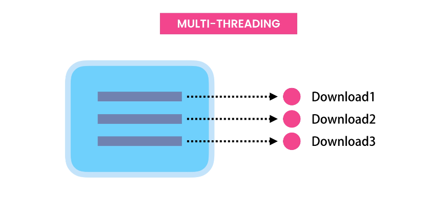
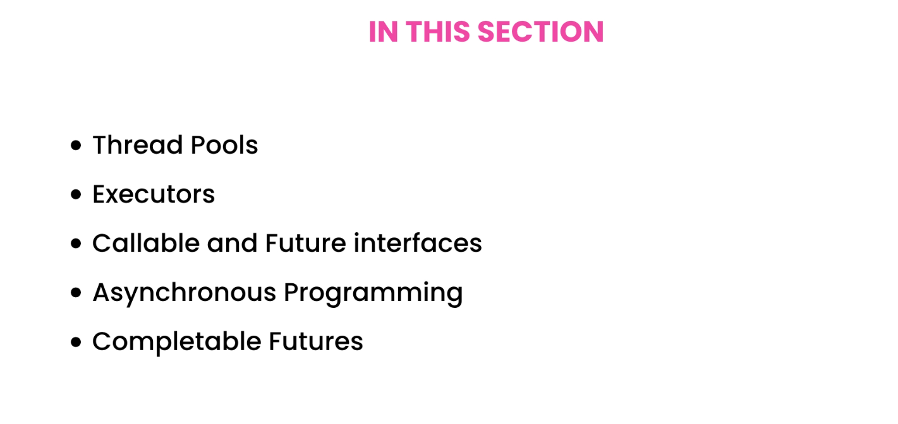

# Java

# Table of Contents
1. [Fundamentals](#fundamentals)
    1. [Getting Started](#getting-started)
    2. [How Java Code executed](#how-java-code-executed)
    3. [Types](#types)
        1. [Variables and Constants](#variables-and-constants)
        2. [Primitive Types](#primitive-types)
        3. [Reference Types](#reference-types)
        4. [Primitive vs Reference Types](#primitive-vs-reference-types)
        5. [Strings](#strings)
        6. [Arrays](#arrays)
        7. [Constants](#constants)
        8. [Arithmetic Expressions](#arithmetic-expressions)
        9. [Casting](#casting)
       10. [Math class](#math-class)
       11. [Format Numbers](#format-numbers)
       12. [Reading Input](#reading-input)
   4. [Control Flow](#control-flow)
        1. [If Statements](#if-statements)
        2. [Teranry Operator](#ternary-operator)
        3. [Switch Statements](#switch-statement)
        4. [For Loops](#for-loops)
        5. [While Loops](#while-loops)
        6. [Do-While Loops](#do-while-loops)
        7. [Break and Continue Statements](#break-and-continue-statements)
        8. [For Each Loop](#for-each-loop)
   5. [Clean Coding](#clean-coding)
   6. [Debugging and Deploying Applications](#debugging-and-deploying-applications)
      1. [Type of Errors](#types-of-errors)
      2. [Packaging Java Applications](#packaging-java-applications)

2. [Object Oriented Programming](#object-oriented-programming)
    1. [Classes and Objects](#classes-and-objects)
    2. [Encapsulation](#encapsulation)
    3. [Getters and Setters](#getters-and-setters)
    4. [Abstraction](#abstraction)
       1. [Constructors](#constructors)
       2. [Method Overloading](#method-overloading)
       3. [Constructor Overloading](#constructor-overloading)
       4. [Static Members](#static-members)
       5. [Notes](#notes)
    5. [Inheritance](#inheritance)
       1. [The Object Class](#the-object-class)
       2. [Constructor and Inheritance](#constructor-and-inheritance)
       3. [Access Modifiers](#access-modifiers)
       4. [Method Overriding](#method-overriding)
       5. [Upcasting and Downcasting](#upcasting-and-downcasting)
       6. [Comparing Objects](#comparing-objects)
       7. [Polymorphism](#polymorphism)
       8. [Abstract Classes and Methods](#abstract-classes-and-methods)
       9. [Final Classes and Methods](#final-classes-and-methods)
       10. [Deep Inheritance Hierarchies](#deep-inheritance-hierarchies)
       11. [Summary](#summary)
    6. [Interfaces](#interfaces)
       1. [Creating Interfaces](#creating-interface)
       2. [Dependency Injection](#dependency-injection)
          1. [Constructor Injection](#constructor-injection)
          2. [Setter Injection](#setter-injection)
          3. [Method Injection](#method-injection)
       3. [Interface Segregation Principle](#interface-segregation-principle)
       4. [MyTube Video Platform - Project](#mytube-video-platform---project)
       5. [Fields in Interfaces](#fields)
       6. [Static Methods in Interfaces](#static-methods)
       7. [Private Methods in Interfaces](#private-methods)
       8. [Interface and Abstract Methods](#interfaces-and-abstract-methods)
       9. [When to use Interface](#when-to-use-interfaces)
       10. [Summary in Interfaces](#summary-)

3. [Advanced Topics](#advanced-topics)
   1. [Exceptions](#exceptions)
      1. [Types of Exception](#types-of-exceptions)
      2. [Exception Hierarchy](#exception-hierarchy)
      3. [Catching Exceptions](#catching-exceptions)
      4. [Cathcing multiple type of Exceptions](#catching-a-multiple-type-of-exception)
      5. [The finally Block](#the-finally-block)
      6. [Try-with-Resources Statement](#try-with-resource-statement)
      7. [Throwing Exceptions](#throwing-exceptions)
      8. [Rethrowing Exceptions](#rethrowing-exceptions)
      9. [Custom Exceptions](#custom-exceptions)
      10. [Chaining Exceptions](#chaining-exceptions)
   2. [Generics](#generics)
      1. [Generic Classes](#generic-classes)
      2. [Generic and Primitive Types](#generic-and-primitive-types)
      3. [Constraints with Generics](#constraints)
      4. [Type Erasure](#type-erasure)
      5. [Comparable Interface](#comparable-interface)
      6. [Generic Methods](#generic-methods)
      7. [Multiple type parameters](#multiple-type-parameters)
      8. [Generic classes and Interfaces](#generic-classes-and-interfaces)
      9. [Wildcards](#wildcards)
      10. [Summary](#summarygenerics)
   3. [Collection Framework](#collections-framework)
      1. [Iterable Interface](#iterable-interface)
      2. [Iterator Interface](#iterator-interface)
      3. [Collection Interface](#collection-interface)
      4. [List Interface](#list-interface)
      5. [Java List and ArrayList](#java-list-and-arraylist)
      6. [Comparable Interface](#comparable-interface)
      7. [Comparator Interface](#comparator-interface)
      8. [Queue Interface](#queue-interface)
      9. [Set Interface](#set-interface)
      10. [Map Interface](#map-interface)
      11. [Summary](#summary---collection)
   4. [Lambda Expressions and Functional Interface](#lambda-expressions-and-functional-interfaces)
      1. [Functional Interfaces](#functional-interfaces)
      2. [Variable Capture](#variable-capture)
      3. [Method References](#method-reference)
      4. [Built in Functional Interfaces](#built-in-functional-interfaces)
      5. [Consumer Interface](#consumer-interface)
      6. [Chaining Consumers](#chaining-consumers)
      7. [Supplier Interface](#supplier-interface)
      8. [Function Interface](#function-interface)
      9. [Composing Functions](#composing-functions)
      10. [Predicate Interface](#predicate)
      11. [Combining Predicates](#combining-predicate-)
      12. [Binary Operator Interface](#binary-operator-interface)
      13. [Unary Operator Interface](#unary-operator)
      14. [Summary](#summary---lambdas)
   5. [Streams](#streams)
      1. [Creating Streams](#creating-streams)
      2. [Mapping Elements](#mapping-elements)
      3. [Filtering Elements](#filtering-elements)
      4. [Slicing Streams](#slicing-streams)
      5. [Sorting Streams](#sorting-streams)
      6. [Getting Unique Elements](#getting-unique-elements)
      7. [Peeking Elements](#peeking-elements)
      8. [Simple Reducers](#simple-reducers)
      9. [Reducing a Stream](#reducing-a-stream)
      10. [Collectors](#collectors)
      11. [Grouping Elements](#grouping-elements-)
      12. [Partitioning Elements](#partitioning-elements)
      13. [Primitive Type Streams](#primitive-type-streams)
      14. [Summary](#summary---streams)
   6. [Concurrency and Multi threading](#concurrency-and-multi-threading)
      1. [Processes and Threads](#processes-and-threads)
      2. [Starting a thread](#starting-a-thread)
      3. [Pausing a thread](#pausing-a-thread)
      4. [Joining a thread](#joining-a-thread)
      5. [Interrupting a thread](#interrupting-a-thread)
      6. [Concurrency Issues](#concurrency-issues)
      7. [Strategies for Thread Safety](#strategies-for-thread-safety)
      8. [Confinement](#confinement)
      9. [Locks](#locks)
      10. [The Synchrnoized Keyword](#the-synchronized-keyword)
      11. [The Volatile Keyword](#the-volatile-keyword)
      12. [Atomic Objects](#atomic-objects)
      13. [Adders](#adders)
      14. [Synchronized Collections](#synchronized-collections)
      15. [Concurrent Collections](#concurrent-collections)
      16. [Summary](#summary-of-concurrency-and-multi-threading)
   7. [The Executive Framework](#the-executive-framework)
      1. [Thread Pools](#thread-pools)
      

# Fundamentals
## Getting Started
**Function** - Block of code that performs a specific task

**Class** - A container for related functions

**Method** - A function that is a part of the class


### How Java Code executed


Java code execution involves several steps:

1. **Compilation**: The Java source code (`.java` files) is compiled by the Java Compiler (`javac`) into bytecode (`.class` files).
2. **Class Loading**: The Java Class Loader loads the compiled bytecode into the Java Virtual Machine (JVM).
3. **Bytecode Verification**: The JVM verifies the bytecode to ensure it is valid and does not violate Java's security constraints.
4. **Execution**: The JVM's Just-In-Time (JIT) compiler translates the bytecode into native machine code, which is then executed by the host machine's processor.

This process allows Java to be platform-independent, as the same bytecode can run on any machine with a compatible JVM.

Here is a brief explanation of JVM, JRE, and JDK:

- **JVM (Java Virtual Machine)**: The JVM is a virtual machine that runs Java bytecode. It provides a runtime environment in which Java bytecode can be executed, enabling Java's platform independence.

- **JRE (Java Runtime Environment)**: The JRE includes the JVM and the standard libraries and other components necessary to run Java applications. It does not include development tools like compilers or debuggers.

- **JDK (Java Development Kit)**: The JDK includes the JRE and development tools such as the Java compiler (`javac`), debuggers, and other tools necessary for Java development. It is used for developing and compiling Java applications.

Here is a simple diagram to illustrate the relationship:

```
JDK = JRE + Development Tools
JRE = JVM + Libraries
```


Java is platform-independent because of the Java Virtual Machine (JVM). Here is a brief explanation:

1. **Compilation to Bytecode**: Java source code is compiled into bytecode by the Java compiler (`javac`). This bytecode is a platform-independent intermediate representation.

2. **JVM Execution**: The bytecode is executed by the JVM, which is available for many different operating systems and hardware platforms. The JVM interprets or compiles the bytecode into native machine code specific to the host machine.

This means that the same Java program can run on any device that has a compatible JVM, making Java platform-independent.


To execute the Main.java file, you can use the following commands:
```bash
javac Main.java
java Main
```


## Types
1. Variables and constants
2. Primitive and reference types
3. Casting
4. Numbers, String and Arrays
5. Read Input

### Variables and Constants
```java
public class Main {
    public static void main(String[] args) {
        // Declare variables and constants
        int myAge = 25;
        int herAge = myAge;  // copying only value, since its primitive
        System.out.println(herAge);
    }
}
```

###  Primitive Types

Java has several primitive types, which are the most basic data types in the language. These types represent simple values like numbers, characters, and booleans. Here are the eight primitive types in Java:
1. **byte**: 8-bit integer
2. **short**: 16-bit integer
3. **int**: 32-bit integer
4. **long**: 64-bit integer
5. **float**: 32-bit floating-point number
6. **double**: 64-bit floating-point number
7. **char**: 16-bit Unicode character
8. **boolean**: true or false


```java
public class Main {
    public static void main(String[] args) {
        byte age = 30;
        long viewsCount = 123_456_789L;
        float price = 10.99F;
        char letter = 'A'; // single quote for char, double quote for string
        boolean isEligible = true;
    }
}
```

### Reference Types


- When declare primitive types, we don't need to allocate memory. Memory is allocated automatically by Java (JRE).
- When dealing with reference types, we should always allocate memory. Now we don't have to release this memory, Java JRE will take care of it.

```java
import java.util.Date;

Date now = new Date();
// variable 'now' is the instance of Date class.
// So these classes define templates or blueprints for creating new objects, new instances.
// So, an object is an instance of a class.
// we can access the methods and properties of the Date class using dot notation through now variable.
// Primtive types dont have members
```

NOTE:

In Java, a function and a method are not exactly the same, although they are similar concepts.

- **Function**: A block of code that performs a specific task. In many programming languages, functions can exist independently of classes.

- **Method**: A function that is associated with an object or class. In Java, all functions are methods because they are always defined within a class.

Here is an example to illustrate the difference:

```java
public class Example {
    // This is a method because it is defined within a class
    public void myMethod() {
        System.out.println("This is a method.");
    }

    public static void main(String[] args) {
        Example example = new Example();
        example.myMethod(); // Calling the method
    }
}
```

In Java, you always define functions as methods within a class.

### Primitive vs Reference Types


```java
public static void main(String[] args) {
    byte x = 1;
    byte y = x;
    x = 2;
    System.out.println(y); // 1
}
```
If I changed the value of `x` to 10, it will not affect the value of `y`. Because `x` and `y` are independent of each other. They are stored in different memory locations.

```java
import java.awt.*;

public static void main(String[] args) {
   Point point1 = new Point(1, 1);
   Point point2 = point1; // actually reference point1 location/object
   point1.x = 2;
   System.out.println(point2); // java.awt.Point[x=2,y=1]
}
```


- Reference type copied by their reference, not by their value.
- Primitive types copied by their value. Values are completely independent of each other.

### Strings
```java
  public static void main(String[] args) {
        String message = "   Hello, World!   "; // Reference type
        System.out.println(message.endsWith("!!"));  // true
        System.out.println(message.startsWith("!!")); // false
        System.out.println(message.length()); // 13
        System.out.println(message.indexOf("e")); // 1
        System.out.println(message.replace("Hello", "Hola")); // 1
        // Strings are immutable, so it will return a new string.
        System.out.println(message.toLowerCase()); // hello, world!
        System.out.println(message.toUpperCase()); // HELLO, WORLD!
        System.out.println(message.trim()); // get rid of white spaces
    }
```

- Parameters are the holes. that we define in our method. // target,replacement
- Arguments are the actual values that we pass to the method. // Hello, Hola

### Escape Sequences
1. Double Quote: `\"`

```java
public static void main(String[] args) {
    String message = "Hello \"Mosh\"";
    System.out.println(message); // Hello "Mosh"
}
```

2. Backslash: `\\`

```java
public static void main(String[] args) {
        // c:\windows\..
        String path = "c:\\windows\\.. ";
        System.out.println(path);
    }
```

3. Backslash n (new Line)
4. Backslash t (tab)


### Arrays

```java
public static void main(String[] args) {
        // Old method and tedious
        int[] numbers = new int[5];
        numbers[0] = 1;
        numbers[1] = 2;

        System.out.println(Arrays.toString(numbers));
    }
```

Newer way to initialize arrays if we know the values upfront.

```java
import java.lang.reflect.Array;
import java.util.Arrays;

public static void main(String[] args) {
    int[] numbers = {5, 4, 8, 1, 9};
    System.out.println(numbers.length);
    System.out.println(Arrays.sort(numbers));

    System.out.println(Arrays.toString(numbers));
}
```

- Arrays have fixed size. Once we create an array, we cannot change its size.

### Multi-Dimensional Arrays

```java
public static void main(String[] args) {
       int[][] numbers = {{3,5,7}, {10,4,5} };

       System.out.println(Arrays.deepToString(numbers));
    }
```

```java
public static void main(String[] args) {
    // 2 rows and 3 columns
        int[][] numbers = new int[2][3];
        numbers[0][0] = 1;

        System.out.println(Arrays.deepToString(numbers));
    }
```

### Constants
```java
public static void main(String[] args) {
    // Constants are declared with the final keyword, and by convention, they are written in uppercase.
        final float PI = 3.14F;
        System.out.println(PI);
    }
```

### Arithmetic Expressions

```java
public static void main(String[] args) {
    int result = 10 + 3;
    System.out.println(result); // 13

    int result = 10 / 3;
    System.out.println(result); // 3

    double result = (double)10 / (double)3;
    System.out.println(result); // 3.3333333333333335

    int x = 1;
    x++;
    System.out.println(x); // 2

    int x = 1;
    int y = x++;
    System.out.println(x); // 2
    System.out.println(y); // 1

    int x = 1;
    int y = ++x;
    System.out.println(x); // 2
    System.out.println(y); // 2
    
    int x = 1;
//    x = x + 2;
    x += 2; // compound or augmented assignment operator

    // Order of Expressions
    int x = 10 + 3 * 2;
    System.out.println(x); // 16

    int x = (10 + 3) * 2;
    System.out.println(x); // 26
}
```


### Casting
```java
// Implicit casting (No chance of lose data)
// byte > short > int > long > float > double
short x = 1;  // 2 bytes
int y = x + 2; // 4 bytes
System.out.println(y); // 3
// Under the hood, Java converts x short value to an int value.

double x = 1.1;
double y = x + 2; // it converts 2 as 2.0 here
System.out.println(y); // 3.1
```

Explicit casting
```java
double x = 1.1;
int y = int(x) + 2;
System.out.println(y); // 3
```

```java
// Wrapper class to convert string to integer
String x = "1";
int y = Integer.parseInt(x) + 2;
System.out.println(y); // 3

//Integer.parseInt(x) , takes an String and returns an integer
// Short.parseShort(x)

    String x = "1.1";
    double y = Double.parseDouble(x) + 2;
    System.out.println(y);

```

### Math class

```java
int result = Math.round(1.1F);
Math.ceil(1.1F); // 2.0
Math.floor(1.1F); // 1.0
Math.max(1,2);
Math.min(1,2);
Math.random(); // 0.0 to 1.0
System.out.println(result);
```

// Generate 1 - 100
```java
public static void main(String[] args) {
        int result = (int) (Math.random() * 100);
        System.out.println(result);
    }
```

### Format Numbers

- Cannot use new Operator to create an instance(Object) of NumberFormat class. Since it's an abstract class.
- Factory method, because it's like a factory to create objects.
- `NumberFormat.getCurrencyInstance()`

```java
    NumberFormat currency = NumberFormat.getCurrencyInstance();
    String result = currency.format(123456.891);
    System.out.println(result); // $123,456.89

    NumberFormat percent = NumberFormat.getPercentInstance();
    String result = percent.format(0.1);
    System.out.println(result); // 10%
   

// Method chaining
        String result = NumberFormat.getPercentInstance().format(0.1);
        System.out.println(result);
```

### Reading Input

```java
        Scanner scanner = new Scanner(System.in);
        System.out.print("Enter your age: ");
        byte age = scanner.nextByte();
        System.out.println("You are " + age);

        Scanner scanner = new Scanner(System.in);
        System.out.print("Enter your name: ");
        String name = scanner.nextLine();
        System.out.println("Your are " + name);
```

#### Exercise - Mortgage Calculator

```java
public class Main {
    public static void main(String[] args) {
        final byte MONTHS_IN_YEAR = 12;
        final byte PERCENT = 100;

        Scanner scanner = new Scanner(System.in);
        System.out.print("Principal: ");
        int principal = scanner.nextInt();   // p

        System.out.print("Annual Interest Rate: ");
        float annualInterest = scanner.nextFloat();
        float monthlyInterest = annualInterest / PERCENT / MONTHS_IN_YEAR; // r

        System.out.print("Period (Years): ");
        int years = scanner.nextInt();
        int numberOfPayments = years * MONTHS_IN_YEAR; // n

        double mortgage = principal
                * (monthlyInterest * Math.pow((1+ monthlyInterest), numberOfPayments)
                / (Math.pow((1+ monthlyInterest), numberOfPayments) - 1) );

        String mortgageInDollar = NumberFormat.getCurrencyInstance().format(mortgage);
        System.out.println("Mortgage: " + mortgageInDollar);
    }
}
```

## Control Flow
1. Comparison Operators
2. Logical Operators
3. Conditional Statements
4. Loops

### Comparison Operators

```java
    public static void main(String[] args) {
        int x = 1;
        int y = 1;
        // This uses for primitive types
        // boolean expression produces a boolean value
        System.out.println(x == y); // true
        System.out.println(x != y); // false
        System.out.println(x > y); // false
        System.out.println(x >= y); // true
        System.out.println(x <= y); // false
    }
```

### Logical Operators

```java
    public static void main(String[] args) {
        int temperature = 22;
        boolean isWarm = temperature > 20 && temperature < 30;
        System.out.println(isWarm); // true

        boolean hasHighIncome = true;
        boolean hasGoodCredit = true;
        boolean hasCriminalRecord = false;
        boolean isEligible = (hasHighIncome || hasGoodCredit) && !hasCriminalRecord;
        System.out.println(isEligible); // true
    }
```

### If Statements

```java
    public static void main(String[] args) {
        int temp = 32;
        if (temp > 30){
            System.out.println("It's a hot day!");
            System.out.println("Drink plenty of water");
        }
        else if(temp > 20)
            System.out.println("It's a nice day!");
        else
            System.out.println("It's cold!");

    }
```

### Simplifying If Statements

```java
    public static void main(String[] args) {
        int income = 120_000;
        boolean hasHighIncome = (income > 100_000);
    }
    
    
    
```

### Ternary Operator

```java
    public static void main(String[] args) {
        int income = 120_000;
        String className = income > 100_000 ? "First" : "Economy";
    }
```

### Switch Statement

```java
    public static void main(String[] args) {
        String role = "admin";
        switch (role){
            case "admin":
                System.out.println("You're admin");
                break;
            case "moderator":
                System.out.println("You're moderator");
                break;
            default:
                System.out.println("You're a guest");
        }
    }

```

### Exercise - Fizzbuzz

```java
    public static void main(String[] args) {
        Scanner scanner = new Scanner(System.in);
        System.out.print("Number: ");
        int number = scanner.nextInt();

        if (number % 3 == 0 && number % 5 == 0)
            System.out.println("FizzBuzz");
        else if (number % 5 == 0)
            System.out.println("Fizz");
        else if (number % 3 == 0)
            System.out.println("Buzz");
        else
            System.out.println(number);
    }
```

### For Loops

For loop is used when we know the number of iterations in advance.
```java
public static void main(String[] args){
    for (int i = 0; i < 5; i++){
        System.out.println("Hello, World! " + i);
    }

    for (int i = 5; i > 0; i--) {
        System.out.println("Hello, World! " + j);
    }
}
```

### While Loops
While loop is used when we don't know the number of iterations in advance.

```java
public static void main(String[] args){
    int i = 5;
    while (i > 0){
        System.out.println("Hello, World! " + i);
        i--;
    }

    int i = 1;
    while (i <= 5){
        System.out.println("Hello, World! " + i);
        i++;
    }
}

```

NOTE:
- We cannot use comparison operator between referene type. Because this operator compare the address or string objects, not their values. 
- Instead we can use `equals` method to compare the values of reference types.


```java
// Work until quit
public static void main(String[] args) {
        String input = "";
        Scanner scanner = new Scanner(System.in);

        while (!input.equals("quit")){
            System.out.print("Input: ");
            input = scanner.next().toLowerCase();
            System.out.println(input);
        }
    }
}
```

### Do while loops

Do while loops, executed at least once.

```java
    public static void main(String[] args) {
    String input = "";
    Scanner scanner = new Scanner(System.in); 

    do {
        System.out.print("Input: ");
        input = scanner.next().toLowerCase();
        System.out.println(input);
    } while (!input.equals(("quit")));
}

```

### Break and Continue Statements

```java
    public static void main(String[] args) {
        String input = "";
        Scanner scanner = new Scanner(System.in);

        while (!input.equals("quit")){
            System.out.print("Input: ");
            input = scanner.next().toLowerCase();
            if (input.equals("pass"))
                continue;
            if (input.equals("quit"))
                break;
            System.out.println(input);
        }
    }

```

### For Each loop

We use iterate over Arrays or collections.

Limitations
- We cannot get the index of the current item.
- Always Forward only

```java
    public static void main(String[] args) {
        String[] fruits = {"Apple", "Mango", "Orange"};

        // forEach 
        for (String fruit: fruits)
            System.out.println(fruit);
    }

```

### Exercise - Mortagege Calc V2 

```java
import java.text.NumberFormat;
import java.util.Scanner;

public class Main {
    public static void main(String[] args) {
        final byte MONTHS_IN_YEAR = 12;
        final byte PERCENT = 100;

        int principal = 0;
        float annualInterest = 0;
        int years  = 0;

        Scanner scanner = new Scanner(System.in);

        while (true) {
            System.out.print("Principal ($1K - $1M): ");
            principal = scanner.nextInt();   // p
            if (principal < 1_000_000_0 && principal > 1000)
                break;

            System.out.println("Enter a number between 1,000 and 1,000,000.");
        }

        while(true) {
            System.out.print("Annual Interest Rate: ");
            annualInterest = scanner.nextFloat();
            if (annualInterest > 0 && annualInterest < 30)
                break;

            System.out.println("Enter a value greater than 0 and less than 30.");

        }
        float monthlyInterest = annualInterest / PERCENT / MONTHS_IN_YEAR; // r

        while (true) {
            System.out.print("Period (Years): ");
            years = scanner.nextInt();
            if (years > 0 && years <= 30)
                break;

            System.out.println("Enter a value between 1 and 30");
        }
        int numberOfPayments = years * MONTHS_IN_YEAR; // n

        double mortgage = principal
                * (monthlyInterest * Math.pow((1+ monthlyInterest), numberOfPayments)
                / (Math.pow((1+ monthlyInterest), numberOfPayments) - 1) );

        String mortgageInDollar = NumberFormat.getCurrencyInstance().format(mortgage);
        System.out.println("Mortgage: " + mortgageInDollar);
    }
}

```

## Clean Coding

```java
// Void
public class Main {
    public static void main(String[] args) {
        greet("John");
        greet("Mary");
    }
    
    public static void greet(String name){
        System.out.println("Hello " + name);
    }
}
```

// Return value
```java
    public static void main(String[] args) {
        String message = greet("John");
        System.out.println(message);
    }

    public static String greet(String name){
        return "Hello " + name;
    }

```

### Refactoring 

Changing the structure of the code without changing its behavior.

```java
// V3 - Create a method
import java.text.NumberFormat;
import java.util.Scanner;

public class Main {
    public static void main(String[] args){
        int principal = 0;
        float annualInterest = 0;
        byte years  = 0;

        Scanner scanner = new Scanner(System.in);

        while (true) {
            System.out.print("Principal ($1K - $1M): ");
            principal = scanner.nextInt();   // p
            if (principal < 1_000_000_0 && principal > 1000)
                break;

            System.out.println("Enter a number between 1,000 and 1,000,000.");
        }

        while(true) {
            System.out.print("Annual Interest Rate: ");
            annualInterest = scanner.nextFloat();
            if (annualInterest > 0 && annualInterest < 30)
                break;

            System.out.println("Enter a value greater than 0 and less than 30.");
        }

        while (true) {
            System.out.print("Period (Years): ");
            years = scanner.nextByte();
            if (years > 0 && years <= 30)
                break;

            System.out.println("Enter a value between 1 and 30");
        }

        double mortgage = calculateMortgage(annualInterest, principal, years);

        String mortgageInDollar = NumberFormat.getCurrencyInstance().format(mortgage);
        System.out.println("Mortgage: " + mortgageInDollar);
    }

    public static double calculateMortgage(
            float annualInterest,
            int principal,
            byte years){
        final byte MONTHS_IN_YEAR = 12;
        final byte PERCENT = 100;

        float monthlyInterest = annualInterest / PERCENT / MONTHS_IN_YEAR; // r
        short numberOfPayments = (short)(years * MONTHS_IN_YEAR); // n

        return principal
                * (monthlyInterest * Math.pow((1+ monthlyInterest), numberOfPayments)
                / (Math.pow((1+ monthlyInterest), numberOfPayments) - 1) );
    }
}

```

Refactor Repetitive patters (While loop)
- We cannot reuse read input logic, because one is nextInt(), nextFloat() and nextByte(). So creating separate functions for this is no use.
- So we can create a generic function to read input that returns double then we can cast it to int, float or byte.

```java
import java.text.NumberFormat;
import java.util.Scanner;

// v4
public class Main {
    public static void main(String[] args){
        int principal = (int) readNumber("Principal ($1K - $1M): ", 1000, 1_000_000);
        float annualInterest = (float) readNumber("Annual Interest Rate: ", 0, 30);
        byte years = (byte) readNumber("Period (Years): ", 0, 30);

        double mortgage = calculateMortgage(annualInterest, principal, years);

        String mortgageInDollar = NumberFormat.getCurrencyInstance().format(mortgage);
        System.out.println("Mortgage: " + mortgageInDollar);
    }

    public static double readNumber(String prompt, double min, double max){
        Scanner scanner = new Scanner(System.in);
        double value;
        while (true) {
            System.out.print(prompt);
            value = scanner.nextFloat();   // p
            if (value < max && value > min)
                break;

            System.out.println("Enter a number between " + min + " and "+ max);
        }
        return value;
    }

    public static double calculateMortgage(
            float annualInterest,
            int principal,
            byte years){
        final byte MONTHS_IN_YEAR = 12;
        final byte PERCENT = 100;

        float monthlyInterest = annualInterest / PERCENT / MONTHS_IN_YEAR; // r
        short numberOfPayments = (short)(years * MONTHS_IN_YEAR); // n

        return principal
                * (monthlyInterest * Math.pow((1+ monthlyInterest), numberOfPayments)
                / (Math.pow((1+ monthlyInterest), numberOfPayments) - 1) );
    }
}

```

### Exercise - Project Payment Schedule

```java
import java.text.NumberFormat;
import java.util.Scanner;

public class Main {
    // make static since all methods in this class are static and they can only access static variables.
    // in this case, this variable are called as fields. so the field define at the class level and its accessible to all methods in the class
    final static byte MONTHS_IN_YEAR = 12;
    final static byte PERCENT = 100;

    public static void main(String[] args){
        int principal = (int) readNumber("Principal ($1K - $1M): ", 1000, 1_000_000);
        float annualInterest = (float) readNumber("Annual Interest Rate: ", 0, 30);
        byte years = (byte) readNumber("Period (Years): ", 0, 30);

        double mortgage = calculateMortgage(annualInterest, principal, years);
        String mortgageInDollar = NumberFormat.getCurrencyInstance().format(mortgage);
        System.out.println();
        System.out.println("MORTGAGE");
        System.out.println("--------");
        System.out.println("Monthly Payments: " + mortgageInDollar);
        System.out.println();

        System.out.println("PAYMENT SCHEDULE");
        System.out.println("----------------");
        for (short month = 1; month <= years * MONTHS_IN_YEAR; month++) {
            double balance = calculateBalance(annualInterest, principal, years, month);
            System.out.println(NumberFormat.getCurrencyInstance().format(balance));
        }

    }

    public static double readNumber(String prompt, double min, double max){
        Scanner scanner = new Scanner(System.in);
        double value;
        while (true) {
            System.out.print(prompt);
            value = scanner.nextFloat();   // p
            if (value < max && value > min)
                break;

            System.out.println("Enter a number between " + min + " and "+ max);
        }
        return value;
    }

    public static double calculateBalance(float annualInterest,
                                          int principal,
                                          byte years,
                                          short numberOfPaymentsMade){


        float monthlyInterest = annualInterest / PERCENT / MONTHS_IN_YEAR; // r
        int numberOfPayments = (years * MONTHS_IN_YEAR); // n
        
        double balance = principal
                * (Math.pow(1 + monthlyInterest, numberOfPayments) - Math.pow(1 + monthlyInterest, numberOfPaymentsMade))
                / (Math.pow(1 + monthlyInterest, numberOfPayments) - 1 );

        return balance;
    }

    public static double calculateMortgage(
            float annualInterest,
            int principal,
            byte years){

        float monthlyInterest = annualInterest / PERCENT / MONTHS_IN_YEAR; // r
        short numberOfPayments = (short)(years * MONTHS_IN_YEAR); // n

        double mortgage = principal
                * (monthlyInterest * Math.pow((1+ monthlyInterest), numberOfPayments)
                / (Math.pow((1+ monthlyInterest), numberOfPayments) - 1) );

        return mortgage;
    }
}

// monthlyInterest and numberOfPayments is gonna change in the future. so duplicate 2 times is not a big deal. 
// we can get rid when we go through OOP
```

-----------After Refactor--------
```java
// Procedurel way - Not OOP this one. Need to refactor in OOP
import java.text.NumberFormat;
import java.util.Scanner;

public class Main {
    final static byte MONTHS_IN_YEAR = 12;
    final static byte PERCENT = 100;

    public static void main(String[] args){
        int principal = (int) readNumber("Principal ($1K - $1M): ", 1000, 1_000_000);
        float annualInterest = (float) readNumber("Annual Interest Rate: ", 0, 30);
        byte years = (byte) readNumber("Period (Years): ", 0, 30);

        printMortgage(principal, annualInterest, years);
        printPaymentSchedule(principal, annualInterest, years);
    }

    private static void printMortgage(int principal, float annualInterest, byte years) {
        double mortgage = calculateMortgage(annualInterest, principal, years);
        String mortgageInDollar = NumberFormat.getCurrencyInstance().format(mortgage);
        System.out.println();
        System.out.println("MORTGAGE");
        System.out.println("--------");
        System.out.println("Monthly Payments: " + mortgageInDollar);
        System.out.println();
    }

    private static void printPaymentSchedule(int principal, float annualInterest, byte years) {
        System.out.println("PAYMENT SCHEDULE");
        System.out.println("----------------");
        for (short month = 1; month <= years * MONTHS_IN_YEAR; month++) {
            double balance = calculateBalance(annualInterest, principal, years, month);
            System.out.println(NumberFormat.getCurrencyInstance().format(balance));
        }
    }

    public static double readNumber(String prompt, double min, double max){
        Scanner scanner = new Scanner(System.in);
        double value;
        while (true) {
            System.out.print(prompt);
            value = scanner.nextFloat();   // p
            if (value < max && value > min)
                break;

            System.out.println("Enter a number between " + min + " and "+ max);
        }
        return value;
    }

    public static double calculateBalance(float annualInterest,
                                          int principal,
                                          byte years,
                                          short numberOfPaymentsMade){


        float monthlyInterest = annualInterest / PERCENT / MONTHS_IN_YEAR; // r
        int numberOfPayments = (years * MONTHS_IN_YEAR); // n

        double balance = principal
                * (Math.pow(1 + monthlyInterest, numberOfPayments) - Math.pow(1 + monthlyInterest, numberOfPaymentsMade))
                / (Math.pow(1 + monthlyInterest, numberOfPayments) - 1 );

        return balance;
    }

    public static double calculateMortgage(
            float annualInterest,
            int principal,
            byte years){

        float monthlyInterest = annualInterest / PERCENT / MONTHS_IN_YEAR; // r
        short numberOfPayments = (short)(years * MONTHS_IN_YEAR); // n

        double mortgage = principal
                * (monthlyInterest * Math.pow((1+ monthlyInterest), numberOfPayments)
                / (Math.pow((1+ monthlyInterest), numberOfPayments) - 1) );

        return mortgage;

    }

}

```

## Debugging and Deploying Applications

### Types of Errors

1. **Compile-time Errors**:
    - These errors occur when you compile your code.
    - They are usually syntax errors, such as missing semicolons, incorrect use of keywords, or mismatched parentheses.
    - The compiler detects these errors and provides error messages to help you fix them.
- Use google or stackoverflow if that not understandable

2. **Runtime Errors**:
    - These errors occur while the program is running.
    - They are often caused by illegal operations, such as dividing by zero, accessing invalid array indices, or null pointer dereferences.
    - Runtime errors cause the program to terminate abnormally.
- Use debugger

3. **Logical Errors**:
    - These errors occur when the program runs without crashing but produces incorrect results.
    - They are often due to mistakes in the program's logic, such as incorrect calculations or flawed algorithms.
    - Logical errors are the hardest to detect because the compiler and runtime do not provide error messages for them.

### Packaging Java Applications

Packaging Java applications involves bundling your compiled code and resources into a format that can be easily distributed and executed. The most common format for packaging Java applications is the JAR (Java ARchive) file. Here are the steps to package a Java application into a JAR file:

### GUI 
1. File -> Project Structure -> Artifacts -> + -> JAR -> From modules with dependencies
2. Select the main class
3. Build -> Build Artifacts -> Build
4. The JAR file will be generated in the `out/artifacts` directory.
5. If you want to run the JAR file with a double click, you can associate the `.jar` extension with the Java runtime with open with terminal
6. Run the JAR file using the `java -jar jarFileName` command.

-----
### CMD
1. **Compile the Java Code**: Ensure all your `.java` files are compiled into `.class` files.

   ```cmd
   javac -d out src\*.java
   ```

2. **Create a Manifest File**: The manifest file (`MANIFEST.MF`) contains metadata about the JAR file, including the main class to be executed.

   ```plaintext
   Manifest-Version: 1.0
   Main-Class: Main
   ```

3. **Package into a JAR File**: Use the `jar` command to create the JAR file, including the compiled classes and the manifest file.

   ```cmd
   jar cfm MyApplication.jar MANIFEST.MF -C out .
   ```

4. **Run the JAR File**: You can run the packaged JAR file using the `java -jar` command.

   ```cmd
   java -jar MyApplication.jar
   ```

This process creates a self-contained JAR file that can be distributed and executed on any machine with a compatible JVM.

# Object Oriented Programming

## Getting Started
### Programming Paradigms


1. **Procedural Programming**: Focuses on procedures or functions that operate on data.
2. **Object-Oriented Programming (OOP)**: Focuses on objects that encapsulate data and behavior.
3. **Functional Programming**: Focuses on functions that take input and produce output without side effects.
4. **Event-Driven Programming**: Focuses on events that trigger actions or behaviors.
5. **Logic Programming**: Focuses on rules and facts that define relationships and constraints.
6. **Aspect-Oriented Programming**: Focuses on aspects or concerns that cut across multiple modules.


Depends on the **problem**, **context** and **budget**, we can choose the programming paradigm.

### Benefits of OOP
- Reduced Complexity
- Easier Maintenance
- Code Reuse
- Faster Development

Both functional and OOP are great, but OOP is more popular because of the benefits mentioned above.


## Classes
1. Encapsulation
2. Abstraction
3. Constructors
4. Getters and setters
5. Method Overloading

### Classes and Objects


We can create multiple objects using same class.


```java
// TextBox.java
public class TextBox {
    public String text = "";

    public void setText(String text){
        this.text = text;
    }

    public void clear(){
        text = "";
    }
}

// Main.java

public class Main {
    public static void main(String[] args) {
        var textBox1 = new TextBox();
        textBox1.setText("Box 1");
        System.out.println(textBox1.text.toUpperCase());

        var textBox2 = new TextBox();
        textBox2.setText("Box 2");
        System.out.println(textBox2.text);
    }
}

```

### Memory Allocation


```java
public static void main(String[] args) {
    var textBox1 = new TextBox();
    var textBox2 = textBox1;
    textBox2.setText("Hello World");
    System.out.println(textBox1.text);
}

```

- Here textBox1 and textBox2 are pointing to the same object in memory.
- If we change the value of textBox2, it will reflect in textBox1 as well.

Deallocation
- Java has a garbage collector that automatically deallocates memory when an object is no longer in use.
- After the execution of the main method, the garbage collector will deallocate the memory used by the TextBox objects.

### Procedural Programming

```java
 public static void main(String[] args) {
    int baseSalary = 50_000;
    int extraHours = 10;
    int hourlyRate = 20;

    int wage = calculateWage(baseSalary, extraHours, hourlyRate);
    System.out.println(wage);
}

public static int calculateWage(
        int baseSalary,
        int extraHours,
        int hourlyRate
){
    return baseSalary + (extraHours * hourlyRate);
}
```

The provided code is procedural because it focuses on functions (or procedures) that operate on data, rather than encapsulating data and behavior within objects. In procedural programming, the data and functions are separate, and the functions operate on the data passed to them as arguments.

In contrast, Object-Oriented Programming (OOP) encapsulates data and behavior within objects. In OOP, you would define a class to represent the concept of an employee or a job, and the methods to calculate the wage would be part of that class.

### Encapsulation

- Data Hiding & Protection
- Bundle the data and methods that operate on the data into a single unit called a class.
- integrating data (variables) and code (methods) into a single unit. In encapsulation, a class's variables are hidden from other classes and can only be accessed by the methods of the class in which they are found.
```java
// Employee.java
public class Emplyee {
    public int baseSalary;
    public int hourlyRate;

    public int calculateWage(int extraHours){
        return baseSalary + (extraHours * hourlyRate);
    }
}

// Main.java

public static void main(String[] args) {
    var employee = new Emplyee();
    employee.baseSalary = 50_000;
    employee.hourlyRate = 20;
    int wage = employee.calculateWage(10);
    System.out.println(wage);
}

// This code not complete yet, we still have issues
```

### Getters and Setters

- What if we put -1 for baseSalary, so we have to do validation, instead of doing if validation there, we use setBasicSalary and put validation there.
- Use IntelliJ to create getters and setters by clicking hint over `public int hourlyRate`

```java
// Employee.java
public class Employee {
    private int baseSalary;
    private int hourlyRate;

    public void setBaseSalary(int baseSalary){
        if (baseSalary <= 0)
            throw new IllegalArgumentException("Salary cannot be 0 or less");
        this.baseSalary = baseSalary;
    }

    public int getBaseSalary(){
        return baseSalary;
    }

    public int calculateWage(int extraHours){
        return baseSalary + (extraHours * getHourlyRate());
    }

    public int getHourlyRate() {
        return hourlyRate;
    }

    public void setHourlyRate(int hourlyRate) {
        if (hourlyRate <= 0)
            throw new IllegalArgumentException("Hourly rate cannot be 0 or less");
        this.hourlyRate = hourlyRate;
    }
}

// Main.java
public static void main(String[] args) {
    var employee = new Employee();
    employee.setBaseSalary(50_000);
    employee.setHourlyRate(20);
    int wage = employee.calculateWage(10);
    System.out.println(wage);
}
```


### Abstraction

- Hiding complexity & Showing Only essentials
- Reduce complexity by hiding unnecessary details
- Remote Controller example (we dont know how the transistors of remote working internally, we only know just changing the channel etc)
- Hiding implementation details
- hiding the implementation details of a code and exposing only the necessary information to the user. It provides the ability to simplify complex systems by ignoring irrelevant details and reducing complexity

**Coupling** - the level of dependency between classes. If we change one class, it should not affect the other class.


The more coupling between classes, the more difficult it is to maintain and extend the codebase.

```java
private int getBaseSalary(){
        return baseSalary;
}

private int getHourlyRate() {
        return hourlyRate;
}

// Main.java
var employee = new Employee();
        employee.setBaseSalary(50_000);
        employee.setHourlyRate(20);
int wage = employee.calculateWage(10);
        System.out.println(wage);

// employee class have 3 coupling here. so inorder to reduce we are going to make public getters to private getters. so we can only see 3 methods there
    }
```

### Reduce Coupling

```java
// Browser.java
public class Browser {
    public void navigate(String address){
        // to navigate we need find ip address, then request httpReq
        String ip = findIpAddress(address);
        String html = sendHttpRequest(ip);
        System.out.println(html);
    }

    private String sendHttpRequest(String ip) {
        return "<html></html>";
    }

    private String findIpAddress(String address) {
        return "127.0.0.1";
    }

}

// Main.java
public class Main {
    public static void main(String[] args) {
        var browser = new Browser();
        browser.navigate("");
    }
}
```


We can see only navigate, bcz that's only we need to see.


### Constructors
- Special method that is called when an instance of a class is created.
- Used to initialize the object.
- Automatically called when we create an object called default constructor. And it will initialize the fields with default values.
- We can create our own custom constructor as well.
- In previous example, what if the user forget to put the baseSalary and hourlyRate, where constructor comes in.


```java
// Employee.java
public class Employee {
    private int baseSalary;
    private int hourlyRate;

    public Employee(int baseSalary, int hourlyRate){
//        this.baseSalary = baseSalary; // here we don't have validation so
        setBaseSalary(baseSalary);
        setHourlyRate(hourlyRate);
    }

    private void setBaseSalary(int baseSalary){
        if (baseSalary <= 0)
            throw new IllegalArgumentException("Salary cannot be 0 or less");
        this.baseSalary = baseSalary;
    }

    private int getBaseSalary(){
        return baseSalary;
    }

    public int calculateWage(int extraHours){
        return baseSalary + (extraHours * getHourlyRate());
    }

    private int getHourlyRate() {
        return hourlyRate;
    }

    private void setHourlyRate(int hourlyRate) {
        if (hourlyRate <= 0)
            throw new IllegalArgumentException("Hourly rate cannot be 0 or less");
        this.hourlyRate = hourlyRate;
    }
}

// Main.java
public class Main {
    public static void main(String[] args) {
        var employee = new Employee(50_000, 20);
        int wage = employee.calculateWage(10);
        System.out.println(wage);
    }
}

```

### Method Overloading

- Defining multiple methods with the same name but different parameters.
- Java will automatically determine which method to call based on the arguments passed.
- In prev example, what if we don't want to pass the extraHours, so we can create another method with same name but different parameters.

```java
// Employee.java
public int calculateWage(int extraHours){
        return baseSalary + (extraHours * getHourlyRate());
    }

    // here don't need to overload the method, just call the method with 0 since it's the simple case
    public int calculateWage(){
//        return baseSalary;
        return calculateWage(0);
    }
```

### Constructor overloading

- Ctrl + D - Duplicate Code
- Ctrl + B - Go to Declaration (Navigate to the method)
- Ctrl + P - Parameter Info

```java
// Employee.java

// M1
public Employee(int baseSalary){
    setBaseSalary(baseSalary);
    setHourlyRate(0);
}

// M2
// this is a reference to the current Object.
// reusing logic from another constructor (2nd constructor)
public Employee(int baseSalary){
    this(baseSalary, 0);
}

public Employee(int baseSalary, int hourlyRate){
    setHourlyRate(hourlyRate);
    setBaseSalary(baseSalary);
}

```

### Static Members

- In OOP, we have instance members and static members.
- Instance members belong to an object/instance, whereas static members belong to the class.
- Static members are shared among all instances of a class.
- Static members are accessed using the class name, not the object reference.
- Static members are initialized when the class is loaded into memory and are destroyed when the class is unloaded.
- We use static, where value is independent of the object state.

like the concept `Employee.numberOfEmployees`

```java
// Employee.java

public static int numberOfEmployees;

// M2
// reusing logic from another constructor (2nd constructor)
public Employee(int baseSalary){
    this(baseSalary, 0);
}

public Employee(int baseSalary, int hourlyRate){
    setHourlyRate(hourlyRate);
    setBaseSalary(baseSalary);
    numberOfEmployees++;
}

public static void printNumberOfEmployees() {
    System.out.println(numberOfEmployees);

    // if we need to access calculateWage, we cannot use directly here
//       new Employee().calculateWage()

}

// Main.java
public static void main(String[] args) {
    var employee = new Employee(50_000, 20);
    var employee2 = new Employee(50_000);
//    System.out.println(Employee.numberOfEmployees); // 2
    Employee.printNumberOfEmployees();
    
    
//    Integer.parseInt() // static method
}

```

### NOTES

In Java, memory is divided into two main areas: the stack and the heap.

### Stack
- **Purpose**: The stack is used for static memory allocation and the execution of threads.
- **Storage**: It stores primitive data types (e.g., int, char) and references to objects.
- **Lifetime**: Variables stored in the stack are short-lived and are automatically deallocated when the method call ends.
- **Access**: Stack memory is accessed in a last-in, first-out (LIFO) manner.
- **Size**: The size of the stack is limited and determined at runtime.

### Heap
- **Purpose**: The heap is used for dynamic memory allocation for Java objects and JRE classes.
- **Storage**: It stores objects and arrays.
- **Lifetime**: Objects in the heap have a longer lifetime and are managed by the garbage collector.
- **Access**: Heap memory is accessed via references stored in the stack.
- **Size**: The size of the heap is larger and can grow as needed, limited by the available memory.

### Example
```java
public class Example {
    public static void main(String[] args) {
        int x = 10; // Stored in stack
        Example obj = new Example(); // obj reference stored in stack, actual object stored in heap
    }
}
```

In this example:
- The variable `x` is stored in the stack.
- The reference `obj` is stored in the stack, but the actual `Example` object is stored in the heap.


**Class** - blueprint or template for creating objects.

**Object** -  instance of a class

**Instantiating** means creating an Object OR instance of a class: `new
Customer()`

**Encapsulation** - bundle the data and operations on the data inside a single unit (class). 

**Abstraction** - should reduce complexity by hiding the unnecessary implementation details. implementation details. As a metaphor, think of the remote control of 
a TV. You don't need to know how the remote control works internally, you just need to know how to use it.  our objects to be like our remote controls.

**Coupling** - the level of dependency between software entities (eg classes).

**Constructors** - Constructors are called when we instantiate our class. We use them
to initialize our objects. Initialization means putting an object into an
early or initial state (eg giving it initial values).

**Method overloading** - Method overloading means declaring a method with the same name
but with different signatures. The number, type and order of its
parameters will be different

**Static Methods** - Static methods are accessible via classes, not objects.

### Method overriding and overloading

| Feature             | Overloading                                      | Overriding                                          |
|---------------------|--------------------------------------------------|-----------------------------------------------------|
| Same class or subclass/superclass? | Same class                                   | Subclass and superclass                           |
| Method signature (name and parameters) | Same name, different parameters               | Same name and parameters                          |
| Purpose             | Different operations with the same method name   | Specific implementation of an inherited method     |
| Polymorphism        | Compile-time                                     | Runtime                                             |


#### Moving away from Static Members
// MortgageCalc
- We use constructor to initialize instances. But `calculator` object declared as static field. and `printMortgage` and `printPaymentSchedule` are declared as static.
- Having too many static members is not a good practice. troublesome to maintain and test.
  - Only for situation the place concept dealing with the single place. In real application, we need to use multiple window, where we that display each report. Each report display multiple calculater.
- **Create property** - Getter and Setter
- **Create read-only property** - Getter only

```java

// to remove the duplicate, 1. make the variable as a field (private), and initialize with constructor. this is not a good option in future, if annualInterest changes.
// 2. extract as a private method in this class to calculate Monthly Interest
float monthlyInterest = annualInterest / PERCENT / MONTHS_IN_YEAR; // r
short numberOfPayments = (short) (years * MONTHS_IN_YEAR); // n
```

#### Extracting getRemainingBalance Method

```java
// MortgageReport.java
for (short month = 1; month <= calculator.getYears() * MortgageCalculator.MONTHS_IN_YEAR; month++) {
            double balance = calculator.calculateBalance(month);
            System.out.println(NumberFormat.getCurrencyInstance().format(balance));
        }
```

- Once its set to constructor, it cannot be reset

```java
// cannot be reset once is set to constructor
    private final NumberFormat currency;
    private MortgageCalculator calculator;

    public MortgageReport(MortgageCalculator calculator) {
        this.calculator = calculator;
        currency = NumberFormat.getCurrencyInstance();
    }

```

--- After refactoring as OOP ----

```java
// MortgageCalculator.java

public class MortgageCalculator {
    private final static byte MONTHS_IN_YEAR = 12;
    private final static byte PERCENT = 100;

    private int principal;
    private float annualInterest;
    private byte years;

    public MortgageCalculator(byte years, float annualInterest, int principal) {
        this.years = years;
        this.annualInterest = annualInterest;
        this.principal = principal;
    }

    public double calculateBalance(short numberOfPaymentsMade) {

        float monthlyInterest = getMonthlyInterest(); // r
        int numberOfPayments = getNumberOfPayments(); // n

        double balance = principal
                * (Math.pow(1 + monthlyInterest, numberOfPayments) - Math.pow(1 + monthlyInterest, numberOfPaymentsMade))
                / (Math.pow(1 + monthlyInterest, numberOfPayments) - 1);

        return balance;
    }


    public double calculateMortgage() {
        float monthlyInterest = getMonthlyInterest(); // r
        int numberOfPayments = getNumberOfPayments(); // n

        double mortgage = principal
                * (monthlyInterest * Math.pow((1 + monthlyInterest), numberOfPayments)
                / (Math.pow((1 + monthlyInterest), numberOfPayments) - 1));

        return mortgage;
    }

    public double[] getRemainingBalances(){
        var balances = new double[getNumberOfPayments()];
        for (short month = 1; month <= balances.length; month++) {
            balances[month -1] = calculateBalance(month);
        }
        return balances;
    }

    private int getNumberOfPayments() {
        return years * MONTHS_IN_YEAR;
    }

    private float getMonthlyInterest() {
        return annualInterest / PERCENT / MONTHS_IN_YEAR;
    }
}

```

```java
// MortgageReport.java
import java.text.NumberFormat;

public class MortgageReport {

    // cannot be reset once is set to constructor
    private final NumberFormat currency;
    private MortgageCalculator calculator;

    public MortgageReport(MortgageCalculator calculator) {
        this.calculator = calculator;
        currency = NumberFormat.getCurrencyInstance();
    }

    public void printPaymentSchedule() {
//        calculator = new MortgageCalculator(years,annualInterest, principal);
        System.out.println("PAYMENT SCHEDULE");
        System.out.println("----------------");
        for (double balance : calculator.getRemainingBalances())
            System.out.println(currency.format(balance));

    }

    public void printMortgage() {
        double mortgage = calculator.calculateMortgage();
        String mortgageInDollar = currency.format(mortgage);
        System.out.println();
        System.out.println("MORTGAGE");
        System.out.println("--------");
        System.out.println("Monthly Payments: " + mortgageInDollar);
        System.out.println();
    }
}

//        for (short month = 1; month <= calculator.getYears() * MortgageCalculator.MONTHS_IN_YEAR; month++) {
//            double balance = calculator.calculateBalance(month);
//            System.out.println(NumberFormat.getCurrencyInstance().format(balance));
//        }

```

```java
// Console.java
import java.util.Scanner;

public class Console {
    private static Scanner scanner = new Scanner(System.in);

    public static double readNumber(String prompt){
        return scanner.nextDouble();
    }
    public static double readNumber(String prompt, double min, double max) {
        double value;
        while (true) {
            System.out.print(prompt);
            value = scanner.nextDouble();   // p
            if (value < max && value > min)
                break;

            System.out.println("Enter a number between " + min + " and " + max);
        }
        return value;
    }
}

// we don't need to expose Scanner class here, so hide the implementation details by making private.
// also make static to use in both static methods
```

```java
// Main.java
public class Main {

    public static void main(String[] args){
        int principal = (int) Console.readNumber("Principal ($1K - $1M): ", 1000, 1_000_000);
        float annualInterest = (float) Console.readNumber("Annual Interest Rate: ", 0, 30);
        byte years = (byte) Console.readNumber("Period (Years): ", 0, 30);

        var calculator = new MortgageCalculator(years, annualInterest, principal);

        var report = new MortgageReport(calculator);
        report.printMortgage();
        report.printPaymentSchedule();
    }

}
```

## Inheritance
1. Constructors
2. Access Modifiers
3. Overriding Methods
4. Comparing Objects
5. Polymorphism

Inheritance is a fundamental concept in object-oriented programming (OOP) that allows a class to inherit properties and behaviors (methods) from another class. The class that inherits is called the **subclass** or **derived class**, and the class from which it inherits is called the **superclass** or **base class**.

### Key Points:
- **Reusability**: Inheritance promotes code reusability by allowing common properties and methods to be defined in a base class and reused in derived classes.
- **Hierarchy**: It helps in creating a hierarchical classification of classes.
- **Method Overriding**: Subclasses can provide specific implementations of methods that are already defined in their superclasses.
- **Polymorphism**: Inheritance enables polymorphism, where a subclass object can be treated as an instance of its superclass.

 

- **Base Class** - Parent class or superclass.
- **Derived Class** - Child class or subclass
- **Inheritance** - Mechanism where a new class inherits properties and behavior from an existing class.
- **is A relationship** - A derived class is a type of the base class.

```java
// Main.java

public class Main {
    public static void main(String[] args) {
        var control = new TextBox();
        control.disable();
        System.out.println(control.isEnabled());
    }
}

// UIControl.java
public class UIControl {
    private boolean isEnabled = true;

    public void enable(){
        isEnabled = true;
    }

    public void disable(){
        isEnabled = false;
    }

    public boolean isEnabled(){
        return isEnabled;
    }
}

// TextBox.java
public class TextBox extends UIControl {
    private String text = "";

    public void setText(String text){
        this.text = text;
    }

    public void clear(){
        text = "";
    }
}
```

### The Object Class

```java
public static void main(String[] args) {
    var obj = new Object();
    obj.
}
```


```java
    public static void main(String[] args) {
        var Box1 = new TextBox();
        var Box2 = Box1;
        var Box3 = new TextBox();
        System.out.println(Box1.hashCode()); //  1072408673-  Hashcode
        System.out.println(Box2.hashCode()); //  1072408673 -  Hashcode
        System.out.println(Box1.equals(Box2)); // true
        System.out.println(Box1.equals(Box3)); // false
        System.out.println(Box1.toString()); // TextBox@3feba861 , hashcode in Object represented in hexadecimal.
        // This integer based on the address of this object in memory.
        // address of this Object can get by HashFunction.
    }
    
```

In Java, the `Object` class is the root of the class hierarchy. Every class has `Object` as a superclass. All objects, including arrays, implement the methods of this class. Here are some key methods provided by the `Object` class:

### Key Methods of the `Object` Class

1. **`clone()`**: Creates and returns a copy of the object.
2. **`equals(Object obj)`**: Indicates whether some other object is "equal to" this one.
3. **`finalize()`**: Called by the garbage collector on an object when garbage collection determines that there are no more references to the object.
4. **`getClass()`**: Returns the runtime class of the object.
5. **`hashCode()`**: Returns a hash code value for the object.
6. **`notify()`**: Wakes up a single thread that is waiting on this object's monitor.
7. **`notifyAll()`**: Wakes up all threads that are waiting on this object's monitor.
8. **`toString()`**: Returns a string representation of the object.
9. **`wait()`**: Causes the current thread to wait until another thread invokes the `notify()` method or the `notifyAll()` method for this object.

### Example Usage

Here is an example demonstrating some of these methods:

```java
public class Example {
    private int id;
    private String name;

    public Example(int id, String name) {
        this.id = id;
        this.name = name;
    }

    @Override
    public boolean equals(Object obj) {
        if (this == obj) return true;
        if (obj == null || getClass() != obj.getClass()) return false;
        Example example = (Example) obj;
        return id == example.id && name.equals(example.name);
    }

    @Override
    public int hashCode() {
        return Objects.hash(id, name);
    }

    @Override
    public String toString() {
        return "Example{" +
                "id=" + id +
                ", name='" + name + '\'' +
                '}';
    }

    public static void main(String[] args) {
        Example obj1 = new Example(1, "Object1");
        Example obj2 = new Example(1, "Object1");

        System.out.println(obj1.equals(obj2)); // true
        System.out.println(obj1.hashCode()); // hash code of obj1
        System.out.println(obj1.toString()); // Example{id=1, name='Object1'}
    }
}
```

In this example:
- The `equals` method is overridden to compare the `id` and `name` fields.
- The `hashCode` method is overridden to return a hash code based on the `id` and `name` fields.
- The `toString` method is overridden to return a string representation of the object.


### Constructor and Inheritance

```java
// UIControl.java
public class UIControl {
    private boolean isEnabled = true;

    public UIControl() {
        System.out.println("UIControl");
    }

    public void enable(){
        isEnabled = true;
    }

    public void disable(){
        isEnabled = false;
    }

    public boolean isEnabled() {
        return isEnabled;
    }
}

// TextBox.java
public class TextBox extends UIControl {
    private String text = "";

    public TextBox() {
        System.out.println("TextBox");
    }

    public void setText(String text){
        this.text = text;
    }

    public void clear(){
        text = "";
    }
}

// Main.java

public class Main {
    public static void main(String[] args) {
        var textBox = new TextBox();
    }
}

// ---Output---
// UIControl
// TextBox
```

When we add parameter to the UIControl constructor,
TextBox Constructor will say There is no parameterless constructor in the UIControl class.
```java
public UIControl(boolean isEnabled) {
        this.isEnabled = isEnabled;
        System.out.println("UIControl");
    }
```


because TextBox class don't know what to pass in the parameter of UIControl.
For that we are calling super() and pass argument as true or false.

```java
public TextBox() {
        super(true);
        System.out.println("TextBox");
    }
    
//Output for Main class
// UIControl 
// TextBox
```

Then it will work as expected.

### Access Modifiers


| Access Modifier | Class | Package | Subclass | World |
|-----------------|-------|---------|----------|-------|
| `public`        | Yes   | Yes     | Yes      | Yes   |
| `protected`     | Yes   | Yes     | Yes      | No    |
| (default)       | Yes   | Yes     | No       | No    |
| `private`       | Yes   | No      | No       | No    |

### Explanation:
- **`public`**: The member is accessible from any other class.
- **`protected`**: The member is accessible within its own package and by subclasses.
- **(default)**: If no access modifier is specified, the member is accessible only within its own package.
- **`private`**: The member is accessible only within its own class.


- `private` members are not inherited by subclasses. They are only accessible within the class where they are declared.
- `protected` is like public within the package and by its subclasses. This is kinda bad practice, because it's hard to maintain the app.
- stay away from `protected` and `default` access modifiers.
- stick to `public` and `private` access modifiers.

### Method Overriding

Method overriding occurs when a subclass provides a specific implementation for a method that is already defined in its superclass. The overridden method in the subclass should have the same name, return type, and parameters as the method in the superclass.

### Key Points:
- **Purpose**: To provide a specific implementation of a method that is already defined in the superclass.
- **Signature**: The method in the subclass must have the same name, return type, and parameters as the method in the superclass.
- **Annotation**: The `@Override` annotation is used to indicate that a method is being overridden. This helps to catch errors at compile time.

### Example:

Here is an example demonstrating method overriding:

```java
// Superclass - Object Class (java.lang)
 

// Subclass
public class TextBox extends UIControl {
    private String text = "";

    public TextBox() {
        super(true);
        System.out.println("TextBox");
    }
    
    @Override
    public String toString(){
        return text;
    }

    public void setText(String text){
        this.text = text;
    }

    public void clear(){
        text = "";
    }

}


// Main class to test the overriding
public class Main {
    public static void main(String[] args) {
        var textBox = new TextBox();
        textBox.setText("Hello, World!");
        System.out.println(textBox.toString());
    }
}
```

In this example:
- The `toString` method is defined in the `Object` class.
- The `TextBox` class overrides the `toString` method to provide a specific implementation.
- When the `toString` method is called on an instance of `TextBox`, the overridden method in the `TextBox` class is executed.

### Upcasting and Downcasting


```java

public class Main {
    public static void main(String[] args) {
        var control = new UIControl(true);
        var textBox = new TextBox();
        show(textBox);  // Upcasting, textBox is technically a UIControl (derived from UIControl)
        // we can give UIControl or any derivatives of UIControl to show method

    }

    public static void show(UIControl control){
//        control. //  can only see control methods
        if (control instanceof TextBox) {
            TextBox textBox = (TextBox) control;  // Explicitly casting - Downcasting
            textBox.setText("Hello, World!");
        }
        System.out.println(control);
    }
}

// UIControl - Base
// TextBox - Subclass

// Every Text is a UIControl, but not every UIControl is a TextBox
```


### Comparing Objects

- **`==`**: Compares the references of two objects. It checks if the two references point to the same object in memory.
- **`equals`**: Compares the contents of two objects. It checks if the two objects have the same values for their fields.

Equals
1. Check if the two objects are same
2. Check if the object is instance of an Object
3. if the same instance, check if the fields are same. (Convert to Point and check )

HashCode
1. return Objects.hash(point1, point2)

- Can generate `equals and hashCode` using generators
```java
// Point.java
import java.util.Objects;

public class Point {
    private int x;
    private int y;

    public Point(int x, int y) {
        this.x = x;
        this.y = y;
    }

    @Override
    public boolean equals(Object o) {
        if (this == o) return true;
        if (!(o instanceof Point point)) return false;
        return x == point.x && y == point.y;
    }

    @Override
    public int hashCode() {
        return Objects.hash(x, y);
    }
    //    @Override
//    public boolean equals(Object obj) {
//        if (this == obj)
//            return true;
//
//        if (!(obj instanceof Point))
//            return false;
//
//        var other = (Point) obj;
//        return other.x == x && other.y == y;
//    }
//
//    @Override
//    public int hashCode() {
//        return Objects.hash(x, y);
//    }
}

// Main.java
public class Main {
    public static void main(String[] args) {
        var point1 = new Point(1,2);
        var point2 = new Point(1,2);
        System.out.println(point1.equals(point2));
//        System.out.println(point1 == point2); // address of the memory not values
    }
}

```

### `instanceof` vs `getClass` in `equals` Method

#### `instanceof`:
- **Purpose**: Checks if the object is an instance of a specific class or its subclasses.
- **Usage**: Allows for polymorphic behavior, meaning it can handle objects of the specified class and its subclasses.
- **Example**:
  ```java
  @Override
  public boolean equals(Object o) {
      if (this == o) return true;
      if (!(o instanceof Point)) return false;
      Point point = (Point) o;
      return x == point.x && y == point.y;
  }
  ```

#### `getClass`:
- **Purpose**: Checks if the object is exactly of the specified class.
- **Usage**: Ensures that the objects being compared are of the exact same class, not allowing subclass comparisons.
- **Example**:
  ```java
  @Override
  public boolean equals(Object o) {
      if (this == o) return true;
      if (o == null || getClass() != o.getClass()) return false;
      Point point = (Point) o;
      return x == point.x && y == point.y;
  }
  ```

### Summary
- **`instanceof`**: More flexible, allows comparison with subclasses.
- **`getClass`**: Stricter, only allows comparison with the exact same class.

### Polymorphism


```java
// UIControl.java
public class UIControl {
    private boolean isEnabled = true;

    public void render(){
    }

    public void enable(){
        isEnabled = true;
    }

    public void disable(){
        isEnabled = false;
    }

    public boolean isEnabled() {
        return isEnabled;
    }
}


// TextBox.java
public class TextBox extends UIControl {
    private String text = "";
    
    @Override
    public void render() {
        System.out.println("Render TextBox");
    }

    @Override
    public String toString(){
        return text;
    }

    public void setText(String text){
        this.text = text;
    }

    public void clear(){
        text = "";
    }
}

// CheckBox.java
public class CheckBox extends UIControl{
    @Override
    public void render() {
        System.out.println("Render CheckBox");
    }
}

// Main.java

public class Main {
    public static void main(String[] args) {
        // we have bunch of controls in Array
        UIControl[] controls = { new TextBox(), new CheckBox()};
        for (var control: controls)
            control.render();
    }
}


//for (var control: controls){
//        // if control is TextBox
//        //    renderTextBox
//        // if control is CheckBox
//        //    renderCheckBox
//        // this is grow and will be fat
//        }

// Instead of doing that, simply call render of their own.
// This is Polymorphism in action.

/*
 * ---Output---
 * Render TextBox
 * Render CheckBox
 * */
```


### Abstract Classes and Methods

- **Abstract Class**: A class that cannot be instantiated and is used as a base class for other classes.

Imagine a situation like this
```java
public class Main {
    public static void main(String[] args) {
        UIControl[] controls = { new UIControl(), new TextBox(), new CheckBox()};
        for (var control: controls)
            control.render();
    }
}

```

Here what is UIControl???
It's not a real thing,  We cannot use render UIControl. it's just a concept.So we can make it as abstract class.
Abstract class means we cannot create an instance of it. but can declare.

So,

```java
// UIControl.java
public abstract class UIControl {
    private boolean isEnabled = true;
    
    public abstract void render();

    public void enable(){
        isEnabled = true;
    }

    public void disable(){
        isEnabled = false;
    }

    public boolean isEnabled() {
        return isEnabled;
    }
}
 
```

 Now, cannot instantiate UIControl.


If I dont have a render method in CheckBox, it will give an error. So we have to implement the render method in CheckBox or make abstract class.
SO, make sure to implement the render method in CheckBox.
You can only extend Abstract Classes.


### Final Classes and Methods

- **Final Class**: A class that cannot be instantiated
- It prevents us from using Inheritance, Polymorphism, and Method Overriding.

In Java, the `final` keyword can be used to define classes and methods that cannot be extended or overridden.

#### Final Classes
A final class cannot be subclassed. This is useful when you want to prevent inheritance for security reasons or to ensure the integrity of the class. We don't use this. bad practice. When you do, make sure you know 100% What you are doing.

```java
public final class FinalClass {
    // Class implementation
}
```


Ex: We cannot extend String class. String is immutable. So, that is as final Class.

 - String is final class.

#### Final Methods
A final method cannot be overridden by subclasses. This is useful when you want to prevent a method from being modified in any subclass.

```java
public class BaseClass {
    public final void finalMethod() {
        // Method implementation
    }
}
```


 - You can't see the enable method


### Deep Inheritance Hierarchies

Don't create deep inheritance hierarchies. It's a bad practice. It makes the code difficult to maintain and understand. Instead, use composition over inheritance.


If there any changes in Entity class, it will affect all the classes. So, it has to recomplie all the classes. also tight coupling.


When lastlogin common with Instructor and Student,

### Multiple Inheritance


Diamond Problem
 

That's why Java doesn't support multiple inheritance. Instead, it supports multiple interfaces.

### Summary

- The `super` keyword is a reference to the base or parent class. We can
use it to access the members (fields and methods) or call the
constructors of the base class. In contrast, the `this` keyword returns a
reference to the current object.  


- Method overriding means changing the implementation of an
  inherited method in a subclass. For example, we can override the
  equals() or hashCode() methods of the Object class. Method
  overloading means declaring a method with different signatures
  (different number, type and order of parameters).  
- The `@Override` annotation is used to indicate that a method is
  being overridden. It helps the compiler catch errors at compile time.  It signals the Java compiler that were overriding a method in the
  base class and this helps the compiler check our code for correctness. It
  will ensure the signature of the method in the subclass matches the on
  declared in the base class. Also, if we remove this method from the base
  class, the compiler will let us know and we can remove the method in
  the subclass as well. 


- `instanceof` - It tells us if an object is an instance of a class. We use it before
  casting an object to a different type to make sure we dont get a casting
  exception.


- **Encapsulation**: bundling the data and operations on the data inside
  a single unit (class).  
- **Abstraction**: reducing complexity by hiding unnecessary details
  (metaphor: the implementation detail of a remote control is hidden
  from us. We only work with its public interface.)  
- **Inheritance**: a mechanism for reusing code.  
- **Polymorphism**: a mechanism that allows an object to take many
  forms and behave differently. This will help us build extensible
  applications. 


- An **abstract class** is a partially-implemented (half-cooked) class. We
  cannot instantiate them. But we use them to share some common code
  across their subclasses. 


- Can we have an abstract class without any abstract methods?
  Yes, we can have an abstract class without any abstract methods. But if we
  mark a method as abstract, we should mark the class as abstract as well. 


- Final Class -  Final classes cannot be inherited. We use them when weve made
  certain assumptions about a class and we want to prevent other classes
  extending our class and break those assumptions. 


- The diamond problem happens in languages that support multiple
  inheritance. If two classes (B, C) derive from A and are also the parents
  of another class (D), we see a diamond. If the top class (A) declares a
  method (eg toString) and its children (B and C) override this method,
  its not clear which implementation will be inherited by D.  


## Interfaces
- What interfaces are
- Why we need them
- How to use them 'properly'
- Dependency Injection

- We use interface to build loosely-coupled, extensible, testable applications.


If A class is dependent on B class, then it's tightly coupled. If there any changes in B, have to change in A as well. If not any breaking changes there, it has to recompile all the classes. 
This is not an issue in small applications. But in Large applications, it's a big issue.


 - In Interface, If there any changes in B, it will not affect A. 

Abstract - hide the implementation details. 
Interface - hide the implementation details and also hide the dependencies.

- Only define method declaration. No implementation.


#### Tightly coupled code

```java
// TaxCalculator2018.java
public class TaxCalculator2018 {
    private double taxableIncome;

    public TaxCalculator2018(double taxableIncome) {
        this.taxableIncome = taxableIncome;
    }

    public double calculateTax() {
        return taxableIncome * 0.4;
    }
}

// TaxReport.java
public class TaxReport {
    private TaxCalculator2018 calculator;

    public TaxReport() {
        calculator = new TaxCalculator2018(100_000);
    }

    public void show() {
        var tax = calculator.calculateTax();
        System.out.println(tax);
    }
}

// if we add another paramter to taxCalculator, it will broke
// if we change the tax percentage, it will recompile
```

### Creating Interface

```java
// TaxCalculator.java
public interface TaxCalculator {
    double calculateTax();
}

// TaxCalculator2018.java
public class TaxCalculator2018 implements TaxCalculator {
    private double taxableIncome;

    public TaxCalculator2018(double taxableIncome) {
        this.taxableIncome = taxableIncome;
    }

    @Override
    public double calculateTax() {
        return taxableIncome * 0.4;
    }
}
```

### Dependency Injection

Our classes should not instantiate their dependencies. Instead, they should be passed in. This is called dependency injection.
 
In TaxReport.java, we instantiate Taxcalulator


**Dependency Injection** principal says Should not worry about creating about calculator Object. We should only use it.
1. creating calculator object 
2. using it

are two different concerns. That's what we call **separation of concerns**.


1. Constructor Injection
2. Setter Injection
3. Method Injection

### Constructor Injection

We don't need TaxReport class depend on concrete implementation of TaxCalculator. Instead, we can depend on the interface.

Poormans Dependency InjectionWe can pass the object in the constructor. When we pass multiple dependencies, where we use Dependency Injection FrameworkSpring...

Poormans Dependency Injection refers to a simple way of injecting dependencies into a class without using a DI framework. This can be done using constructor injection, setter injection, or method injection.

In this approach, the dependency is passed to the class via its constructor. This ensures that the dependency is provided when the class is instantiated.

Here is an example using the provided context:

#### `TaxCalculator.java`
```java
public interface TaxCalculator {
    double calculateTax();
}
```

#### `TaxCalculator2018.java`
```java
public class TaxCalculator2018 implements TaxCalculator {
    private double taxableIncome;

    public TaxCalculator2018(double taxableIncome) {
        this.taxableIncome = taxableIncome;
    }

    @Override
    public double calculateTax() {
        return taxableIncome * 0.4;
    }
}
```

#### `TaxReport.java`
```java
public class TaxReport {
    private TaxCalculator calculator;

    // Constructor Injection
    public TaxReport(TaxCalculator calculator) {
        this.calculator = calculator;
    }

    public void show() {
        var tax = calculator.calculateTax();
        System.out.println(tax);
    }
}
```

#### `Main.java`
```java
public class Main {
    public static void main(String[] args) {
        TaxCalculator calculator = new TaxCalculator2018(100_000);
        TaxReport report = new TaxReport(calculator);
        report.show();
    }
}
```

In this example:
- The `TaxReport` class does not instantiate the `TaxCalculator2018` class directly.
- Instead, it receives an instance of `TaxCalculator` through its constructor, adhering to the Dependency Injection principle.


### Setter Injection

In Setter Injection, we use setter methods to inject dependencies into a class. This allows us to set the dependencies after the class has been instantiated. 

In a nutshell, can change the dependency class throughout the lifetime of application.

So, if you want to change the dependency class throughout the lifetime of the application, you can use Setter Injection. otherwise Constructor injection is common approach.

Here is an example using the provided context:

#### `TaxCalculator.java`
```java
public interface TaxCalculator {
    double calculateTax();
}
```

#### `TaxCalculator2018.java`
```java
public class TaxCalculator2018 implements TaxCalculator {
    private double taxableIncome;

    public TaxCalculator2018(double taxableIncome) {
        this.taxableIncome = taxableIncome;
    }

    @Override
    public double calculateTax() {
        return taxableIncome * 0.4;
    }
}
```

#### `TaxReport.java`
```java
public class TaxReport {
    private TaxCalculator calculator;
    
    public TaxReport(TaxCalculator calculator) {
        this.calculator = calculator;
    }    
    
    public void show() {
        var tax = calculator.calculateTax();
        System.out.println(tax);
    }
    
    // Setter Injection
    public void setCalculator(TaxCalculator calculator) {
        this.calculator = calculator;
    }
    
}
```

#### `Main.java`
```java
public class Main {
    public static void main(String[] args) {
        var calculator = new TaxCalculator2018(100_000);
        var report = new TaxReport();
        report.show(); // 40,000
        
        report.setCalculator(new TaxCalculator2019());
        report.show(); // 0.00
    }
}
```

### Method Injection


Method Injection is another way to inject dependencies into a class. Instead of passing the dependency through the constructor or setter, you provide the dependency as a parameter to the method that needs it.

Here is an example using the provided context:

#### `TaxCalculator.java`
```java
public interface TaxCalculator {
    double calculateTax();
}
```

#### `TaxCalculator2018.java`
```java
public class TaxCalculator2018 implements TaxCalculator {
    private double taxableIncome;

    public TaxCalculator2018(double taxableIncome) {
        this.taxableIncome = taxableIncome;
    }

    @Override
    public double calculateTax() {
        return taxableIncome * 0.4;
    }
}
```


#### `TaxCalculator2019.java`

```java
public class TaxCalculator2019 implements TaxCalculator{
    @Override
    public double calculateTax() {
        return 0;
    }
}

```

#### `TaxReport.java`
```java
public class TaxReport {
    
    public void show(TaxCalculator calculator) {
        var tax = calculator.calculateTax();
        System.out.println(tax);
    }
}
```

#### `Main.java`
```java
public class Main {
    public static void main(String[] args) {
        var calculator = new TaxCalculator2018(100_000);
        var report = new TaxReport();
        report.show(calculator);
        report.show(new TaxCalculator2019());
    }
}
```

In this example:
- The `TaxReport` class does not store the `TaxCalculator` dependency.
- Instead, the `show` method receives the `TaxCalculator` instance as a parameter, adhering to the Method Injection principle.

When designing `interface`, make it small or light weight, don't make it as fat.


### Interface Segregation Principle

- Divide big interfaces into smaller ones. This is called the Interface Segregation Principle.
- Supports Multiple Interfaces
- But not Multiple Inheritance

The Interface Segregation Principle (ISP) is one of the SOLID principles of object-oriented design. It states that no client should be forced to depend on methods it does not use. Instead of having a large, "fat" interface, it's better to have multiple smaller, specific interfaces.

### Example

Let's consider an example where we have a `UIWidget` interface that is too large and violates the ISP.

#### Initial `UIWidget` Interface (Violates ISP)
```java
public interface UIWidget {
    void draw();
    void resize();
    void move();
    void click();
    void drag();
}
```

In this case, a class implementing `UIWidget` might not need all these methods. For example, a `Button` might not need `drag()`.

### Refactored Interfaces (Adheres to ISP)

We can split the `UIWidget` interface into smaller, more specific interfaces:

#### `Drawable` Interface
```java
public interface Drawable {
    void draw();
}
```

#### `Resizable` Interface
```java
public interface Resizable {
    void resize();
}
```

#### `Movable` Interface
```java
public interface Movable {
    void move();
}
```

#### `Clickable` Interface
```java
public interface Clickable {
    void click();
}
```

#### `Draggable` Interface
```java
public interface Draggable {
    void drag();
}
```

### Implementing Classes

Now, classes can implement only the interfaces they need:

#### `Button` Class
```java
public class Button implements Drawable, Clickable {
    @Override
    public void draw() {
        // Implementation
    }

    @Override
    public void click() {
        // Implementation
    }
}
```

#### `Window` Class
```java
public class Window implements Drawable, Resizable, Movable {
    @Override
    public void draw() {
        // Implementation
    }

    @Override
    public void resize() {
        // Implementation
    }

    @Override
    public void move() {
        // Implementation
    }
}
```

By following the Interface Segregation Principle, we ensure that classes only implement the methods they actually need, leading to a more maintainable and flexible codebase.

#### Ex2:

```java
public interface UIWidget {
    void drag();
    void resize(int size);
    void render();
}

//when we change the parameter of resize, it will affect all the classes. So, we can divide into smaller interfaces.
```

```java
//UIWidget.java
public interface UIWidget extends Draggable, Resizable {
    void render();
}

// Resizable.java
public interface Resizable {
    void resize(int size);
}

// Draggable.java
public interface Draggable {
    void drag();
}

// Dragger.java
public class Dragger {
    public void drag(Draggable draggable){
        draggable.drag();
        System.out.println("Dragging done!");
    }
// If we use UIWidget we can use other methods as well. But we only need drag method. So, we can use Draggable interface.
}

```

### MyTube Video Platform - Project

```java
// EmailService.java
package com.mytube;

public class EmailService {
    public void sendEmail(User user) {
        System.out.println("Notifying " + user.getEmail() + "...");
        System.out.println("Done!\n");
    }
}

// VideoDatabase.java
package com.mytube;

public class VideoDatabase {
    public void store(Video video) {
        System.out.println("Storing video metadata in a SQL database...");
        System.out.println("Title: " + video.getTitle());
        System.out.println("File Name: " + video.getFileName());
        System.out.println("Done!\n");
    }
}

// VideoEncoder.java
package com.mytube;

public class VideoEncoder {
    public void encode(Video video) {
        System.out.println("Encoding video...");
        System.out.println("Done!\n");
    }
}

// User.java
package com.mytube;

public class User {
    private String email;

    public User(String email) {
        this.email = email;
    }

    public String getEmail() {
        return email;
    }

    public void setEmail(String email) {
        this.email = email;
    }
}


// Video.java
package com.mytube;

public class Video {
    private String fileName;
    private String title;
    private User user;

    public String getFileName() {
        return fileName;
    }

    public void setFileName(String fileName) {
        this.fileName = fileName;
    }

    public String getTitle() {
        return title;
    }

    public void setTitle(String title) {
        this.title = title;
    }

    public User getUser() {
        return user;
    }

    public void setUser(User user) {
        this.user = user;
    }
}

// VideoProcessor.java
package com.mytube;

public class VideoProcessor {
    public void process(Video video) {
        var encoder = new VideoEncoder();
        encoder.encode(video);

        var database = new VideoDatabase();
        database.store(video);

        var emailService = new EmailService();
        emailService.sendEmail(video.getUser());
    }
}

// Main.java
package com.mytube;

public class Main {

    public static void main(String[] args) {
        var video = new Video();
        video.setFileName("birthday.mp4");
        video.setTitle("Jennifer's birthday");
        video.setUser(new User("john@domain.com"));

        var processor = new VideoProcessor();
        processor.process(video);
    }
}

```

Refactor this code to use interfaces and dependency injection. (Tightly coupled to loosely coupled)

#### `EmailService.java`
```java
package com.mytube;

public interface EmailService {
    void sendEmail(User user);
}
```

#### `VideoDatabase.java`
```java
package com.mytube;

public interface VideoDatabase {
    void store(Video video);
}
```

#### `VideoEncoder.java`
```java
package com.mytube;

public interface VideoEncoder {
    void encode(Video video);
}
```

#### `NotificationService.java`
```java
package com.mytube;

public class NotificationService implements EmailService {
    @Override
    public void sendEmail(User user) {
        System.out.println("Notifying " + user.getEmail() + "...");
        System.out.println("Done!\n");
    }
}
```

#### `SQLVideoDatabase.java`
```java
package com.mytube;

public class SqlVideoDatabase implements VideoDatabase {
    @Override
    public void store(Video video) {
        System.out.println("Storing video metadata in a SQL database...");
        System.out.println("Title: " + video.getTitle());
        System.out.println("File Name: " + video.getFileName());
        System.out.println("Done!\n");
    }
}
```

#### `XVideoEncoder.java`
```java
package com.mytube;

public class XVideoEncoder implements VideoEncoder {
    @Override
    public void encode(Video video) {
        System.out.println("Encoding video...");
        System.out.println("Done!\n");
    }
}
```

#### `VideoProcessor.java`
```java
package com.mytube;

public class VideoProcessor {
    private VideoEncoder encoder;
    private VideoDatabase database;
    private EmailService emailService;

    // Constructor Injection
    public VideoProcessor(VideoEncoder encoder, VideoDatabase database, EmailService emailService) {
        this.encoder = encoder;
        this.database = database;
        this.emailService = emailService;
    }

    public void process(Video video) {
//        var encoder = new XVideoEncoder();
        encoder.encode(video);

//        var database = new SqlVideoDatabase();
        database.store(video);

//        var emailService = new NotificationService();
        emailService.sendEmail(video.getUser());
    }
}
```

#### `Main.java`
```java
package com.mytube;

public class Main {

    public static void main(String[] args) {
        var video = new Video();
        video.setFileName("birthday.mp4");
        video.setTitle("Jennifer's birthday");
        video.setUser(new User("john@domain.com"));

        var processor = new VideoProcessor(new XVideoEncoder(), new SqlVideoDatabase(), new NotificationService());
        processor.process(video);
    }
}
```

#### `User.java` and `Video.java` will remain same.


### Fields
// Bad feature in interface,  

- Programmers think this is not a good one. 

In Java, interfaces can contain fields, but these fields are implicitly `public`, `static`, and `final`. This means that they are constants and cannot be changed. Here is an example:

```java
public interface Constants {
    // Interface fields
    int MAX_USERS = 100;
    String APP_NAME = "MyApplication";
}
```

### Explanation

- **Fields**: `MAX_USERS` and `APP_NAME` are fields in the `Constants` interface.
- **Implicit Modifiers**: These fields are implicitly `public`, `static`, and `final`.

You can access these fields directly using the interface name:

```java
public class Main {
    public static void main(String[] args) {
        System.out.println("Max Users: " + Constants.MAX_USERS);
        System.out.println("App Name: " + Constants.APP_NAME);
    }
}
```

Java supports various features. That doesn't mean you have to use them all. you need to understand the concepts, implications and use them wisely.
Mosh thinks CONSTANTS HAVE NO PLACES in Interfaces. and that's a bad decision from JAVA team

### Static Methods
// Bad feature in interface

**Interfaces are about WHAT Not HOWs**
#### `TaxCalculator.java`
```java
public interface TaxCalculator {
    double calculateTax();
    
    static double getTaxableIncome(double income, double expenses){
        return income - expenses;
    }
}
```
#### `TaxCalculator2018.java`
```java
public class TaxCalculator2018 implements TaxCalculator{
    private double taxableIncome;

    public TaxCalculator2018(double taxableIncome) {
        this.taxableIncome = taxableIncome;
    }

    @Override
    public double calculateTax() {
        TaxCalculator.getTaxableIncome(5000, 1000);
        return taxableIncome * 0.4;
    }
}
```

Avoid to use static methods in interfaces.
Instead use abstract class and methods.

#### `TaxCalculator.java`
```java
public class TaxCalculator2018 extends AbtractTaxCalculator{
    private double taxableIncome;

    public TaxCalculator2018(double taxableIncome) {
        this.taxableIncome = taxableIncome;
    }

    @Override
    public double calculateTax() {
        getTaxableIncome(5000, 1000);
        return taxableIncome * 0.4;
    }
}

```

#### `AbstractTaxCalculator.java`
```java
public abstract class AbtractTaxCalculator implements TaxCalculator{

    protected double getTaxableIncome(double income, double expenses){
        return income - expenses;
    }
}

```

### Private Methods

Java 9 introduced private methods in interfaces. These methods are used to break down complex default methods into smaller, more manageable parts.
 
- When you write a static method,(you shouldnt write anywayyy) you may end up in some repetitive logic, refactor our code and extract to private method inside an interface. That's why this feature is requested and added to interface.
- Interfaces should not have code, no implementation, no static methods, no private methods, no field nothing. Just DECLARATION. PERIOD.

### Interfaces and Abstract Methods


### Interfaces
- **Purpose**: Define a contract for what a class can do, without specifying how it does it.
- **Methods**: Can contain abstract methods (method declarations without a body), default methods (with a body), static methods, and private methods (Java 9+).
- **Fields**: Can contain constants (implicitly `public`, `static`, and `final`).
- **Multiple Inheritance**: A class can implement multiple interfaces.
- **Example**:

```java
public interface Animal {
    void eat();
    void sleep();
}
```

### Abstract Classes
- **Purpose**: Provide a base class with some common implementation that other classes can extend.
- **Methods**: Can contain both abstract methods (without a body) and concrete methods (with a body).
- **Fields**: Can contain instance variables and constants.
- **Single Inheritance**: A class can extend only one abstract class.
- **Example**:

```java
public abstract class Animal {
    protected String name;

    public Animal(String name) {
        this.name = name;
    }

    public abstract void eat();
    public void sleep() {
        System.out.println(name + " is sleeping");
    }
}
```

### Key Differences
- **Multiple Inheritance**: Interfaces support multiple inheritance, while abstract classes do not.
- **Implementation**: Abstract classes can provide some implementation, while interfaces cannot (except for default and static methods).
- **Fields**: Abstract classes can have instance variables, while interfaces can only have constants.


People are abusing this feature, they use as hack to achieve multiple inheritance.
Interfaces should not be confused with classes, you should keep as contract and minimize the impact of changes, so we can build loosely coupled, extensible, testable applications.   

### When to use Interfaces
 - use when you decouple a class from dependencies.
 
**Swap implementations** - In future versions, interfaces allow you to swap implementations without changing the code that uses them.
Ex: VideoProcessor, we can swap the implementation of VideoEncoder, VideoDatabase, EmailService without changing the VideoProcessor class.


Today you may use one service for SendingEmail, Tomorrow you may use OTPService.

Ex2: In Mortage Calculator, we dont have MortgageCalc Interface, bcz that's pretty straightforward. in future we don't end up with that calculator with different. so we don't need interface here. unless for unit testing.

**Extend your Applications** - Interfaces allow you to extend your applications without changing the existing code. This will help to build a new framework for others to use. 

 - Program against interfaces

**Test your class in Isolation** - Interfaces allow you to test your class in isolation. You can create a mock implementation of an interface and test your class without the real implementation.

 - 


### Summary 

- We use interfaces to build loosely-coupled, extensible and testable
  applications.  


- Tightly coupled code is code that is hard to change because there is a
  strong dependency between the entities (eg classes) in the code.
  Changing one class may result in several cascading, breaking changes in
  the code.


- Even though the type of the calculator field in TaxReport is an
interface, were initializing this field to an instance of
TaxCalculator2018 in the constructor. So, TaxReport is tightly
coupled to TaxCalculator2018, which is an implementation, not an
interface.


- **Dependency injection** refers to passing or injecting dependencies of a
   class. 

- We can inject dependencies via `constructors`, `setters` and regular
  `methods`. 

- The **Interface Segregation Principle (ISP)** suggests that we should
  segregate or divide big, fat interfaces into smaller ones, each focusing on
  a single responsibility or capability. Smaller interfaces are less likely to
  change. Changes to one capability, will only affect a single interface and
  fewer classes that depend on that interface.  

- `Fields, static and private methods` are all about implementation.
  `Interfaces` are contracts and should not have any implementation.


- **Both are abstract** concepts and **we cannot instantiate** them.
  
- Interfaces are contracts and should only have method declarations.
  
- Abstract classes are partially-implemented classes. We use them to
  share some common code across their derivates.
```java
// Abstract class
abstract class Animal {
    String name;

    // Constructor
    public Animal(String name) {
        this.name = name;
    }

    // Concrete method
    public void speak() {
        System.out.println(name + " makes a sound.");
    }

    // Abstract method (must be implemented by subclasses)
    abstract void makeSound();
}

// Subclass implementing the abstract method
class Dog extends Animal {
    public Dog(String name) {
        super(name);
    }

    @Override
    void makeSound() {
        System.out.println(name + " says: Woof!");
    }
}

// Another subclass implementing the abstract method
class Cat extends Animal {
    public Cat(String name) {
        super(name);
    }

    @Override
    void makeSound() {
        System.out.println(name + " says: Meow!");
    }
}

// Main class to test the abstract class and its subclasses
public class Main {
    public static void main(String[] args) {
        Animal dog = new Dog("Buddy");
        Animal cat = new Cat("Whiskers");

        dog.speak();   // Output: Buddy makes a sound.
        dog.makeSound(); // Output: Buddy says: Woof!

        cat.speak();   // Output: Whiskers makes a sound.
        cat.makeSound(); // Output: Whiskers says: Meow!
    }
}

```

- The new features in Java allow writing code and logic in interfaces but this is a bad practice
  and should be avoided.


- Blindly extracting interfaces doesnt solve any problems nor is it
  considered a best practice. 
- If you extract an interface from every single class, youll end up with an explosion of interfaces that dont necessarily
  add any values. 
- You should use interfaces in situations where you want
  to decouple a class from its dependencies so you can swap these
  dependencies. This allows building applications that are extensible and
  testable


# Advanced Topics


# Exceptions


```java
// ExceptionDemo.java
package exceptions;

public class ExceptionsDemo {
    public static void show(){
        sayHello(null); // This will throw a NullPointerException
    }

    public static void sayHello(String name){
        System.out.println("Hello " + name.toUpperCase() );
    }
}

// Main.java
public static void main(String[] args) {
    ExceptionsDemo.show();
}
```

 - Unchecked Exception


### Types of Exceptions
1. Checked aka Compile time exception
2. Unchecked aka Runtime exception
3. Error


**Checked exception** - Compile time exception. You have to handle it. Ex: IOException, SQLException

**Unchecked exception** - Runtime exception. You don't have to handle it. Ex: NullPointerException, IllegalArgumentException


**Error** - You cannot handle it. Ex: OutOfMemoryError, StackOverflowError

### Exception Hierarchy


### Catching Exceptions

- Generate by clicking more options


```java
package exceptions;

import java.io.FileNotFoundException;
import java.io.FileReader;

public class ExceptionsDemo {
    public static void show(){
        try {
            var reader = new FileReader("file.txt");
        } catch (FileNotFoundException e) {
            throw new RuntimeException(e);
        }
    }
}

/*
Manually Typed Exception
    * try{
        var reader = new FileReader("file.txt");
        System.out.println("File opened");
       } catch (FileNotFoundException ex){
            System.out.println("File not found "  + ex.getMessage());
    }
* */
```

### Catching a multiple type of Exception

```java
package exceptions;

import java.io.FileNotFoundException;
import java.io.FileReader;
import java.io.IOException;
import java.text.ParseException;
import java.text.SimpleDateFormat;

public class ExceptionsDemo {
    public static void show(){
        try {
            var reader = new FileReader("file.txt");
            var value = reader.read();
            new SimpleDateFormat().parse("");
        }
         catch (IOException | ParseException e) {
            System.out.println("Could not read data.");
        }
//        catch (ParseException e) {
//            throw new RuntimeException(e);
//        }
    }
}

/*
* When first catch block is executed, the control is transferred to the catch block and the second catch block is not executed.
* IOException is thrown by FileReader.read() method and it is a subclass of FileNotFoundException.
            IOException ex = new FileNotFoundException();
            *
* public class ExceptionsDemo {
    public static void show(){
        try {
            var reader = new FileReader("file.txt");
            var value = reader.read();
        } catch (IOException e) {
            System.out.println("Could not read data.");
        }
    }
}
* If we change the order of catch blocks, the code will not compile.
* Just make OR operator in catch block to make it 2 exceptions in one catch block.
* */
```

### The `finally` Block

- The `finally` block is used to execute a block of code regardless of whether an exception is thrown or not.
- It is used to release resources (such as closing a file or a database connection) or to perform cleanup tasks.

```java
public class ExceptionsDemo {
    public static void show(){
        FileReader reader = null;
        try {
            reader = new FileReader("file.txt");
            var value = reader.read();
        }
         catch (IOException e) {
            System.out.println("Could not read data.");
        }
        finally {
            if (reader != null){
                try {
                    reader.close();
                } catch (IOException e) {
                    e.printStackTrace();
                }
            }
        }
        // This finally is ugly btw.
    }
}
```

### Try-with-resource statement

- The `try-with-resources` statement is a try statement that declares one or more resources.
- A resource is an object that must be closed after the program is finished with it.
- The `try-with-resources` statement ensures that each resource is closed at the end of the statement.

```java
import java.io.FileWriter;

public class ExceptionsDemo {
    public static void show() {
        try (
                var reader = new FileReader("file.txt");
                var writer = new FileWriter("..");
        ) {
            var value = reader.read();
        } catch (IOException e) {
            System.out.println("Could not read data.");
        }
    }
}

```

The `try-with-resources` statement in Java is a try statement that declares one or more resources. A resource is an object that must be closed after the program is finished with it. The `try-with-resources` statement ensures that each resource is closed at the end of the statement, which helps to avoid resource leaks.

### Key Points:
- **Automatic Resource Management**: Resources are automatically closed at the end of the statement.
- **Implements `AutoCloseable`**: The resource must implement the `AutoCloseable` interface.
- **Simplifies Code**: Reduces the need for explicit `finally` blocks to close resources.

### Example

Here is an example demonstrating the use of the `try-with-resources` statement:

```java
import java.io.FileReader;
import java.io.FileWriter;
import java.io.IOException;

public class TryWithResourcesExample {
    public static void main(String[] args) {
        try (
            FileReader reader = new FileReader("input.txt");
            FileWriter writer = new FileWriter("output.txt")
        ) {
            int data;
            while ((data = reader.read()) != -1) {
                writer.write(data);
            }
        } catch (IOException e) {
            e.printStackTrace();
        }
    }
}
```

### Explanation
- **Resource Declaration**: `FileReader` and `FileWriter` are declared in the try-with-resources statement.
- **Automatic Closing**: Both `reader` and `writer` are automatically closed at the end of the try block.
- **Exception Handling**: Any `IOException` that occurs is caught in the catch block.

### Throwing Exceptions

- You can throw an exception using the `throw` keyword.
- You can throw any exception, including checked exceptions, unchecked exceptions, and errors.
- You can create your own custom exceptions by extending the `Exception` class.

In Java, exceptions are thrown to signal that an error or unexpected condition has occurred. This allows the program to handle errors gracefully and maintain control flow. You can throw exceptions using the `throw` keyword.

### Key Points:
- **Throwing Exceptions**: Use the `throw` keyword followed by an instance of an exception.
- **Checked Exceptions**: Must be declared in the method signature using the `throws` keyword.
- **Unchecked Exceptions**: Do not need to be declared in the method signature.
- **Custom Exceptions**: You can create your own exceptions by extending the `Exception` class or `RuntimeException` class.

### Example

Here is an example demonstrating how to throw exceptions:

```java
public class Account {
    private float balance;

    public void deposit(float value) throws IOException {
        if (value < 0) {
            throw new IOException("Negative value not allowed");
        }
        balance += value;
    }

    public void withdraw(float value) {
        if (value > balance) {
            throw new IllegalArgumentException("Insufficient balance");
        }
        balance -= value;
    }
}
```

### Explanation
- **Checked Exception**: The `deposit` method throws an `IOException` if the value is negative. This must be declared in the method signature.
- **Unchecked Exception**: The `withdraw` method throws an `IllegalArgumentException` if the value is greater than the balance. This does not need to be declared in the method signature.
- **Custom Message**: Exceptions can include custom messages to provide more context about the error.

Ex2:
```java
// Account.java
package exceptions;

import java.io.IOException;

public class Account {
    public void deposit(float value) throws IOException {
        if (value < 0) throw new IOException();
        // this technique is called defensive programming
        // it is used to prevent the program from crashing
    }
}

// Main.java
import exceptions.ExceptionsDemo;

public class Main {
    public static void main(String[] args) {
        ExceptionsDemo.show();
    }
}
```


### Rethrowing Exceptions

Rethrowing exceptions in Java allows you to catch an exception in a catch block and then throw it again to be handled by another catch block or to propagate it up the call stack. This is useful when you want to log the exception or perform some other action before passing it on.

### Key Points:
- **Catch and Rethrow**: Catch an exception, perform some action (like logging), and then rethrow it.
- **Preserve Stack Trace**: Rethrowing the same exception preserves the original stack trace, which is useful for debugging.
- **Method Signature**: The method must declare that it throws the exception if it is a checked exception.

### Example

Here is an example demonstrating how to rethrow exceptions:

#### `Account.java`
```java
package exceptions;

import java.io.IOException;

public class Account {
    public void deposit(float value)  {
        if (value < 0) throw new IllegalArgumentException("Negative value not allowed");
    }
}
```

#### `ExceptionsDemo.java`
```java
package exceptions;

import java.io.IOException;

public class ExceptionsDemo {
    public static void show() throws IOException {
        var account = new Account();
        try {
            account.deposit(-1);
        } catch (IOException e) {
            System.out.println("Logging exception: " + e.getMessage());
            throw e; // Rethrow the exception
        }
    }
}
```

#### `Main.java`
```java
import exceptions.ExceptionsDemo;

import java.io.IOException;

public class Main {
    public static void main(String[] args) {
        try {
            ExceptionsDemo.show();
        } catch (IOException e) {
            System.out.println("An unexpected error occurred: " + e.getMessage());
        }
    }
}
```

### Explanation
- **Catch and Log**: The `ExceptionsDemo.show` method catches the `IOException`, logs it, and then rethrows it.
- **Rethrow**: The exception is rethrown to be handled by the caller of the `show` method.
- **Handle in Main**: The `Main` class catches the rethrown exception and handles it appropriately.


### Custom Exceptions

Custom exceptions in Java allow you to create your own exception classes to handle specific error conditions in your application. This can make your code more readable and maintainable by providing meaningful exception names and messages.

### Key Points:
- **Extending Exception Classes**: Custom exceptions are created by extending the `Exception` class (for checked exceptions) or the `RuntimeException` class (for unchecked exceptions).
- **Constructors**: Custom exceptions typically provide constructors to set error messages and other relevant information.
- **Usage**: Custom exceptions can be thrown and caught like any other exceptions.

### Example

Here is an example demonstrating how to create and use a custom exception:

#### `InsufficientFundsException.java`
```java
package exceptions;

public class InsufficientFundsException extends Exception {
    public InsufficientFundsException() {
        super("Insufficient funds in your account");
    }

    public InsufficientFundsException(String message) {
        super(message);
    }
}
```

#### `Account.java`
```java
package exceptions;

public class Account {
    private float balance;

    public void withdraw(float amount) throws InsufficientFundsException {
        if (amount > balance) {
            throw new InsufficientFundsException("Attempt to withdraw " + amount + " with only " + balance + " in account");
        }
        balance -= amount;
    }
}
```

#### `Main.java`
```java
import exceptions.Account;
import exceptions.InsufficientFundsException;

public class Main {
    public static void main(String[] args) {
        Account account = new Account();
        try {
            account.withdraw(100);
        } catch (InsufficientFundsException e) {
            System.out.println(e.getMessage());
        }
    }
}
```

### Explanation
- **Custom Exception Class**: `InsufficientFundsException` extends `Exception` and provides constructors for default and custom messages.
- **Throwing Custom Exception**: The `withdraw` method in `Account` class throws `InsufficientFundsException` if the withdrawal amount exceeds the balance.
- **Handling Custom Exception**: In the `Main` class, the custom exception is caught and handled appropriately.


### Chaining Exceptions

Chaining exceptions in Java allows you to associate one exception with another, providing more context about the error. This is useful when you want to preserve the original exception while adding additional information.

### Key Points:
- **Cause**: The original exception that caused the current exception.
- **Constructor**: Use the constructor of the exception class to pass the cause.
- **Method**: Use the `initCause` method to set the cause of an exception.

### Example

Here is an example demonstrating how to chain exceptions:

#### `AccountException.java`
```java
package exceptions;

public class AccountException extends Exception{
    public AccountException(Exception cause){
        super(cause);
    }
}
```

#### `InsufficientFundsException.java`
```java
package exceptions;

// Checked -> Exception
// Unchecked (runtime) -> RuntimeException

public class InsufficientFundException extends Exception{

    public InsufficientFundException() {
        super("Insufficient funds in your account");
    }

    public InsufficientFundException(String message){
        super(message);
    }
}

```

#### `Account.java`
```java
package exceptions;

public class Account {
    private int balance;

    public void deposit(float value)  {
        if (value < 0) throw new IllegalArgumentException();
    }

    public void withdraw(float value) throws AccountException {
        if (value > balance)
            throw new AccountException(new InsufficientFundException());

    }
}


//public void withdraw(float value) throws AccountException {
//    if (value > balance){
//        var fundsException = new InsufficientFundException();
//        var accountException = new AccountException();
//        accountException.initCause(fundsException);
//        throw accountException;
//    }
//}
```

#### `Main.java`
```java
import exceptions.ExceptionsDemo;

import java.io.IOException;

public class Main {
    public static void main(String[] args) {
        try {
            ExceptionsDemo.show();
        } catch (Throwable e) {
            System.out.println("An unexpected error occurred");
        }
    }
}
```

### Explanation
- **Custom Exception Class**: `AccountException` includes a constructor that accepts a message and a cause.
- **Throwing Exception**: The `withdraw` method in `Account` class throws an `AccountException` with an `InsufficientFundsException` as the cause.
- **Handling Exception**: In the `Main` class, the chained exception is caught, and both the main message and the cause message are printed.

# Generics

Many of the Collections class of Java using generics
 

### Need of Generics

```java
// List.java
package generics;

public class List {
    private int[] items = new int[10];
    private int count;

    public void add(int item){
        items[count++] = item;
    }

    public int get(int index){
        return items[index];
    }
}

// User.java
package generics;

public class User {
}

// UserList.java
package generics;

public class UserList {
    private User[] items = new User[10];
    private int count;

    // We created new List class when we need to store list of integers.
    // Again, we created UserList class inorder to create UserList class. What if we need lots of classes to store other things.
    // Where generic comes in.
}

```


### Poor solution

We know Object class is a parent class of reference type classes

```java
// Main.java
import exceptions.ExceptionsDemo;
import generics.List;
import generics.User;

import java.io.IOException;

public class Main {
    public static void main(String[] args) {
        var list = new List();
        list.add(1); // this is primitive. but Java will convert it. Integer.valueOf(1)
        list.add("1");
        list.add(new User());

        int number = (int) list.get(0); // explicitly casting, little verbose and noisy
//        int number = (int) list.get(1); // What if we do like this, if we did wrong casting, InvalidCastException
        // Also we can only identify this problem in runtime

    }
}

/*
 * This is really bad solution for couple of reasons.
 *
 *
 * */


// List.java
package generics;

public class List {
    private Object[] items = new Object[10];
    private int count;

    public void add(Object item){
        items[count++] = item;
    }

    public Object get(int index){
        return items[index];
    }
}

```

### Generic Classes

Generic classes in Java allow you to create classes that can operate on objects of various types while providing compile-time type safety. This helps to avoid runtime errors and reduces the need for type casting.

### Key Points:
- **Type Parameters**: Generic classes use type parameters (e.g., `<T>`) to specify the types they operate on.
- **Type Safety**: Generics provide compile-time type safety, ensuring that you can only use the specified types.
- **Reusability**: Generic classes can be reused with different types without code duplication.

### Example

Here is an example demonstrating how to create and use a generic class:

#### `GenericList.java`
```java
package generics;

public class GenericList<T> {
    private T[] items = (T[]) new Object[10];
    private int count;

    public void add(T item) {
        items[count++] = item;
    }

    public T get(int index) {
        return items[index];
    }
}
```

### Explanation
- **Type Parameter**: `<T>` is the type parameter, allowing the class to operate on objects of type `T`.
- **Array of Type `T`**: The `items` array is cast to `T[]` to store objects of type `T`.
- **Add Method**: The `add` method adds an item of type `T` to the list.
- **Get Method**: The `get` method retrieves an item of type `T` from the list.

### Usage

Here is an example of how to use the `GenericList` class:

#### `Main.java`
```java
import generics.GenericList;
import generics.User;

public class Main {
    public static void main(String[] args) {
        var list = new GenericList<Integer>();
        list.add(1);
        int number = list.get(0);

        var list2 = new GenericList<User>();
        list2.add(new User());
        User user = list2.get(0);
    }
}
```

### Explanation
- **Integer List**: A `GenericList` of `Integer` is created, and an integer is added and retrieved.
- **User List**: A `GenericList` of `User` is created, and a `User` object is added and retrieved.

Generic classes enhance code reusability and type safety, making your code more robust and easier to maintain.


### Generic and Primitive Types

#### Boxing and Unboxing in Java

Boxing and unboxing are processes in Java that convert between primitive types and their corresponding wrapper classes. This is particularly important when working with generics, as generics in Java only work with objects, not primitive types.

### Key Points:
- **Boxing**: Converting a primitive type to its corresponding wrapper class.
- **Unboxing**: Converting a wrapper class back to its corresponding primitive type.
- **Generics**: Generics in Java require objects, so primitive types are automatically boxed when used with generics.

### Example

Here is an example demonstrating boxing and unboxing with generics:

#### `GenericList.java`
```java
package generics;

public class GenericList<T> {
    private T[] items = (T[]) new Object[10];
    private int count;

    public void add(T item) {
        items[count++] = item;
    }

    public T get(int index) {
        return items[index];
    }
}
```

#### `Main.java`
```java
import generics.GenericList;

public class Main {
    public static void main(String[] args) {
        // int -> Integer
        // float -> Float
        // boolean -> Boolean

        GenericList<Integer> numbers = new GenericList<>();
        numbers.add(1); // Boxing: int 1 is converted to Integer
        Integer number = numbers.get(0); // Unboxing: Integer is converted to int
    }
}
```

### Explanation
- **Boxing**: When `1` is added to `GenericList<Integer>`, it is automatically converted (boxed) to an `Integer` object.
- **Unboxing**: When retrieving the value from the list, the `Integer` object is automatically converted (unboxed) to an `int`.

Boxing and unboxing allow seamless integration of primitive types with generics, ensuring type safety and reducing the need for explicit conversions.

### Constraints

Constraint doesn't have to be a class, it can be interface.
- Comparable - is an interface, used to compare objects.
  - Can pass any class that implements Comparable interface. User class doesn't implement Comparable interface, so we can't pass User class to this method. But if we implement Comparable interface in User class, we can pass User class to this method.

Constraints in generics allow you to specify that a type parameter must satisfy certain conditions, such as implementing a specific interface or extending a particular class. This ensures that the generic type can use the methods and properties defined by the constraint.

### Key Points:
- **Bounded Type Parameters**: Use the `extends` keyword to specify that a type parameter must extend a class or implement an interface.
- **Multiple Bounds**: A type parameter can have multiple bounds, separated by the `&` symbol.
- **Interface Constraints**: Constraints can be interfaces, ensuring that the type parameter implements the specified interface.

### Example

Here is an example demonstrating how to use constraints in generics:

#### `GenericList.java`
```java
package generics;

public class GenericList<T extends Comparable<T> & Cloneable> {
    private T[] items = (T[]) new Object[10];
    private int count;

    public void add(T item) {
        items[count++] = item;
    }

    public T get(int index) {
        return items[index];
    }
}
```

### Explanation
- **Bounded Type Parameter**: `<T extends Comparable<T> & Cloneable>` specifies that `T` must implement both `Comparable` and `Cloneable` interfaces.
- **Type Safety**: Ensures that the methods of `Comparable` and `Cloneable` can be used with `T`.

### Usage

Here is an example of how to use the `GenericList` class with constraints:

#### `User.java`
```java
// if you don't understand, dont worry  will be back here.
package generics;

public class User implements Comparable<User>, Cloneable {
    private String name;

    public User(String name) {
        this.name = name;
    }

    @Override
    public int compareTo(User other) {
        return this.name.compareTo(other.name);
    }

    @Override
    protected Object clone() throws CloneNotSupportedException {
        return super.clone();
    }
}
```

#### `Main.java`
```java
import generics.GenericList;
import generics.User;

public class Main {
    public static void main(String[] args) {
        GenericList<User> users = new GenericList<>();
        users.add(new User("Alice"));
        User user = users.get(0);
    }
}
```

### Explanation
- **User Class**: Implements `Comparable<User>` and `Cloneable`, satisfying the constraints of `GenericList`.
- **GenericList Usage**: A `GenericList` of `User` objects is created, and a `User` object is added and retrieved.

Constraints in generics ensure type safety and allow you to use specific methods and properties of the constrained types, making your code more robust and maintainable.

### Type Erasure

- Type erasure in Java is a process where the compiler removes type parameters and replaces them with their bounds or the most specific type. This is done to ensure compatibility with older versions of Java (Backward Compatibility) that do not support generics.
- When you check the bytecode, you will see the type is removed and replaced with Object. (Active on Generic Class  -> View -> Show Bytecode)

Type erasure in Java is a process where the compiler removes type parameters and replaces them with their bounds or the most specific type. This is done to ensure compatibility with older versions of Java that do not support generics.

### Key Points:
- **Type Parameters Removal**: The compiler removes all type parameters in generic types.
- **Replacement with Bounds**: If a type parameter has a bound, it is replaced with the first bound.
- **Object Replacement**: If a type parameter has no bounds, it is replaced with `Object`.
- **Backward Compatibility**: Ensures that generic code can interoperate with legacy code that uses raw types.

### Example

Here is an example demonstrating type erasure:

#### `GenericList.java`
```java
package generics;

public class GenericList<T> {
    private T[] items = (T[]) new Object[10];
    private int count;

    public void add(T item) {
        items[count++] = item;
    }

    public T get(int index) {
        return items[index];
    }
}
```

### After Type Erasure

After type erasure, the `GenericList` class would look like this:

```java
package generics;

public class GenericList {
    private Object[] items = new Object[10];
    private int count;

    public void add(Object item) {
        items[count++] = item;
    }

    public Object get(int index) {
        return items[index];
    }
}
```

### Explanation
- **Type Parameter Removal**: The type parameter `T` is removed.
- **Object Replacement**: The type parameter `T` is replaced with `Object`.

Type erasure allows you to use generics in Java while maintaining backward compatibility with older versions of the language.


### Comparable Interface

The `Comparable` interface in Java is used to define a natural ordering for objects of a class. When a class implements `Comparable<T>`, it must override the `compareTo` method to provide a comparison logic. This is particularly useful in generics to ensure that objects can be compared and sorted.

### Key Points:
- **Type Parameter**: The `Comparable<T>` interface uses a type parameter to specify the type of objects that can be compared.
- **compareTo Method**: The `compareTo` method must be overridden to define the natural ordering.
- **Return Values**: The `compareTo` method returns:
    - A negative integer if the current object is less than the specified object.
    - Zero if the current object is equal to the specified object.
    - A positive integer if the current object is greater than the specified object.

### Example

Here is an example demonstrating how to implement the `Comparable` interface in a generic class:

#### `User.java`
```java
package generics;

public class User implements Comparable<User> {
    private int points;

    public User(int points) {
        this.points = points;
    }

    @Override
    public int compareTo(User other) {
        return Integer.compare(points, points);
    }

//    @Override
//    public int compareTo(User other) {
//        return points - other.points;
//    }
}


/*
 * Logic behind
 *     @Override
    public int compareTo(User other) {
        // this < o -> -1
        // this == o -> 0
        // this > o -> 1
        return points - other.points;

//        if (points < o.points)
//            return -1;
//
//        if (points == o.points)
//            return 0;
//
//        return 1;
    }
}

 * */
```

### Explanation
- **Implements Comparable**: The `User` class implements `Comparable<User>`, specifying that `User` objects can be compared.
- **compareTo Method**: The `compareTo` method compares the `points` of the current `User` object with another `User` object.

### Usage

Here is an example of how to use the `User` class with the `Comparable` interface:

#### `Main.java`
```java
import generics.User;

public class Main {
    public static void main(String[] args) {
        User user1 = new User(10);
        User user2 = new User(20);

        if (user1.compareTo(user2) < 0)
            System.out.println("user1 < user2");
        else if (user1.compareTo(user2) == 0)
            System.out.println("user1 == user2");
        else
            System.out.println("user1 > user2");
    }
}
```

### Explanation
- **Comparison**: The `compareTo` method is used to compare `user1` and `user2`, and the result is printed based on the comparison.


### Generic Methods

Generic methods allow you to define methods with type parameters, enabling them to operate on different types while providing compile-time type safety. This is useful when you want a method to be flexible and reusable with various data types.

### Key Points:
- **Type Parameters**: Defined before the return type of the method (e.g., `<T>`).
- **Type Inference**: The compiler can often infer the type parameters based on the method arguments.
- **Type Safety**: Ensures that the method operates on the specified types, reducing runtime errors.

### Example

Here is an example demonstrating how to create and use a generic method:

#### `Utils.java`
```java
package generics;

public class Utils {
    public static <T extends Comparable<T>> T max(T first, T second) {
        return (first.compareTo(second) > 0) ? first : second;
    }
}

/*
* public class Utils {
    public static int max(int first, int second){
        return (first > second) ? first : second;
    }
}
* What if we wanna use for any types.
* First add generic type parameter before the return type.
* Then replace the type with T.
* To compare the object extend T with Comparable interface.
*
* public static <T extends Comparable<T>> T max(T first, T second){
        return first.compareTo(second) < 0 ? second : first;
    }
*
* */
```

#### `User.java`
```java
// Add this to User.java
 @Override
    public String toString(){
        return "Points = " + points;
    }
```

### Explanation
- **Type Parameter**: `<T extends Comparable<T>>` specifies that `T` must implement the `Comparable` interface.
- **max Method**: Compares two objects of type `T` and returns the larger one.

### Usage

Here is an example of how to use the `max` method:

#### `Main.java`
```java
import generics.Utils;
import generics.User;

public class Main {
    public static void main(String[] args) {
        var max = Utils.max(new User(10), new User(20));
        System.out.println(max);
    }
}

// Alternative
/*
 * User user = Utils.max(new User(10), new User(20));
   System.out.println("Max user points: " + user.getPoints());
 * 
 * To achieve this simply add getPoints getter in User class.
 * Then no need to override toString method in User class.
 * 
 * */
```

### Explanation
- **Type Inference**: The compiler infers the type parameter `T` based on the arguments passed to the `max` method.
- **Comparison**: The `max` method is used to compare two `User` objects and return the one with the higher points.

Generic methods enhance code reusability and type safety, making your code more flexible and robust.


### Multiple Type Parameters

In Java, you can define generic classes, interfaces, and methods with multiple type parameters. This allows you to work with multiple types in a type-safe manner.

### Key Points:
- **Multiple Type Parameters**: Use comma-separated type parameters within angle brackets (e.g., `<K, V>`).
- **Type Safety**: Ensures that each type parameter is used consistently within the class, interface, or method.
- **Flexibility**: Allows you to create more flexible and reusable code.

### Example

Here is an example demonstrating how to use multiple type parameters in a generic class:

#### `KeyValuePair.java`
```java
package generics;

public class KeyValuePair<K, V> {
    private K key;
    private V value;

    public KeyValuePair(K key, V value) {
        this.key = key;
        this.value = value;
    }

    public K getKey() {
        return key;
    }

    public V getValue() {
        return value;
    }

    @Override
    public String toString() {
        return key + " = " + value;
    }
}
```

### Explanation
- **Multiple Type Parameters**: `<K, V>` specifies two type parameters, `K` and `V`.
- **Constructor**: Initializes the `key` and `value` fields with the provided arguments.
- **Getters**: `getKey` and `getValue` methods return the key and value, respectively.
- **toString Method**: Provides a string representation of the key-value pair.

### Usage

Here is an example of how to use the `KeyValuePair` class:

#### `Main.java`
```java
import generics.KeyValuePair;

public class Main {
    public static void main(String[] args) {
        KeyValuePair<Integer, String> pair = new KeyValuePair<>(1, "One");
        System.out.println(pair);
    }
}
```

### Explanation
- **Instantiation**: Creates a `KeyValuePair` object with an `Integer` key and a `String` value.
- **Output**: Prints the key-value pair using the `toString` method.

Using multiple type parameters in generics allows you to create more versatile and type-safe classes, interfaces, and methods.


### Generic Classes and Interfaces

```java
// Instructor.java
package generics;

public class Instructor extends User{

    public Instructor(int points) {
        super(points);
    }
}

// Utils.java
package generics;

public class Utils {
    public static <T extends Comparable<T>> T max(T first, T second){
        return first.compareTo(second) < 0 ? second : first;
    }

    public static void printUser(User user){
        System.out.println(user);
    }

    public static void printUsers(GenericList<User> users){

    }
}

// Main.java
import generics.GenericList;
import generics.Instructor;
import generics.User;
import generics.Utils;

public class Main {
    public static void main(String[] args) {
        User user = new Instructor(10);
        Utils.printUser(user);

        var users = new GenericList<User>();
//        var users = new GenericList<Instructor>();
        Utils.printUsers(users);
    }

}

/*
*  public static void main(String[] args) {
        User user = new Instructor(10);
        Utils.printUser(user);

        var users = new GenericList<User>();
        * When we change to Instructor, it will show an error
        *  Generic List of Instructor is not subtype of Generic List of Users
        * Bcz, in bytecode, it will be common Object.
        *
        * Then how to solve this,
        *
        * var instructors = new GenericList<Instructor>();
        * var users = new GenericList<User>();
        *
        * Now iterate over instructors and add to users. then, print user.
        * Utils.printUsers(users);
        *
        * This is tedious.
        *
        * But there is Wildcard, which is a solution for this.
        * Will see next
        *
        var users = new GenericList<Instructor>();
        Utils.printUsers(users);
    }
*
* */
```


### Wildcards

Wildcards in Java generics provide a way to use generics more flexibly. They allow you to specify a range of types that a generic type can accept, making your code more adaptable and reusable.

### Key Points:
- **Unbounded Wildcards (`?`)**: Represents an unknown type. Useful when you want to work with a generic type but do not care about the specific type.
- **Bounded Wildcards**:
    - **Upper Bounded Wildcards (`? extends T`)**: Restricts the unknown type to be a subtype of `T`. Useful for reading data.
    - **Lower Bounded Wildcards (`? super T`)**: Restricts the unknown type to be a supertype of `T`. Useful for writing data.


```java
// Utils.java
package generics;

public class Utils {
    public static <T extends Comparable<T>> T max(T first, T second){
        return first.compareTo(second) < 0 ? second : first;
    }

    public static void printUser(User user){
        System.out.println(user);
    }


    // class CAP#1 extends User{}
    // class Instructor extends User{}
    public static void printUsers(GenericList<? extends User> users){
        User x = users.get(0);

    }
}

/*
*   // class CAP#1 extends User{}
    // class Instructor extends User{}
    public static void printUsers(GenericList<? extends User> users){
        User x = users.get(0); // can only read from the list
        users.add(); // Error
        * We can't add to the list, bcz, it is not sure, what type of list it is.
        * For that we can use super keyword.
        *
        * When we add super keyword, it will be able to add to the list. But, we can't read from the list. but you can store it in Object but not User.
        * (GenericList<? super User> users)
        * users will be act like temp.
        * GenericList<Object> temp = new GenericList<>();
        *
        * If you want to read from list, then use extends keyword.
        * If you want to write to the list, then use super keyword.
 }
*
* */
```

### Example

#### Unbounded Wildcard

```java
public void printList(List<?> list) {
    for (Object obj : list) {
        System.out.println(obj);
    }
}
```

### Explanation
- **Unbounded Wildcard**: The `printList` method can accept a list of any type.

#### Upper Bounded Wildcard

```java
public void printNumbers(List<? extends Number> list) {
    for (Number num : list) {
        System.out.println(num);
    }
}
```

### Explanation
- **Upper Bounded Wildcard**: The `printNumbers` method can accept a list of any type that is a subtype of `Number`.

#### Lower Bounded Wildcard

```java
public void addNumbers(List<? super Integer> list) {
    list.add(10);
    list.add(20);
}
```

### Explanation
- **Lower Bounded Wildcard**: The `addNumbers` method can accept a list of any type that is a supertype of `Integer`.

### Usage

Here is an example of how to use wildcards in a generic class:

#### `Main.java`

```java
import java.util.ArrayList;
import java.util.List;

public class Main {
    public static void main(String[] args) {
        List<Integer> intList = new ArrayList<>();
        intList.add(1);
        intList.add(2);

        List<Double> doubleList = new ArrayList<>();
        doubleList.add(1.1);
        doubleList.add(2.2);

        printList(intList);
        printList(doubleList);

        printNumbers(intList);
        // printNumbers(doubleList); // This will cause a compile-time error

        addNumbers(intList);
        // addNumbers(doubleList); // This will cause a compile-time error
    }

    public static void printList(List<?> list) {
        for (Object obj : list) {
            System.out.println(obj);
        }
    }

    public static void printNumbers(List<? extends Number> list) {
        for (Number num : list) {
            System.out.println(num);
        }
    }

    public static void addNumbers(List<? super Integer> list) {
        list.add(10);
        list.add(20);
    }
}
```

### Explanation
- **Unbounded Wildcard**: `printList` can accept any type of list.
- **Upper Bounded Wildcard**: `printNumbers` can accept a list of `Number` or its subtypes.
- **Lower Bounded Wildcard**: `addNumbers` can accept a list of `Integer` or its supertypes.

## SummaryGenerics

With generics, we can create general purpose classes and methods that can work with different types of objects. Generics are very common in Java. As you will see throughout this course, a lot of built-in classes and interfaces in Java are generic. Now, when we compile a generic class, the Java Compiler will erase the generic type parameter and replace it with an actual class. By default, it will use the object class unless we apply a constraint to a parameter. We can apply a constraint using the extends keyword, and this will ensure that we can only use the given type or its subtypes as a generic type argument. We also talked about wild cards. With wild cards, we can cast generic types. So that's it.

# Collections Framework
- The Collection Framework in Java provides a set of classes and interfaces to store and manipulate collections of objects.
- The core interfaces in the Collection Framework are `Collection`, `List`, `Set`, and `Map`.


* **Iterable** - The `Iterable` interface is the root interface for all collection classes. It provides a way to iterate over the elements of a collection.
   * **Collection** - The `Collection` interface is the base interface for all collection classes. It provides methods to add, remove, and query elements in a collection.
      *  **List** - The `List` interface extends `Collection` and represents an ordered collection of elements. It allows duplicate elements and provides methods to access elements by index.
          *  **ArrayList** - The `ArrayList` class implements the `List` interface using a dynamic array. It allows fast random access to elements and is suitable for storing large collections.
          *  **LinkedList** - The `LinkedList` class implements the `List` interface using a doubly linked list. It provides fast insertion and deletion of elements and is suitable for implementing queues and stacks.
      *  **Set** - The `Set` interface extends `Collection` and represents a collection of unique elements. It does not allow duplicate elements.
          *  **HashSet** - The `HashSet` class implements the `Set` interface using a hash table. It provides constant-time performance for basic operations and does not guarantee the order of elements.
      *  **Queue** - The `Queue` interface extends `Collection` and represents a collection of elements in a specific order. It provides methods for adding, removing, and inspecting elements.
          *  **Priority Queue** - The `PriorityQueue` class implements the `Queue` interface using a priority heap. It orders elements based on their natural ordering or a custom comparator.


### Need for iterables
```java
package generics;

public class GenericList<T> {
    public T[] items = (T[]) new Object[10];
    // we need to change privqte to public, inorder to access in Main class
    // what if change in furure as ArrayList<T> items = new ArrayList<T>();, then we need to change all the references
    private int count;

    public void add(T item){
        items[count++] = item;
    }

    public T get(int index){
        return items[index];
    }
}

// Main.java
import generics.GenericList;
import generics.Instructor;
import generics.User;
import generics.Utils;

public class Main {
    public static void main(String[] args) {
        var list = new GenericList<String>();
        list.add("a");
        list.add("b");
        for (var item : list.items)
            System.out.println(item);
    }
}

```

### Iterable interface

- We can iterate over it without anything known about the implementation details.
```java
package generics;

import java.util.Iterator;

public class GenericList<T> implements Iterable<T> {
    private T[] items = (T[]) new Object[10];
    private int count;

    public void add(T item){
        items[count++] = item;
    }

    public T get(int index){
        return items[index];
    }

    @Override
    public Iterator<T> iterator() {
        return null;
    }
    // need to implement
}

//Main.java
import generics.GenericList;
import generics.Instructor;
import generics.User;
import generics.Utils;

public class Main {
    public static void main(String[] args) {
        var list = new GenericList<String>();
        var iterator = list.iterator();

        // [a, b, c] 
        //  ^
        if (iterator.hasNext()){
            var current = iterator.next();
            System.out.println(current);
        }
//      for (var item: list){
//        System.out.println(item);
//      }
    }
}


```


### Iterator interface

The `Iterator` interface in Java is part of the Java Collections Framework and provides a way to traverse elements in a collection sequentially. It is used to iterate over collections such as `List`, `Set`, and `Map`.

### Key Points:
- **Traversal**: Allows you to traverse a collection of elements one by one.
- **Methods**: The `Iterator` interface provides three main methods:
    - `hasNext()`: Returns `true` if there are more elements to iterate over.
    - `next()`: Returns the next element in the iteration.
    - `remove()`: Removes the last element returned by the iterator (optional operation).

### Example

Here is an example demonstrating how to use the `Iterator` interface:

#### `GenericList.java`
```java
package generics;

import java.util.Iterator;

public class GenericList<T> implements Iterable<T> {
    private T[] items = (T[]) new Object[10];
    private int count;

    public void add(T item){
        items[count++] = item;
    }

    public T get(int index){
        return items[index];
    }

    @Override
    public Iterator<T> iterator() {
        return new ListIterator(this);
    }

    private class ListIterator implements Iterator<T>{
        private GenericList<T> list;
        private int index;

        public ListIterator(GenericList<T> list) {
            this.list = list;
        }

        @Override
        public boolean hasNext() {
            return (index < list.count);
        }

        @Override
        public T next() {
            return list.items[index++];
        }
    }
}

/*
* 1. Create private ListIterator class that implements Iterator<T> interface
* 2. Implement hasNext() and next() methods
* 3. We need to pass GenericList<T> list to its constructor
* 4. Now we need to store this to private list in this class
*
* public ListIterator(GenericList<T> list) {
            this.list = list;
            list.items // this is perfectly fine. this is part of the implementation of the outer class. In future, if we change this array to ArrayList, just need to alter the ListIterator class
        }


* 5. private field for index to iterate over the array
* 6. In hasNext() method, check if index is less than count of list
* 7. In next() method, return the item at index and increment the index
* 8. In Iterator method, return new ListIterator(this)
* */
```

### Explanation
- **Iterable Interface**: The `GenericList` class implements the `Iterable<T>` interface, allowing it to be used in enhanced for loops.
- **Iterator Method**: The `iterator()` method returns an instance of `ListIterator`, which implements the `Iterator<T>` interface.
- **ListIterator Class**: A private inner class that provides the implementation of the `Iterator<T>` interface, including the `hasNext()`, `next()`, and `remove()` methods.

### Usage

Here is an example of how to use the `GenericList` class with the `Iterator` interface:

#### `Main.java`
```java
import generics.GenericList;

public class Main {
    public static void main(String[] args) {
        var list = new GenericList<String>();
        list.add("a");
        list.add("b");
        
        // M1 - for iterate
        for (var item: list){
            System.out.println(item);
        }
        
        // M2 - for iterate
//        Iterator<String> iterator = list.iterator();
//        while (iterator.hasNext()) {
//            System.out.println(iterator.next());
//        }
    }
}
```

### Explanation
- **Iterator Usage**: The `iterator()` method is called on the `GenericList` instance to get an `Iterator`.
- **Traversal**: The `while` loop uses the `hasNext()` and `next()` methods to traverse and print each element in the list or we can simply use for Each loop.

### Collection Interface


```java
package collections;

import java.util.ArrayList;
import java.util.Collection;
import java.util.Collections;

public class CollectionsDemo {
    public static void show(){
        Collection<String> collection = new ArrayList<>();
        Collections.addAll(collection, "a", "b", "c");

        Collection<String> other = new ArrayList<>(collection); // initialize with another collection, instead of other.add(collection);

        System.out.println(collection == other); // false, different references
        System.out.println(collection.equals(other)); // true, same content


//        Object[] objectArray = collection.toArray();
//        var stringArray = collection.toArray(new String[0]); // Ctrl + Q to see the documentation(type)
//        stringArray[0]. // Can access string methods


//        System.out.println(collection.contains("a"));
//        collection.remove("a");
//        collection.clear();
//        System.out.println(collection.isEmpty());
//        System.out.println(collection);

//        System.out.println(collection.size());
//        collection.add("a");
//        collection.add("b");
//        collection.add("c");
//
//        for (var item: collection)
//            System.out.println(item);

    }
}

// Main.java
        CollectionsDemo.show();
```

### List Interface

```java
package collections;

import java.util.ArrayList;
import java.util.Collections;
import java.util.List;

public class ListDemo {
    public static void show(){
        List<String> list = new ArrayList<>();
        Collections.addAll(list, "a", "b", "c");
        System.out.println(list);

//        System.out.println(list.subList(0,2)); // get a sublist of the list, returns new list [a, b]
//        System.out.println(list.lastIndexOf("a")); // get the last index of the element
//        System.out.println(list.indexOf("b")); // get the index of the element
//        list.remove(0); // remove the first element
//        list.set(0, "a+"); // updating the first element
//        System.out.println(list.get(0)); // getting the first element
//        list.add("a");
//        list.add("b");
//        list.add("c");
//        list.add(0, "!");
    }
}

```

## Java List and ArrayList

## List (Interface)
- Represents an **ordered collection** of elements.
- Allows **duplicate elements** and **multiple null values**.
- Elements can be **inserted, accessed, or removed** by position.
- **Cannot be instantiated directly** (must use a class that implements it).

## ArrayList (Class)
- Implements the **List interface**.
- **Resizable array** that can **grow dynamically**.
- Supports **generic types** to specify the element type.
- Part of the **`java.util` package**.
- **Not synchronized**, requiring external synchronization in multi-threaded environments.


### Comparable Interface

```java
// Customer.java
package collections;

public class Customer implements Comparable<Customer>{
    private String name;

    public Customer(String name){
        this.name = name;
    }

    @Override
    public int compareTo(Customer other) {
        return name.compareTo(other.name);
    }

    @Override
    public String toString() {
        return name;
    }
}
```

```java
// Main.java
import collections.Customer;
import java.util.ArrayList;
import java.util.Collections;
import java.util.List;

public class Main {
    public static void main(String[] args) {
        List<Customer> customers = new ArrayList<>();
        customers.add(new Customer("b"));
        customers.add(new Customer("a"));
        customers.add(new Customer("c"));
        Collections.sort(customers);
        System.out.println(customers);
    }
}
```

NOTE: 
`println` method in Java implicitly calls the `toString()` method on the object passed to it. If you pass an object to `System.out.println`, it will call the object's `toString()` method to get a string representation of the object and then print that string.

For example, in your `Main` class, when you call `System.out.println(customers);`, it will call the `toString()` method on the `customers` list. If the `Customer` class overrides the `toString()` method, it will use that implementation to print each `Customer` object in the list.


### Comparator Interface

The `Comparator` interface in Java is part of the Java Collections Framework and is used to define a custom order for objects. Unlike the `Comparable` interface, which imposes a natural ordering on objects, the `Comparator` interface allows you to define multiple ways to order objects.

### Key Points:
- **Custom Order**: Allows you to define custom orderings for objects.
- **Methods**: The `Comparator` interface provides two main methods:
    - `compare(T o1, T o2)`: Compares its two arguments for order.
    - `equals(Object obj)`: Indicates whether some other object is "equal to" this comparator (optional operation).

### Example

Here is an example demonstrating how to use the `Comparator` interface:

#### `EmailComparator.java`
```java
package collections;

import java.util.Comparator;

public class EmailComparator implements Comparator<Customer> {
    @Override
    public int compare(Customer o1, Customer o2) {
        return o1.getEmail().compareTo(o2.getEmail());
    }
}

// also add Email field to Customer class and add to constructor as well.
```


### Explanation
- **Comparator Implementation**: The `EmailComparator` class implements the `Comparator<Customer>` interface.
- **compare Method**: The `compare` method compares two `Customer` objects based on their email addresses.

### Usage

Here is an example of how to use the `EmailComparator` class to sort a list of `Customer` objects:

#### `Main.java`
```java
import collections.Customer;
import collections.EmailComparator;

import java.util.ArrayList;
import java.util.Collections;
import java.util.List;

public class Main {
    public static void main(String[] args) {
        List<Customer> customers = new ArrayList<>();
        customers.add(new Customer("b", "e3"));
        customers.add(new Customer("a", "e2"));
        customers.add(new Customer("c", "e1"));
        Collections.sort(customers, new EmailComparator()); // Sort by email
        System.out.println(customers);
    }
}
```

### Explanation
- **Sorting**: The `Collections.sort` method is used to sort the `customers` list using the `EmailComparator`.
- **Output**: The sorted list is printed, showing customers ordered by their email addresses.


### Queue Interface

ArrayDeque -> Deque is short for double ended queue - two ends, front and back. It's a linear collection of elements that supports element insertion and removal at both ends. It's like a stack and a queue combined.

PriorityQueueA priority queue is an abstract data type that operates like a queue or stack, but where the order of retrieval is based on the priority of the items in the queue. The item with the highest priority is retrieved first. 

```java
package collections;

import java.util.ArrayDeque;
import java.util.Queue;

public class QueueDemo {
    public static void show(){
        Queue<String> queue = new ArrayDeque<>(); // FIFO
        queue.add("c");
        queue.add("a");
        queue.add("b");
        // b -> a -> c
//        var front = queue.remove(); // removes the element at the front of the queue, but throws an exception if the queue is empty.
        var front = queue.poll(); // removes the element at the front of the queue, but return null if the queue is empty.
//        var front = queue.peek();// returns the element at the front of the queue, but does not remove it.
//        var front = queue.element(); // returns the element at the front of the queue, but throws an exception if the queue is empty.
        System.out.println(front);
        System.out.println(queue);


//        queue.offer("d"); // returns false if queue is full, the difference between add and offer is that add throws an exception if the queue is full.
        // d -> b -> a -> c   (c at the front)
    }
}

```

### Set Interface

No duplicates, no order

```java
package collections;

import java.util.*;

public class SetDemo {
    public static void show() {
        Set<String> set1 = new HashSet<>(Arrays.asList("a", "b", "c"));
        Set<String> set2 = new HashSet<>(Arrays.asList("b", "c", "d"));

        // Union
//        set1.addAll(set2);
//        System.out.println(set1); 

        // Intersection
//        set1.retainAll(set2);
//        System.out.println(set1);

        // Difference
        set1.removeAll(set2);
        System.out.println(set1);

//        Collection<String> collection = new ArrayList<>();
//        Collections.addAll(collection, "a", "b", "c", "c");
//        Set<String> set = new HashSet<>(collection);
//        System.out.println(set);

//        Set<String> set = new HashSet<>();
//        set.add("sky");
//        set.add("is");
//        set.add("blue");
//        set.add("blue");
//        System.out.println(set);
        // no order, no duplicates
    }
}

```

### Map Interface

* **Map** - The `Map` interface represents a collection of key-value pairs. It does not extend the `Collection` interface.
* **HashMap** - The `HashMap` class implements the `Map` interface using a hash table. It provides constant-time performance for basic operations and does not guarantee the order of elements.
* **TreeMap** - The `TreeMap` class implements the `Map` interface using a red-black tree. It orders elements based on their natural ordering or a custom comparator.
* **LinkedHashMap** - The `LinkedHashMap` class extends `HashMap` and maintains the order of elements based on their insertion order or access order.

- Map is not iterable
* 

```java
package collections;

import java.util.ArrayList;
import java.util.HashMap;
import java.util.List;
import java.util.Map;

public class MapDemo {
    public static void show(){
        var c1 = new Customer("a", "e1");
        var c2 = new Customer("b", "e2");
        Map<String, Customer> map = new HashMap<>();
        map.put(c1.getEmail(), c1);
        map.put(c2.getEmail(), c2);

//        map.replace("e1", new Customer("a++", "e1"));
//        var unknown = new Customer("Unknown", "");
//        var exists = map.containsKey("e10");
//        var customer = map.getOrDefault("e10", unknown);
//        var customer = map.get("e1"); // a1 - 0(1)
//        System.out.println(map);

        // Key
        for (var key: map.keySet())
            System.out.println(key);

        // Key and value
        for (var entry :map.entrySet())
            System.out.println(entry);      // entry.getKey() - for only key , entry.getValue() -for only value

        // Values but order is not guaranteed
        for (var customer: map.values())
            System.out.println(customer); // cannot assure the order

        // Map is not iterable
        // Java: Maps
        // C#: Dictionary
        // Python: Dictionary
        // JavaScript: Objects
        // var person = {name: "Mosh"}; // basically its a hash table

//        List<Customer> customers = new ArrayList<>();

//        // TO find an email of customer - O(n)
//        for (var customer: customers)
//            if (customer.getEmail() == "e1")
//                System.out.println("Found");
//        To the rescue HashTables there
    }
}

```

### Summary - Collection


Collection - The `Collection` interface is the root interface for all collection classes. It provides a way to iterate over the elements of a collection.
List - The `List` interface extends `Collection` and represents an ordered collection of elements. It allows duplicate elements and provides methods to access elements by index.
Queue - The `Queue` interface extends `Collection` and represents a collection of elements in a specific order. It provides methods for adding, removing, and inspecting elements. FIFO queues are common implementations of the `Queue` interface.
Set - The `Set` interface extends `Collection` and represents a collection of unique elements. It does not allow duplicate elements.
Map - The `Map` interface represents a collection of key-value pairs. It does not extend the `Collection` interface. It allows faster searching for elements based on a key.


# Lambda Expressions and Functional Interfaces

- **Lambda Expressions**: Lambda expressions provide a concise way to represent an anonymous function. They are commonly used to define inline implementations of functional interfaces.


## Functional Interfaces

 An interface that contains **single abstract method**. It can have multiple default or static methods, but only one abstract method.

```java
// LambdasDemo.java
package lambdas;

public class LambdasDemo {
    public static void show() {
        greet(new ConsolePrinter());
    }

    public static void greet(Printer printer){
        printer.print("Hello World");
    }
}

// ConsolePrinter.java
package lambdas;

public class ConsolePrinter implements Printer{
    @Override
    public void print(String message) {
        System.out.println(message);
    }
}


// Printer.java
package lambdas;

public interface Printer {
    void print(String message);
}
```
#### Anonymous Inner class
We are only using once the ConsolePrinter class, So we can have anonymous inner class. But In Java 8, the better method came, lambda expression to make it more concise. 

```java
// LambdasDemo.java
// We are just only using Printer Interface
package lambdas;

public class LambdasDemo {
    public static void show() {
        greet(new Printer() {
            @Override
            public void print(String message) {
                System.out.println(message);
            }
        });
    }

    public static void greet(Printer printer){
        printer.print("Hello World");
    }
}
```

#### With Lambda expression,
```java
package lambdas;

public class LambdasDemo {
    public static void show() {
        greet(message -> System.out.println(message));
    }

    public static void greet(Printer printer){
        printer.print("Hello World");
    }
}

/*
*       // Base
        greet((message) -> {
            System.out.println(message);
        });

        // V2
        * greet(message -> System.out.println(message));
        *
        * Can be stored in a variable too,
        Printer printer = message -> System.out.println(message);
        greet(printer);
        * 
        * 
        // V3
        greet(System.out::println); // Method reference
*
* */
```

### Variable capture

The difference between inner class and lambda expression is that lambda expression can capture variables from the enclosing scope. 
`this` referencing an enclosing object, while in inner class, `this` referencing current instance of the anonymous inner class object.

```java
package lambdas;

public class LambdasDemo {
    public static String prefix = "-";

    public static void show() {
//        String prefix = "-";
        greet(message -> System.out.println(message));
    }
 
    public static void greet(Printer printer){
        printer.print("Hello World");
    }
}

/*
*       public static void show() {
            String prefix = "-";
            greet(message -> System.out.println(prefix + message));
        }
*
*       // V2
*       public static String prefix = "-";

        public static void show() {
            greet(message -> System.out.println(prefix + message));
        }
        * 
        // V3
        public String prefix = "-";

        public void show() {
            greet(message -> System.out.println(this.prefix + message)); // this represents current instance of the LambdasDemo class
    }
 
      
* */
```

## Method Reference

Method references in lambda expressions provide a way to refer to methods directly by their names. They are a shorthand notation of a lambda expression to call a method. Method references can be used to refer to a static method, an instance method, or a constructor.

### Types of Method References

1. **Static Method Reference**: `ClassName::staticMethodName`
2. **Instance Method Reference of a Particular Object**: `instance::instanceMethodName`
3. **Instance Method Reference of an Arbitrary Object of a Particular Type**: `ClassName::instanceMethodName`
4. **Constructor Reference**: `ClassName::new`


Ex1: Instance Method Reference of an Arbitrary Object of a Particular Type
```java
package lambdas;

public class LambdasDemo {
    public static void show() {
        greet(message -> System.out.println(message));
        greet(System.out::println); // Method reference

        // Class/Object::method
    }

    public static void greet(Printer printer){
        printer.print("Hello World");
    }
}
```

Ex2: Static Method
```java
public class LambdasDemo {
    public static void print(String message) {}

    public static void show() {
        greet(message -> print(message));
        greet(LambdasDemo::print);
    }

    public static void greet(Printer printer){
        printer.print("Hello World");
    }
}
```

Ex3: Instance Method ref of Particular Object
```java
public class LambdasDemo {
    public void print(String message) {}

    public static void show() {
        var demo = new LambdasDemo();
        greet(message -> demo.print(message));
        greet(demo::print);
    }

    public static void greet(Printer printer){
        printer.print("Hello World");
    }
}
```

Ex4: Constructor Reference

```java
public class LambdasDemo {
    public LambdasDemo(String message) {
    }

    public static void show() {
        greet(message -> new LambdasDemo(message));
        greet(LambdasDemo::new);
    }

    public static void greet(Printer printer){
        printer.print("Hello World");
    }
}
```


### Example

Here is an example demonstrating different types of method references:

#### Static Method Reference

```java
import java.util.function.Consumer;

public class MethodReferenceDemo {
    public static void main(String[] args) {
        // Lambda expression
        Consumer<String> lambdaPrinter = message -> System.out.println(message);
        lambdaPrinter.accept("Hello with Lambda");

        // Method reference
        Consumer<String> methodRefPrinter = System.out::println;
        methodRefPrinter.accept("Hello with Method Reference");
    }
}
```

#### Instance Method Reference of a Particular Object

```java
public class MethodReferenceDemo {
    public static void main(String[] args) {
        MethodReferenceDemo demo = new MethodReferenceDemo();

        // Lambda expression
        Runnable lambdaRunner = () -> demo.run();
        lambdaRunner.run();

        // Method reference
        Runnable methodRefRunner = demo::run;
        methodRefRunner.run();
    }

    public void run() {
        System.out.println("Running with Method Reference");
    }
}
```

#### Instance Method Reference of an Arbitrary Object of a Particular Type

```java
import java.util.Arrays;
import java.util.List;

public class MethodReferenceDemo {
    public static void main(String[] args) {
        List<String> list = Arrays.asList("a", "b", "c");

        // Lambda expression
        list.forEach(item -> System.out.println(item));

        // Method reference
        list.forEach(System.out::println);
    }
}
```

#### Constructor Reference

```java
import java.util.function.Supplier;

public class MethodReferenceDemo {
    public static void main(String[] args) {
        // Lambda expression
        Supplier<MethodReferenceDemo> lambdaSupplier = () -> new MethodReferenceDemo();
        MethodReferenceDemo demo1 = lambdaSupplier.get();

        // Method reference
        Supplier<MethodReferenceDemo> methodRefSupplier = MethodReferenceDemo::new;
        MethodReferenceDemo demo2 = methodRefSupplier.get();
    }
}
```

### Explanation

- **Static Method Reference**: `System.out::println` is a reference to the static method `println` of the `System.out` class.
- **Instance Method Reference of a Particular Object**: `demo::run` is a reference to the instance method `run` of the `demo` object.
- **Instance Method Reference of an Arbitrary Object of a Particular Type**: `System.out::println` is used to print each item in the list.
- **Constructor Reference**: `MethodReferenceDemo::new` is a reference to the constructor of the `MethodReferenceDemo` class.


### Built-in Functional Interfaces

Java provides a set of built-in functional interfaces in the `java.util.function` package. These interfaces are commonly used with lambda expressions and method references to represent functions.

 - All are fall into these 4 categories

1. ConsumerAccepts a single input and returns no result.    consume
2. SupplierTake no input but Represents a supplier of results.
3. Function--Represents a function that accepts one argument and produces a result.
4. PredicateRepresents a predicate (boolean-valued function) of one argument.


### Consumer Interface

BiConsumer - Represents an operation that accepts two input arguments and returns no result. `accept(T t, U u)`
IntConsumer - Represents an operation that accepts a single int-valued argument and returns no result. `accept(int value)`

```java
package lambdas;

import java.util.List;

public class LambdasDemo {
    public static void show() {
        List<Integer> list = List.of(1, 2,3);

        // Imperative Programming (for, if/else, switch/case)
        for (var item: list)
            System.out.println(item);

        // Declarative Programming (Functional Programming)
        list.forEach(item -> System.out.println(item));
    }
}

```

### Chaining Consumers

Chaining consumers in Java allows you to perform multiple operations sequentially on each element of a collection. This is achieved using the `andThen` method of the `Consumer` interface. The `andThen` method returns a new `Consumer` that performs the actions of both consumers in sequence.

**andThen**: The `andThen` method of the `Consumer` interface allows you to chain multiple consumers together. It returns a new `Consumer` that performs the actions of both consumers in sequence.

### Example

Here is an example demonstrating how to chain consumers:

```java
import java.util.List;
import java.util.function.Consumer;

public class LambdasDemo {
    public static void show() {
        List<String> list = List.of("a", "b", "c");

        // Define two consumers
        Consumer<String> print = item -> System.out.println(item);
        Consumer<String> printUpperCase = item -> System.out.println(item.toUpperCase());

        // Chain the consumers
        list.forEach(print.andThen(printUpperCase));
//        list.forEach(print.andThen(printUpperCase).andThen(print));
    }
}
```

### Explanation

- **Define Consumers**: Two consumers are defined, one to print the item and another to print the item in uppercase.
- **Chain Consumers**: The `andThen` method is used to chain the two consumers. For each item in the list, the first consumer (`print`) is executed, followed by the second consumer (`printUpperCase`).
- **Output**: The output will be each item printed in its original form followed by its uppercase form.

This approach allows you to combine multiple operations into a single pass over the collection, making the code more concise and readable.


### Supplier Interface

```java
import java.util.function.Supplier;

public class LambdasDemo {
    public static void show() {
        // Nice to work with primitive types
        // until we call it, it doesn't do anything
        Supplier<Double> getRandom = () ->  Math.random();
        Double random = getRandom.get();
        System.out.println(random);
    }
}
```

### Function Interface
- BiFunction - Represents a function that accepts two arguments and produces a result. `R apply(T t, U u)`
- IntFunction - Represents a function that accepts an int-valued argument and produces a result. `R apply(int value)`
- ToIntFunction - Represents a function that accepts an argument and produces an int-valued result. `int applyAsInt(T value)`
- IntToLongFunction - Represents a function that accepts an argument and produces a long-valued result. `long applyAsLong(int value)`

https://docs.oracle.com/javase/8/docs/api/java/util/function/Function.html

```java
public class LambdasDemo {
    public static void show() {
        Function<String, Integer> map = str -> str.length();
        var length = map.apply("sky");
        System.out.println(length);
    }
}
```

### Composing Functions

Composing functions in Java allows you to combine multiple functions into a single function. This is achieved using the `compose` and `andThen` methods of the `Function` interface. The `compose` method applies the specified function before the current function, while the `andThen` method applies the specified function after the current function.

```java
package lambdas;

import java.util.List;
import java.util.function.Consumer;
import java.util.function.Function;
import java.util.function.Supplier;

public class LambdasDemo {
    public static void show() {
        // "key:value"
        // first: "key=value"
        // second: "{key=value}"
        Function<String, String> replaceColon = str -> str.replace(":", "=");
        Function<String, String> addBraces = str -> "{" + str + "}";

        var result = replaceColon
                .andThen(addBraces)
                .apply("key:value");

        // Reverse
        result = addBraces.andThen(replaceColon).apply("key:value");
        System.out.println(result);
    }
}
```

### Predicate

Predicate - Represents a predicate (boolean-valued function) of one argument. `test(T t)`

BiPredicate - Represents a predicate (boolean-valued function) of two arguments. `test(T t, U u)`

IntPredicate - Represents a predicate (boolean-valued function) of one int-valued argument. `test(int value)`

LongPredicate - Represents a predicate (boolean-valued function) of one long-valued argument. `test(long value)`

```java
public class LambdasDemo {
    public static void show() {
        // check if the length is more than given input
        Predicate<String> isLongerThan5 = str -> str.length() > 5;
        var result = isLongerThan5.test("sky");
        System.out.println(result);
    }
}
```

### Combining Predicate 

Combining predicates in Java allows you to create more complex conditions by combining multiple predicates. This is achieved using the `and`, `or`, and `negate` methods of the `Predicate` interface. The `and` method combines two predicates using a logical AND operation, the `or` method combines two predicates using a logical OR operation, and the `negate` method negates the result of a predicate.

```java
public class LambdasDemo {
    public static void show() {
        Predicate<String> hasLeftBrace = str -> str.startsWith("{");
        Predicate<String> hasRightBrace = str -> str.endsWith("}");

        // && || !
        Predicate<String> hasRightandLeftBrace = hasRightBrace.and(hasLeftBrace);
        Predicate<String> hasRightorLeftBrace = hasRightBrace.or(hasLeftBrace);
        
        boolean result = hasRightorLeftBrace.test("{key:value}");
        
//        Predicate<String> negate = hasRightBrace.negate();
//        boolean result = negate.test("}key:value");
        System.out.println(result);
    }
}
```

### Binary Operator Interface

**BinaryOperator** - Represents an operation upon two operands of the same type, producing a result of the same type. `T apply(T t, T u)`

**IntBinaryOperator** - Represents an operation upon two int-valued operands and produces an int-valued result. `int applyAsInt(int left, int right)`

```java
public class LambdasDemo {
    public static void show() {
        // var x = 1 + 2;
        // a, b -> a + b -> square
        BinaryOperator<Integer> add = (a, b) -> a + b;
        Function<Integer, Integer> square = a -> a * a;

        var result = add.andThen(square).apply(1,2);
        System.out.println(result);

    }
}
```


### Unary Operator

**UnaryOperator** - Represents an operation on a single operand that produces a result of the same type as its operand. `T apply(T t)`

```java
package lambdas;

import java.util.List;
import java.util.function.*;

public class LambdasDemo {
    public static void show() {
        UnaryOperator<Integer> square = n -> n * n;
        UnaryOperator<Integer> increment = n -> n + 1;

        var result = increment.andThen(square).apply(1);
        System.out.println(result);

    }
}

```


### Summary - Lambdas

**Lambda Expressions** - Anonymous functions that can pass around our code.
**Functional Interface** - An interface with a single abstract method. We can use them to represent a function. In Java, We have 4 different functional Interfaces
1. Consumer - Accepts a single input and returns no result.
2. Supplier - Take no input but Represents a supplier of results.
3. Function - Represents a function that accepts one argument and produces a result.
4. Predicate - Represents a predicate (boolean-valued function) of one argument.
5. Composition - Combining multiple functions into a single function using `compose` and `andThen` methods of the `Function` interface.

We can compose this interface to build most complex functions


# Streams


A sequence of elements supporting sequential and parallel aggregate operations. Streams do not store data, they operate on the source data structure (such as a collection) to produce a result.


SQL is a example for declarative programming, where we define what we want, not how to do it. Streams are similar to SQL, where we define what we want to do with the data, not how to do it.

**Streams**To process a collection of data in a declarative way


```java
// StreamsDemo.java
package streams;

import java.util.List;

public class StreamsDemo {
    public static void show(){
        var movies = List.of(
                new Movie("a", 10),
                new Movie("b", 15),
                new Movie("c", 20)
        );

        // Imperative Programming
        int count = 0;
        for (var movie : movies)
            if (movie.getLikes() > 10)
                count++;

        // Declarative (Functional) Programming
        var count2 = movies.stream()
                .filter(movie -> movie.getLikes() > 10)
                .count();

    }
}

// Movie.java
package streams;

public class Movie {
    private String title;
    private int likes;

    public Movie(String title, int likes) {
        this.title = title;
        this.likes = likes;
    }

    public int getLikes() {
        return likes;
    }
}

```


### Creating Streams


Every class that implements the `Collection` interface has a `stream` method that returns a stream of elements from the collection. The `stream` method is used to create a stream from a collection.

```java
import java.util.stream.Stream;

public class CreatingStreamsDemo {
    public static void show(){

        // M2 Another way to create a stream - infinite
        Stream.iterate(1, n-> n+1)
                .limit(10)
                .forEach(n -> System.out.println(n));


//        // M1 -  Arbitary no of objects
////        Stream.of() // to create a stream of objects
//        var stream = Stream.generate(() -> Math.random());
//        stream
//                .limit(3)
//                .forEach(System.out::println);

//        // From Arrays
//        int[] number = {1, 2, 3};
//        Arrays.stream(number)
//                .forEach(n -> System.out.println(n));
    }
}

```

### Mapping Elements


```java
public class StreamsDemo {
    public static void show(){
        var movies = List.of(
                new Movie("a", 10),
                new Movie("b", 15),
                new Movie("c", 20)
        );

        movies.stream()
//                .mapToInt(movie -> movie.getLikes()) // IntStream
                .map(movie -> movie.getTitle())
                .forEach(name -> System.out.println(name));

    }
}
```

```java
import java.util.List;
import java.util.stream.Stream;

public class StreamsDemo {
    public static void show(){
        var stream = Stream.of(List.of(1,2,3), List.of(4,5,6));
        stream
                .flatMap(list -> list.stream())
                .forEach(n -> System.out.println(n)); // 1 2 3 4 5 6


//        stream
//                .forEach(list -> System.out.println(list)); // [1, 2, 3] [4, 5, 6]
    }
}

```

###  Filtering Elements


Filtering elements in a stream allows you to select only the elements that match a given condition. This is achieved using the `filter` method of the `Stream` interface.

```java
import java.util.List;
import java.util.function.Predicate;
import java.util.stream.Stream;

public class StreamsDemo {
    public static void show(){
        var movies = List.of(
                new Movie("a", 10),
                new Movie("b", 15),
                new Movie("c", 20)
        );

        Predicate<Movie> isPopular = m -> m.getLikes() > 10;

        movies.stream()
                .filter(isPopular)
                .forEach(m -> System.out.println(m.getTitle()));

    }
}

```

### Slicing Streams


```java
public class StreamsDemo {
    public static void show(){
        var movies = List.of(
                new Movie("a", 10),
                new Movie("b", 15),
                new Movie("c", 20)
        );

        // 1000 movies
        // 10 movies per page
        // 3rd page
        // skip(20) = skip( (page - 1) x pageSize )
        // limit(10) = limit(pageSize)

        movies.stream()
                .skip(2)
                .forEach(m -> System.out.println(m.getTitle())); // c
    }
}
```
The takeWhile method on Java Stream API is used for extracting elements from a stream based on specified conditions. The 'takeWhile' is particularly useful when we want to limit the elements taken from the beginning of a stream until a certain condition becomes false.

The dropWhile method will skip elements as long as the condition is true. Once it encounters an element where the condition is false, it stops skipping and includes the rest of the elements in the stream
```java
public class StreamsDemo {
    public static void show(){
        var movies = List.of(
                new Movie("a", 10),
                new Movie("b", 30),
                new Movie("c", 20)
        );

//        movies.stream()
//                .takeWhile(m -> m.getLikes() < 30) // it will stop when it finds the first movie with likes >= 30
//                .forEach(m -> System.out.println(m.getTitle()));
//
        movies.stream()
                .dropWhile(m -> m.getLikes() < 30) // it will skip that matches the criteria and takes the rest
                .forEach(m -> System.out.println(m.getTitle()));
    }
}
```

### Sorting Streams

Sorting streams in Java allows you to arrange the elements of a stream in a specific order. This is achieved using the `sorted` method of the `Stream` interface. The `sorted` method can be used in two ways:

1. **Natural Order**: Sorts the elements in their natural order. The elements must implement the `Comparable` interface.
2. **Custom Order**: Sorts the elements using a custom comparator.

### Example

#### Natural Order

```java
import java.util.List;
import java.util.stream.Collectors;

public class StreamsDemo {
    public static void show() {
        var numbers = List.of(3, 1, 4, 1, 5, 9);
        var sortedNumbers = numbers.stream()
                                   .sorted()
                                   .collect(Collectors.toList());
        System.out.println(sortedNumbers);
    }

    public static void main(String[] args) {
        show();
    }
}

// class Movie implements Comparable<Movie>
```

#### Custom Order

```java
import java.util.Comparator;
import java.util.List;
import java.util.stream.Collectors;

public class StreamsDemo {
    public static void show() {
        var movies = List.of(
            new Movie("a", 20),
            new Movie("b", 25),
            new Movie("c", 35)
        );

        var sortedMovies = movies.stream()
                                 .sorted(Comparator.comparing(Movie::getTitle))
                                 .collect(Collectors.toList());

        sortedMovies.forEach(m -> System.out.println(m.getTitle()));
    }

    public static void main(String[] args) {
        show();
    }
}
```

### Explanation

- **Natural Order**: The `sorted` method without arguments sorts the elements in their natural order.
- **Custom Order**: The `sorted` method with a `Comparator` argument sorts the elements based on the custom comparator. In this example, the movies are sorted by their titles using `Comparator.comparing(Movie::getTitle)`.

Ex2:
```java
package streams;

import java.util.Comparator;
import java.util.List;
import java.util.function.Predicate;
import java.util.stream.Stream;

public class StreamsDemo {
    public static void show(){
        var movies = List.of(
                new Movie("a", 20),
                new Movie("b", 25),
                new Movie("c", 35)
        );

        movies.stream()
                .sorted(Comparator.comparing(Movie::getTitle).reversed()) // sort reverse
                .forEach(m -> System.out.println(m.getTitle()));

//        movies.stream()
//                .sorted((a,b) -> a.getTitle().compareTo(b.getTitle())) // m1
//                .sorted(Comparator.comparing(m -> m.getTitle())) //m2
//                .forEach(m -> System.out.println(m.getTitle()));


//                .sorted(Comparator.comparing(Movie::getTitle) // sort ascending
    }
}
```

### Getting Unique Elements

distinctReturns a stream consisting of the distinct elements of this stream.

```java
package streams;

import java.util.Comparator;
import java.util.List;
import java.util.function.Predicate;
import java.util.stream.Stream;

public class StreamsDemo {
    public static void show(){
        var movies = List.of(
                new Movie("a", 20),
                new Movie("b", 25),
                new Movie("c", 35)
        );

        movies.stream()
                .map(Movie::getTitle)
                .distinct() // for unique 
                .forEach(System.out::println);
    }
}

```


### Peeking Elements

Peek - Returns a stream consisting of the elements of this stream, additionally performing the provided action on each element as elements are consumed from the resulting stream. Processing pipeline elements as they are consumed.

- Useful for troubleshooting problems in the stream pipeline
```java
public class StreamsDemo {
    public static void show(){
        var movies = List.of(
                new Movie("a", 10),
                new Movie("b", 20),
                new Movie("c", 30)
        );

        // get title of > 10
        movies.stream()
                .filter(m -> m.getLikes() > 10)
                .peek(m -> System.out.println("Filtered: " + m.getTitle()))
                .map(m -> m.getTitle())
                .peek(t -> System.out.println("Mapped: " + t))
                .forEach(System.out::println);
    }
} 
```
Build and customiza our processing pipeline


### Simple reducers

Simple reducers in Java Streams are operations that reduce the elements of a stream to a single value. Here are some common simple reducers:

1. **Count**: Returns the count of elements in the stream.
2. **Match**: Checks if any, all, or none of the elements match a given predicate.
3. **Find**: Finds the first or any element in the stream that matches a given condition.
4. **Max/Min**: Finds the maximum or minimum element in the stream based on a comparator.

### Example

```java
import java.util.List;
import java.util.Comparator;

public class StreamsDemo {
    public static void show() {
        var movies = List.of(
            new Movie("a", 10),
            new Movie("b", 20),
            new Movie("c", 30)
        );

        // Count
        long count = movies.stream().count();
        System.out.println("Count: " + count);

        // Match
        boolean anyMatch = movies.stream().anyMatch(m -> m.getLikes() > 20);
        boolean allMatch = movies.stream().allMatch(m -> m.getLikes() > 20);
        boolean noneMatch = movies.stream().noneMatch(m -> m.getLikes() > 40);
        System.out.println("Any Match: " + anyMatch);
        System.out.println("All Match: " + allMatch);
        System.out.println("None Match: " + noneMatch);

        // Find
        var firstMovie = movies.stream().findFirst().orElse(null);
        var anyMovie = movies.stream().findAny().orElse(null);
        System.out.println("First Movie: " + (firstMovie != null ? firstMovie.getTitle() : "None"));
        System.out.println("Any Movie: " + (anyMovie != null ? anyMovie.getTitle() : "None"));

        // Max/Min
        var maxLikesMovie = movies.stream().max(Comparator.comparing(Movie::getLikes)).orElse(null);
        var minLikesMovie = movies.stream().min(Comparator.comparing(Movie::getLikes)).orElse(null);
        System.out.println("Max Likes Movie: " + (maxLikesMovie != null ? maxLikesMovie.getTitle() : "None"));
        System.out.println("Min Likes Movie: " + (minLikesMovie != null ? minLikesMovie.getTitle() : "None"));
    }

    public static void main(String[] args) {
        show();
    }
}
```

### Explanation
- **Count**: Counts the number of elements in the stream.
- **Match**: Checks if any, all, or none of the elements match the given predicate.
- **Find**: Finds the first or any element in the stream.
- **Max/Min**: Finds the element with the maximum or minimum value based on the comparator.

All operations are terminal operations, we can't call any other operation after these operations

Predicate means a function that returns a boolean value. It takes one argument and returns a boolean value. It is used to filter data.

```java
package streams;

import java.util.Comparator;
import java.util.List;
import java.util.function.Predicate;
import java.util.stream.Stream;

public class StreamsDemo {
    public static void show(){
        var movies = List.of(
                new Movie("a", 10),
                new Movie("b", 20),
                new Movie("c", 30)
        );

        var result = movies.stream()
                .max(Comparator.comparing(Movie::getLikes))
//                .findAny()
//                .findFirst()
                .get();  

        System.out.println(result.getTitle());


//        var result = movies.stream()
//                .noneMatch(m -> m.getLikes() > 20); // none should be matched
//                .allMatch(m -> m.getLikes() > 20); // each should be matched
//                .anyMatch(m -> m.getLikes() > 40); // any match
//        System.out.println(result);


    }
}
```

### Reducing a Stream

```java
    public static void show(){
        var movies = List.of(
                new Movie("a", 10),
                new Movie("b", 20),
                new Movie("c", 30)
        );

        // [10, 20, 30]
        // [30, 30]
        // [60]
        // Integer.sum = (a,b) -> a + b

//        Optional<Integer> sum = movies.stream()
//                .map(Movie::getLikes)
//                .reduce(Integer::sum);

//        System.out.println(sum.orElse(0)); // orElse is used to avoid null pointer exception Instead of get.
        // But we have another method taking 2 params where we can pass default value that will return int.

        Integer sum = movies.stream()
                .map(Movie::getLikes)
                .reduce(0, Integer::sum);

        System.out.println(sum);
    }

```

### Collectors

```java
    public static void show(){
        var movies = List.of(
                new Movie("a", 10),
                new Movie("b", 20),
                new Movie("c", 30)
        );


        var result = movies.stream()
                .filter(m-> m.getLikes() > 10)
                .map(Movie::getTitle)
                .collect(Collectors.joining(", ")); // b,c
//                .collect(Collectors.summarizingInt(Movie::getLikes)); // Summary stats
//                .collect(Collectors.summingDouble(Movie::getLikes)); // another method to sum

        // key (title)
        // value (likes)

        // Same
//                .collect(Collectors.toMap(Movie::getTitle, m-> m)); // not really good to get object as value
//                .collect(Collectors.toMap(Movie::getTitle, Function.identity())); // much better

//                .collect(Collectors.toMap(Movie::getTitle, Movie::getLikes)); // {a=10, b=20, c=30}
//                .collect(Collectors.toList()) // Collectors.toList() returns a list of movies

        System.out.println(result);
    }
```

### Grouping Elements 

Grouping elements in Java Streams allows you to collect elements of a stream into a `Map` based on a classifier function. This is achieved using the `Collectors.groupingBy` method. The classifier function determines the key under which each element is grouped.

### Key Points:
- **Classifier Function**: A function that determines the key for each element.
- **Downstream Collector**: An optional collector to perform further reduction on the values associated with a given key.

### Example

Here is an example demonstrating how to group elements by a specific attribute:

```java
import java.util.List;
import java.util.Map;
import java.util.stream.Collectors;

public class StreamsDemo {
    public static void show() {
        var movies = List.of(
                new Movie("a", 10, Genre.THRILLER),
                new Movie("b", 20, Genre.ACTION),
                new Movie("c", 30, Genre.ACTION)
        );

        // Group movies by genre
        Map<Genre, List<Movie>> moviesByGenre = movies.stream()
                .collect(Collectors.groupingBy(Movie::getGenre));

        System.out.println(moviesByGenre);
    }
}
```

### Explanation
- **Classifier Function**: `Movie::getGenre` is used to classify movies by their genre.
- **Result**: The result is a `Map` where the keys are genres and the values are lists of movies belonging to those genres.

You can also use a downstream collector to perform further reduction on the grouped elements. For example, counting the number of movies in each genre:

```java
import java.util.List;
import java.util.Map;
import java.util.stream.Collectors;

public class StreamsDemo {
    public static void show() {
        var movies = List.of(
                new Movie("a", 10, Genre.THRILLER),
                new Movie("b", 20, Genre.ACTION),
                new Movie("c", 30, Genre.ACTION)
        );

        // Group movies by genre and count them
        Map<Genre, Long> movieCountByGenre = movies.stream()
                .collect(Collectors.groupingBy(Movie::getGenre, Collectors.counting()));

        System.out.println(movieCountByGenre);
    }
}
```

### Explanation
- **Downstream Collector**: `Collectors.counting()` is used to count the number of movies in each genre.
- **Result**: The result is a `Map` where the keys are genres and the values are the counts of movies in those genres.

```java
    public static void show(){
        var movies = List.of(
                new Movie("a", 10, Genre.THRILLER),
                new Movie("b", 20, Genre.ACTION),
                new Movie("c", 30, Genre.ACTION)
        );

        // group by genre
        var result = movies.stream()
                .collect(Collectors.groupingBy(Movie::getGenre,
//                        Collectors.counting();  // 2nd parameter is a collector
                        Collectors.mapping(
                        Movie::getTitle,
                        Collectors.joining(", "))));

        System.out.println(result);
    }

```

### Partitioning Elements

Partitioning elements in Java Streams allows you to divide the elements of a stream into two groups based on a predicate. This is achieved using the `Collectors.partitioningBy` method. The result is a `Map` with a Boolean key, where `true` represents elements that match the predicate and `false` represents elements that do not.

### Key Points:
- **Predicate**: A function that determines the condition for partitioning.
- **Downstream Collector**: An optional collector to perform further reduction on the values associated with each partition.

### Example

Here is an example demonstrating how to partition elements based on a specific condition:

```java
import java.util.List;
import java.util.Map;
import java.util.stream.Collectors;

public class StreamsDemo {
    public static void show() {
        var movies = List.of(
                new Movie("a", 10, Genre.THRILLER),
                new Movie("b", 20, Genre.ACTION),
                new Movie("c", 30, Genre.ACTION)
        );

        // Partition movies by likes > 20
        Map<Boolean, List<Movie>> partitionedMovies = movies.stream()
                .collect(Collectors.partitioningBy(m -> m.getLikes() > 20));

        System.out.println(partitionedMovies);
    }
}
```

### Explanation
- **Predicate**: `m -> m.getLikes() > 20` is used to partition movies based on whether their likes are greater than 20.
- **Result**: The result is a `Map` where the key `true` contains movies with likes greater than 20, and the key `false` contains movies with likes less than or equal to 20.

You can also use a downstream collector to perform further reduction on the partitioned elements. For example, collecting the titles of movies in each partition:

```java
import java.util.List;
import java.util.Map;
import java.util.stream.Collectors;

public class StreamsDemo {
    public static void show() {
        var movies = List.of(
                new Movie("a", 10, Genre.THRILLER),
                new Movie("b", 20, Genre.ACTION),
                new Movie("c", 30, Genre.ACTION)
        );

        // Partition movies by likes > 20 and collect titles
        Map<Boolean, String> partitionedMovies = movies.stream()
                .collect(Collectors.partitioningBy(m -> m.getLikes() > 20,
                        Collectors.mapping(Movie::getTitle, Collectors.joining(", "))));

        System.out.println(partitionedMovies);
    }
}
```

### Explanation
- **Downstream Collector**: `Collectors.mapping(Movie::getTitle, Collectors.joining(", "))` is used to collect the titles of movies in each partition.
- **Result**: The result is a `Map` where the key `true` contains a comma-separated string of titles of movies with likes greater than 20, and the key `false` contains a comma-separated string of titles of movies with likes less than or equal to 20.

```java
    public static void show(){
        var movies = List.of(
                new Movie("a", 10, Genre.THRILLER),
                new Movie("b", 20, Genre.ACTION),
                new Movie("c", 30, Genre.ACTION)
        );

        // partition by > 20 likes
        var result = movies.stream().
                collect(Collectors.partitioningBy(m -> m.getLikes() > 20, 
                        Collectors.mapping(Movie::getTitle, 
                                           Collectors.joining(", "))));

        System.out.println(result);
    }
```

###  Primitive Type Streams


Primitive type streams in Java are specialized streams for handling primitive data types such as `int`, `long`, and `double`. These streams are more efficient than their object counterparts because they avoid the overhead of boxing and unboxing operations. Java provides three specialized stream interfaces for primitive types:

1. **IntStream**: For `int` values.
2. **LongStream**: For `long` values.
3. **DoubleStream**: For `double` values.

### Key Points:
- **Efficiency**: Primitive type streams are more efficient than streams of boxed primitives.
- **Specialized Methods**: They provide specialized methods for common operations like `sum()`, `average()`, `min()`, `max()`, etc.
- **Range Methods**: They include methods to generate ranges of values (`range()`, `rangeClosed()`).

### Example

Here is an example demonstrating the use of `IntStream`:

```java
import java.util.stream.IntStream;

public class PrimitiveStreamsDemo {
    public static void show() {
        // Generate a range of int values
        IntStream.range(1, 5) // 1, 2, 3, 4
                 .forEach(System.out::println);

        // Generate a range of int values (inclusive)
        IntStream.rangeClosed(1, 5) // 1, 2, 3, 4, 5
                 .forEach(System.out::println);

        // Sum of a range of int values
        int sum = IntStream.rangeClosed(1, 5).sum();
        System.out.println("Sum: " + sum);

        // Average of a range of int values
        double average = IntStream.rangeClosed(1, 5).average().orElse(0);
        System.out.println("Average: " + average);
    }

    public static void main(String[] args) {
        show();
    }
}
```

### Explanation
- **`IntStream.range(1, 5)`**: Generates a stream of `int` values from 1 to 4.
- **`IntStream.rangeClosed(1, 5)`**: Generates a stream of `int` values from 1 to 5 (inclusive).
- **`sum()`**: Calculates the sum of the stream elements.
- **`average()`**: Calculates the average of the stream elements.

```java
    public static void show(){
        IntStream
//                .range(1,5) // 1,2,3,4
                .rangeClosed(1,5) // 1,2,3,4,5
                .forEach(System.out::println);

        
    }

```
### Summary - Streams

**Streams**To process a collection of data in a declarative way
**Mapping** - Transforming elements of a stream
**Filtering** - Selecting elements based on a condition
**Slicing** - Extracting a subset of elements
**Sorting** - Arranging elements in a specific order
**Reducing** - Combining elements into a single value
**Collectors** - Collecting elements into a collection


# Concurrency and Multi threading


## Processes and Threads
**Process** - instance of a program or an application. When you launch an application, OS load application inside process.
Process contain image of the application. It contains code, data, stack, heap,(memory) and other resources.


You can run anti-virus while playing music - CONCURRENCY AT Process level

Have concurrency within the process level - THREADS
Technically, THREADS is sequence of instructions. 

Each process has atleast one thread called Main thread. Main thread is responsible for executing the main method. We can create multiple threads to run tasks concurrently..

 - Within one process, we have 3 threads running concurrently.
Application uses multiple threads called MULTI-THREADING Applications. 

These days, most processes have multiple cores, these cores can be used to running many processes or threads.
If your application does not use threads, it will only use one of the processes or cores. It's not utilizing the power of the CPU, your hardware is wasted.


To exploit the parallel hardware, you should learn about threads.
1. How to start
2. How to pause
3. How to interrupt
4. How to safely share data between threads

Because when we share data between threads, Crazy things can happen

### Starting a thread

https://docs.oracle.com/javase/8/docs/api/java/lang/Runnable.html

```java
// DownloadFileTask.java
package concurrency;

public class DownloadFileTask implements Runnable{
    @Override
    public void run() {
        System.out.println("Downloading a file: " + Thread.currentThread().getName());
        // After run, you don't have to kill explicitly; it will be die after execution
    }
}

// ThreadDemo.java
package concurrency;

public class ThreadDemo {
    public static void show(){
        System.out.println(Thread.currentThread().getName());

        Thread thread = new Thread(new DownloadFileTask());
        thread.start();
    }
}

// --Output--
// main
// Downloading a file: Thread-0
```
 
We will try to download 10 file concurrently using loop.


These threads running in parallel even in terminal we can see separate commands.

### Pausing a thread

Sleep method is used to pause a thread for a specific amount of time. It's a static method, so we can call it directly on the Thread class.

```java
// DownloadFileTask.java
package concurrency;

public class DownloadFileTask implements Runnable{
    @Override
    public void run() {
        System.out.println("Downloading a file: " + Thread.currentThread().getName());

        try {
            Thread.sleep(5000);
        } catch (InterruptedException e) {
            throw new RuntimeException(e);
        }

        System.out.println("Download complete: " + Thread.currentThread().getName());
        // If you have single threaded app, it will take 50 seconds to download 10 files, while this will take 5 seconds.
    }
}


// ThreadDemo.java
package concurrency;

public class ThreadDemo {
    public static void show(){
        System.out.println(Thread.currentThread().getName());

        for (int i = 0;i < 10; i++) {
            Thread thread = new Thread(new DownloadFileTask());
            thread.start();
        }
    }
}
```
What if you try to download 100 or 1000 files concurrently, My machine has 4 cores and 8 threads available. Then How it's gonna work ??

JVM has a thread scheduler, it will decide which thread to run at any given time. It will run 4 threads at a time, and then it will pause them and run another 4 threads. This is called context switching.  

### Joining a thread

Join method is used to wait for a thread to complete. It's a instance method, so we can call it on a specific thread.

```java
// ThreadDemo.java
package concurrency;

public class ThreadDemo {
    public static void show(){
        Thread thread = new Thread(new DownloadFileTask());
        thread.start();

        try {
            thread.join();
        } catch (InterruptedException e) {
            throw new RuntimeException(e);
        }

        System.out.println("File is ready to be scanned.");
    }
}

// DownloadFileTask.java
package concurrency;

public class DownloadFileTask implements Runnable{
    @Override
    public void run() {
        System.out.println("Downloading a file: " + Thread.currentThread().getName());

        try {
            Thread.sleep(5000);
        } catch (InterruptedException e) {
            throw new RuntimeException(e);
        }

        System.out.println("Download complete: " + Thread.currentThread().getName());
    }
}

```
There is a better way to do this without waiting the thread to complete. We can use ExecutorService.

### Interrupting a thread

```java
// DownloadFileTask.java
package concurrency;

public class DownloadFileTask implements Runnable{
    @Override
    public void run() {
        System.out.println("Downloading a file: " + Thread.currentThread().getName());

        for (var i = 0; i < Integer.MAX_VALUE; i++){
            if (Thread.currentThread().isInterrupted()) return;
            System.out.println("Downloading byte " + i);
        }

        System.out.println("Download complete: " + Thread.currentThread().getName());
    }
}

// ThreadDemo.java
package concurrency;

public class ThreadDemo {
    public static void show(){
        Thread thread = new Thread(new DownloadFileTask());
        thread.start();

        try {
            thread.sleep(1000);
        } catch (InterruptedException e) {
            throw new RuntimeException(e);
        }

        thread.interrupt(); // to call this we have to check if the thread is interrupted in the run method
    }
}
```

## Concurrency Issues

Concurrency issues arise when multiple threads access shared resources simultaneously, leading to unpredictable behavior and potential errors. Here are some common concurrency issues:
1. **Race Conditions**

   A race condition occurs when the outcome of a program depends on the sequence or timing of uncontrollable events such as thread execution order. This can lead to inconsistent or incorrect results.

When two or more threads are trying to modify the same resource - **RACE CONDITON**


When one thread changes the shared data and that is not visible to other thread - **VISIBILITY PROBLEM**


When you trying to do multi threaded app, you have to know the issues and how to prevent them.

**Thread-safe Code** - you have to write code in such a way that it can be executed by multiple threads concurrently without causing any issues.

#### `DownloadStatus.java`
```java
package concurrency;

public class DownloadStatus {
    private int totalBytes;

    public int getTotalBytes() {
        return totalBytes;
    }

    public void incrementTotalBytes(){
        totalBytes++;
        // 1. the value of this field read from the main memory and stored in the CPU
        // 2. CPU is gonna increment this value
        // 3. and then updated value is stored back in the main memory
        // Call this as non-atomic operation,
        // In contrast, atomic operations is like an atom, we cannot break it down as many steps
    }
}
```
#### `DownloadFileTask.java`
```java
package concurrency;

public class DownloadFileTask implements Runnable{
    private DownloadStatus status;

    public DownloadFileTask(DownloadStatus status) {
        this.status = status;
    }

    @Override
    public void run() {
        System.out.println("Downloading a file: " + Thread.currentThread().getName());

        for (var i = 0; i < 10_000; i++){
            if (Thread.currentThread().isInterrupted()) return;
            status.incrementTotalBytes();
        }

        System.out.println("Download complete: " + Thread.currentThread().getName());
    }
}

```

#### `ThreadDemo.java`
```java
package concurrency;

import java.util.ArrayList;
import java.util.List;

public class ThreadDemo {
    public static void show(){
        var status = new DownloadStatus();

        List<Thread> threads = new ArrayList<>();

        for (int i = 0; i < 10;i++){
            var thread = new Thread(new DownloadFileTask(status));
            thread.start();
//            thread.join();  // cannot use this because main thread wait for each download to finish, it's a blocking method
            threads.add(thread); // every iteration it will add thread to list
        }

        // another for loop to join the all threads
        for (var thread: threads) {
            try {
                thread.join();
            } catch (InterruptedException e) {
                throw new RuntimeException(e);
            }
        }

        System.out.println(status.getTotalBytes()); // 32xxx - racing condition, all threads trying to update one instance
    }
}

```


It should be 2, instead of 1

Ex2:
```java
public class Counter {
    private int count = 0;

    public void increment() {
        count++;
    }

    public int getCount() {
        return count;
    }
}

public class RaceConditionDemo {
    public static void main(String[] args) {
        Counter counter = new Counter();
        Runnable task = () -> {
            for (int i = 0; i < 1000; i++) {
                counter.increment();
            }
        };

        Thread thread1 = new Thread(task);
        Thread thread2 = new Thread(task);

        thread1.start();
        thread2.start();

        try {
            thread1.join();
            thread2.join();
        } catch (InterruptedException e) {
            e.printStackTrace();
        }

        System.out.println("Final count: " + counter.getCount());
    }
}
```

## Strategies for Thread Safety


**Confinement** - Each thread has its own copy of the data. This is the simplest and most effective way to ensure thread safety.


When all tasks are complete, we can combine the results

**Immutability** - Make the shared data immutable. If the data cannot be changed, there is no need to worry about thread safety.

**Synchronization** - Use synchronization to ensure that only one thread can access the shared resource at a time. This can be done using the `synchronized` keyword or using locks.

 
1. One thread at a time can access the shared resource
2. Other threads have to wait
3. When the thread is done, it releases the lock and another thread can access the resource
4. Synchronization is force to run sequentially, which is against the idea of concurrency + implementing synchronization is challenging and error-prone. 

**Deadlock** - A situation where two or more threads are waiting for each other to release the lock, causing all threads to be blocked indefinitely. 
In a nutshell, wait for each other indefinitely and cause deadlock and led to crash. Avoid using synchronization as much as possible.


**Atomic Objects** - Use atomic objects from the `java.util.concurrent.atomic` package. These objects provide atomic operations that are thread-safe without the need for synchronization.

**Partitioning** - Divide the shared resource into smaller parts and assign each part to a different thread. This can reduce contention and improve performance.


## Confinement

Idea: Use own data for each thread

Confinement is a strategy for achieving thread safety by ensuring that data is only accessible by a single thread. This can be done by keeping the data local to the thread, so no other thread can access or modify it. This approach eliminates the need for synchronization and avoids concurrency issues such as race conditions and deadlocks.

### Key Points:
- **Thread-Local Storage**: Each thread has its own copy of the data.
- **No Shared State**: Data is not shared between threads, preventing concurrent access issues.
- **Simpler Code**: No need for synchronization mechanisms, making the code simpler and less error-prone.


```java
// DownloadFileTask.java
package concurrency;

public class DownloadFileTask implements Runnable{
    private DownloadStatus status;

    public DownloadFileTask() {
        this.status = new DownloadStatus();
    }

    @Override
    public void run() {
        System.out.println("Downloading a file: " + Thread.currentThread().getName());

        for (var i = 0; i < 10_000; i++){
            if (Thread.currentThread().isInterrupted()) return;
            status.incrementTotalBytes();
        }

        System.out.println("Download complete: " + Thread.currentThread().getName());
    }

    public DownloadStatus getStatus() {
        return status;
    }
}

// DownloadStatus.java
package concurrency;

public class DownloadStatus {
    private int totalBytes;

    public int getTotalBytes() {
        return totalBytes;
    }

    public void incrementTotalBytes(){
        totalBytes++;
    }
}

// ThreadDemo.java
package concurrency;

import java.util.ArrayList;
import java.util.List;
import java.util.Optional;

public class ThreadDemo {
    public static void show(){
        List<Thread> threads = new ArrayList<>();
        List<DownloadFileTask> tasks = new ArrayList<>();


        for (int i = 0; i < 10;i++){
            var task = new DownloadFileTask();
            tasks.add(task);

            var thread = new Thread(task);
            thread.start();
            threads.add(thread); // every iteration it will add thread to list
        }

        // another for loop to join the all threads
        for (var thread: threads) {
            try {
                thread.join();
            } catch (InterruptedException e) {
                throw new RuntimeException(e);
            }
        }

        Optional<Integer> totalBytes = tasks.stream()
                .map(t -> t.getStatus().getTotalBytes())
                .reduce(Integer::sum);
        System.out.println(totalBytes);
    }
}

```

## Locks

Locks are **synchronization** mechanisms used to control access to shared resources in concurrent programming. They ensure that only one thread can access a resource at a time, preventing race conditions and ensuring data consistency.
    
### Key Points:
- **Mutual Exclusion**: Only one thread can hold the lock at a time, ensuring exclusive access to the shared resource.
- **Lock Acquisition**: A thread must acquire the lock before accessing the shared resource.
- **Lock Release**: The thread must release the lock after it is done with the resource, allowing other threads to acquire the lock.
- **Reentrant Locks**: A type of lock that allows the thread holding the lock to re-acquire it without causing a deadlock.

### Example

Here is an example demonstrating the use of `ReentrantLock` in Java:


#### `DownloadFileTask.java`
```java
package concurrency;

public class DownloadFileTask implements Runnable{
    private DownloadStatus status;

    public DownloadFileTask(DownloadStatus status) {
        this.status = status;
    }

    @Override
    public void run() {
        System.out.println("Downloading a file: " + Thread.currentThread().getName());

        for (var i = 0; i < 10_000; i++){
            if (Thread.currentThread().isInterrupted()) return;
            status.incrementTotalBytes();
        }

        System.out.println("Download complete: " + Thread.currentThread().getName());
    }

    public DownloadStatus getStatus() {
        return status;
    }
}

```

#### `DownloadStatus.java`
```java
package concurrency;

import java.util.concurrent.locks.Lock;
import java.util.concurrent.locks.ReentrantLock;

public class DownloadStatus {
    private int totalBytes;
    private Lock lock = new ReentrantLock();

    public int getTotalBytes() {
        return totalBytes;
    }

    public void incrementTotalBytes(){
        lock.lock(); // Acquire the lock (it's like lock the door after enter the hotel room)
        try {
            totalBytes++; // Critical Section ---for this totalBytes++ operation no need for try catch block, since increment operation will not cause an error. if we have multiple lines of code within we need to use try catch block definitely
        }
        finally {
            lock.unlock(); // Release the lock (this should be in finally block to make sure it will be executed even if exception is)
        }
    }
}
```

In this example:
- **Lock Acquisition**: The `lock.lock()` method is called to acquire the lock before entering the critical section.
- **Critical Section**: The code that modifies the shared resource (`totalBytes++`).
- **Lock Release**: The `lock.unlock()` method is called in the `finally` block to ensure the lock is released even if an exception occurs.

#### `ThreadDemo.java`
```java
package concurrency;

import java.util.ArrayList;
import java.util.List;
import java.util.Optional;

public class ThreadDemo {
    public static void show(){
        List<Thread> threads = new ArrayList<>();
        var status = new DownloadStatus();

        for (int i = 0; i < 10;i++){
            var thread = new Thread(new DownloadFileTask(status));
            thread.start();
            threads.add(thread); // every iteration it will add thread to list
        }

        // another for loop to join the all threads
        for (var thread: threads) {
            try {
                thread.join();
            } catch (InterruptedException e) {
                throw new RuntimeException(e);
            }
        }
        System.out.println(status.getTotalBytes());
    }
}
```

## The synchronized keyword

The `synchronized` keyword in Java is used to control access to a shared resource by multiple threads. It ensures that only one thread can execute a block of code or method at a time, preventing race conditions and ensuring data consistency.

### Key Points:
- **Mutual Exclusion**: Only one thread can execute a synchronized block or method at a time.
- **Monitor Object**: Each synchronized block or method is associated with a monitor object. A thread must acquire the monitor before entering the synchronized block or method.
- **Intrinsic Locks**: Every object in Java has an intrinsic lock (or monitor lock) associated with it.

### Usage:
1. **Synchronized Method**: The entire method is synchronized on the instance (or class, for static methods) of the object.
2. **Synchronized Block**: A specific block of code is synchronized on a specified object.

### Example

#### Synchronized Method
```java
public class Counter {
    private int count = 0;

    public synchronized void increment() {
        count++;
    }

    public synchronized int getCount() {
        return count;
    }
}
```
In this example, the `increment` and `getCount` methods are synchronized, ensuring that only one thread can execute them at a time.

#### Synchronized Block
```java
public class Counter {
    private int count = 0;
    private final Object lock = new Object();

    public void increment() {
        synchronized (lock) {
            count++;
        }
    }

    public int getCount() {
        synchronized (lock) {
            return count;
        }
    }
}
```
In this example, the `increment` and `getCount` methods use a synchronized block with a dedicated lock object, providing finer control over synchronization.

### Considerations:
- **Performance**: Synchronization can introduce overhead and reduce performance due to the blocking nature.
- **Deadlocks**: Improper use of synchronization can lead to deadlocks, where two or more threads are waiting indefinitely for each other to release locks.
- **Atomicity**: Synchronization ensures atomicity of the operations within the synchronized block or method.

```java
package concurrency;

import java.util.concurrent.locks.Lock;
import java.util.concurrent.locks.ReentrantLock;

public class DownloadStatus {
    private int totalBytes;
    private int totalFiles;
    private Object totalBytesLock = new Object();
//    private Object totalFilesLock = new Object();


    public void incrementTotalBytes(){
        synchronized (totalBytesLock){
            totalBytes++;
        }
    }

    public synchronized void incrementTotalFiles(){
            totalFiles++;
    }

    public int getTotalBytes() {
        return totalBytes;
    }

    public int getTotalFiles() {
        return totalFiles;
    }
}


/*
* public class DownloadStatus {
    private int totalBytes;
    private int totalFiles;


    public void incrementTotalBytes(){
        synchronized (this){
            totalBytes++; // using this lock will work, but when we use multiple methods like incrementTotalFiles, this will share same montitor object, so it cannot monitor other one.
        }
    }

    public void incrementTotalFiles(){
        synchronized (this){
            totalFiles++;
        }
    }

    public int getTotalBytes() {
        return totalBytes;
    }

    public int getTotalFiles() {
        return totalFiles;
    }
}
*
* Here we have a class DownloadStatus with two fields totalBytes and totalFiles. We have two methods incrementTotalBytes and incrementTotalFiles that increment the totalBytes and totalFiles fields respectively. We have synchronized the methods using the synchronized keyword.
* In some of the methods, we have used the this keyword as the monitor object. This is not a good practice because if we have multiple methods that are synchronized and they use the this keyword as the monitor object, they will share the same monitor object.
* This means that if one thread is executing one of the synchronized methods, other threads will not be able to execute any of the synchronized methods. This can lead to performance issues and can cause deadlocks.
* It is okay when we have some methoods, what if we have larger number of methods ?? We have to use some dedicated synchronization monitor object.
*
* public void incrementTotalFiles(){
        synchronized (this){
            totalFiles++;
        }
    }

           ======

* public synchronized void incrementTotalFiles(){
            totalFiles++;
    }

  This is synchronizing the current object which will cause unnecessary weight. So better to use dedicated monitor (lock) object.

* Both are same,
*
*
* */

```

## The volatile keyword

The `volatile` keyword in Java is used to indicate that a variable's value will be modified by different threads. It ensures that changes made by one thread to the variable are visible to other threads immediately, preventing visibility issues and ensuring data consistency.
But not RACE conditions 


2 Threads read the value from memory and store it locally 


When thread1 changes the value, it will be stored in the local cache, not in the main memory. Even if update in the main memory, thread2 will not see the updated value. bcz it already has the value in the cache, this is the visibility problem,
To solve this problem, without overhead of synchronization, we can use volatile keyword. VOLATILE means unstable, 
SO we tell to JVM that this variable can be changed by multiple threads, so don't cache it, always read from the main memory.

The `volatile` keyword in Java is used to indicate that a variable's value will be modified by different threads. It ensures that changes made by one thread to the variable are visible to other threads immediately, preventing visibility issues and ensuring data consistency.

### Key Points:
- **Visibility**: Changes to a `volatile` variable are always visible to other threads.
- **No Caching**: The value of a `volatile` variable is always read from and written to the main memory, not from a thread's local cache.
- **No Atomicity**: The `volatile` keyword does not guarantee atomicity of compound actions (e.g., increment operations).

```java
// DownloadStatus.java
package concurrency;

import java.util.concurrent.locks.Lock;
import java.util.concurrent.locks.ReentrantLock;

public class DownloadStatus {
    private volatile boolean isDone;
    private int totalBytes;
    private int totalFiles;
    private Object totalBytesLock = new Object();


    public void incrementTotalBytes(){
        synchronized (totalBytesLock){
            totalBytes++;
        }
    }

    public synchronized void incrementTotalFiles(){
            totalFiles++;
    }

    public int getTotalBytes() {
        return totalBytes;
    }

    public int getTotalFiles() {
        return totalFiles;
    }

    public boolean isDone() {
        return isDone;
    }

    public void done() {
        isDone = true;
    }
}


/*
*  public synchronized boolean isDone() {
        return isDone;
    }

    public synchronized void done() {
        isDone = true;
    }
    *
    * TO fix temporary solution, we can use synchronized keyword to make sure that only one thread can access this method at a time
    * but there is a better way
    * use volatile keyword for boolean
*
* */


// ThreadDemo.java
package concurrency;

import java.util.ArrayList;
import java.util.List;
import java.util.Optional;

public class ThreadDemo {
    public static void show(){
        var status = new DownloadStatus();

        var thread1 = new Thread(new DownloadFileTask(status));
        var thread2 = new Thread(() -> {
            while(!status.isDone()) {}
            System.out.println(status.getTotalBytes());
        });
        // when we run this we cannot run other thread, bcz loop keep running until finish, but there is a better way to do this

        thread1.start();
        thread2.start();

    }
}

// DownloadFileTask.java
package concurrency;

public class DownloadFileTask implements Runnable{
    private DownloadStatus status;

    public DownloadFileTask(DownloadStatus status) {
        this.status = status;
    }

    @Override
    public void run() {
        System.out.println("Downloading a file: " + Thread.currentThread().getName());

        for (var i = 0; i < 1_000_000; i++){
            if (Thread.currentThread().isInterrupted()) return;
            status.incrementTotalBytes();
        }

        status.done();

        System.out.println("Download complete: " + Thread.currentThread().getName());
    }

    public DownloadStatus getStatus() {
        return status;
    }
}

```


### Example

Here is an example demonstrating the use of the `volatile` keyword:

```java
public class VolatileExample {
    private volatile boolean flag = false;

    public void setFlag(boolean flag) {
        this.flag = flag;
    }

    public boolean isFlag() {
        return flag;
    }

    public static void main(String[] args) {
        VolatileExample example = new VolatileExample();

        Thread writer = new Thread(() -> {
            example.setFlag(true);
            System.out.println("Flag set to true");
        });

        Thread reader = new Thread(() -> {
            while (!example.isFlag()) {
                // Busy-wait until flag is true
            }
            System.out.println("Flag is true");
        });

        writer.start(); 
        reader.start();
    }
}
```

### Explanation
- **`volatile boolean flag`**: The `flag` variable is declared as `volatile`, ensuring visibility across threads.
- **Writer Thread**: Sets the `flag` to `true`.
- **Reader Thread**: Continuously checks the `flag` until it becomes `true`.

### Considerations:
- **Performance**: Using `volatile` can introduce performance overhead due to the need to read from and write to the main memory.
- **Use Cases**: Suitable for simple flags or state variables but not for complex synchronization needs.


### Thread signalling with wait() and notify()

Previously we used while loop for checking the isDone() method, `while(!status.isDone()) {}` - this is not a good practice, it's called busy waiting. It's not efficient, it's waste of CPU cycles. bcz it's continuously running the loop until the condition is met.

The `wait()` and `notify()` methods in Java are used for thread signalling, allowing threads to communicate and coordinate their actions. The `wait()` method causes a thread to wait until another thread notifies it, while the `notify()` method wakes up a waiting thread.

Every Object has `notify(), wait() , notifyAll()` method in Java. These methods are used to communicate between threads. Inherited from the `Java.lang.Object` class.

JVM expects us to call these methods from synchronized block or method while passing monitor object as argument. If we call these methods from unsynchronized block, it will throw IllegalMonitorStateException.

After finishing the work, we can call `notify()` method to wake up the waiting thread. `notifyAll()` is use when we have multiple threads waiting for the same monitor object. we need to wrap up inside synchronized block.

```java
// DownloadStatus.java
package concurrency;

import java.util.concurrent.locks.Lock;
import java.util.concurrent.locks.ReentrantLock;

public class DownloadStatus {
    private volatile boolean isDone;
    private int totalBytes;
    private int totalFiles;
    private Object totalBytesLock = new Object();


    public void incrementTotalBytes(){
        synchronized (totalBytesLock){
            totalBytes++;
        }
    }

    public synchronized void incrementTotalFiles(){
        totalFiles++;
    }

    public int getTotalBytes() {
        return totalBytes;
    }

    public int getTotalFiles() {
        return totalFiles;
    }

    public boolean isDone() {
        return isDone;
    }

    public void done() {
        isDone = true;
    }
}

// DownloadFileTask.java
package concurrency;

public class DownloadFileTask implements Runnable{
    private DownloadStatus status;

    public DownloadFileTask(DownloadStatus status) {
        this.status = status;
    }

    @Override
    public void run() {
        System.out.println("Downloading a file: " + Thread.currentThread().getName());

        for (var i = 0; i < 1_000_000; i++){
            if (Thread.currentThread().isInterrupted()) return;
            status.incrementTotalBytes();
        }

        status.done();

        synchronized (status){
            status.notify();
        }

        System.out.println("Download complete: " + Thread.currentThread().getName());
    }

    public DownloadStatus getStatus() {
        return status;
    }
}


//ThreadDemo.java
package concurrency;

import java.util.ArrayList;
import java.util.List;
import java.util.Optional;

public class ThreadDemo {
    public static void show(){
        var status = new DownloadStatus();

        var thread1 = new Thread(new DownloadFileTask(status));
        var thread2 = new Thread(() -> {
            while(!status.isDone()) {
                synchronized (status){
                    try {
                        status.wait();
                    } catch (InterruptedException e) {
                        throw new RuntimeException(e);
                    }
                }
            }
            System.out.println(status.getTotalBytes());
        });

        thread1.start();
        thread2.start();

    }
}
```

Don't use in new code, there is a better way to do it. (ExecutorService instead of wait and notify)


## Atomic Objects

Another way to achieve thread safety is by using atomic objects from the `java.util.concurrent.atomic` package. These objects provide atomic operations that are thread-safe without the need for synchronization.

https://docs.oracle.com/javase/8/docs/api/java/util/concurrent/atomic/package-summary.html

Earlier,
incrementing a variable is not atomic operation, it's a 3 step process, get, increment and write.
With Atomic classes, we can increment and decrement in one step (Atomic way)

1.  Change the type of totalBytes to AtomicInteger and itiialize it with new AtomicInteger() and for getter method, use get() method
2. for incrementTotalBytes method, use one of.
   - use incrementAndGet() method // ++a
   - use getAndIncrement() method // a++
3. That's it. it will show 100,000

```java
// DownloadFileTask.java
package concurrency;

public class DownloadFileTask implements Runnable{
    private DownloadStatus status;

    public DownloadFileTask(DownloadStatus status) {
        this.status = status;
    }

    @Override
    public void run() {
        System.out.println("Downloading a file: " + Thread.currentThread().getName());

        for (var i = 0; i < 10_000; i++){
            if (Thread.currentThread().isInterrupted()) return;
            status.incrementTotalBytes();
        }

        status.done();

        System.out.println("Download complete: " + Thread.currentThread().getName());
    }

    public DownloadStatus getStatus() {
        return status;
    }
}

// DownloadStatus.java
package concurrency;

import java.util.concurrent.atomic.AtomicInteger;
import java.util.concurrent.locks.Lock;
import java.util.concurrent.locks.ReentrantLock;

public class DownloadStatus {
    private boolean isDone;
    private AtomicInteger totalBytes = new AtomicInteger(); // changed line
    private int totalFiles;

    public void incrementTotalBytes(){
        totalBytes.incrementAndGet(); //
    }

    public void incrementTotalFiles(){
        totalFiles++;
    }

    public int getTotalBytes() {
        return totalBytes.get(); //
    } 

    public int getTotalFiles() {
        return totalFiles;
    }

    public boolean isDone() {
        return isDone;
    }

    public void done() {
        isDone = true;
    }
}

// ThreadDemo.java
package concurrency;

import java.util.ArrayList;
import java.util.List;
import java.util.Optional;

public class ThreadDemo {
    public static void show(){
        var status = new DownloadStatus();

        List<Thread> threads = new ArrayList<>();

        for (var i = 0; i< 10; i++){
            var thread = new Thread(new DownloadFileTask(status));
            thread.start();
            threads.add(thread);
        }

        for (var thread : threads){
            try {
                thread.join();
            } catch (InterruptedException e) {
                e.printStackTrace();
            }
        }

        System.out.println(status.getTotalBytes());

    }
}
```

**How atomic types works**
- It uses a technique called CAS (Compare And Swap) - it's a single atomic operation, it's a hardware level operation. Supporting by most CPUs.
- Most CPUs can execute this operation as a single uninterruptible operation.
- `incrementAndGet()` method compare the current value with the expected value, if they are same, it will increment the value, if are not, it will swap them.
- Now value is 0, now am gonna increment the value, 01
- now it's not same, so it will swap them, 1 - 0


**When dealing with counter variables, prefer AtomicType to synchronization because they are faster and easier to use.**

## Adders

Atomic Objects are when implementing counters, but if you have multiple threads updating value frequently better to use Adder class. Faster than atomic objects.
1. LongAdder - long values
2. DoubleAdder

- Just replace AtomicType with LongAdder,
- for get, intValue 
- Internally, long adder keeps an array of counters, that grow on demand, So we do have a single place in memory where our value is stored.
- we have a bunch of array cells, each is holding a counter-value, so different threads can modify counter-variables concurrently, That's why these Array classes are faster than atomic types. because they allow more throughput.
- When we call, `intValue()`, it will call sum() method, which will sum all the values in the array and return the result also convert to integer.
- have `increment()` method, which will increment the value by 1, and `add()` method, which will add the value to the current value.

Now race condition is goneee... Wffff!
 
```java
// DownloadStatus.java

package concurrency;

import java.util.concurrent.atomic.LongAdder;
import java.util.concurrent.locks.Lock;
import java.util.concurrent.locks.ReentrantLock;

public class DownloadStatus {
    private boolean isDone;
    private LongAdder totalBytes = new LongAdder(); //  changed lines
    private int totalFiles;

    public void incrementTotalBytes(){
        totalBytes.increment(); //
    }

    public void incrementTotalFiles(){
        totalFiles++;
    }

    public int getTotalBytes() {
        return totalBytes.intValue(); // sum()
    }

    public int getTotalFiles() {
        return totalFiles;
    }

    public boolean isDone() {
        return isDone;
    }

    public void done() {
        isDone = true;
    }
}

// DownloadFileTask.java
package concurrency;

public class DownloadFileTask implements Runnable{
    private DownloadStatus status;

    public DownloadFileTask(DownloadStatus status) {
        this.status = status;
    }

    @Override
    public void run() {
        System.out.println("Downloading a file: " + Thread.currentThread().getName());

        for (var i = 0; i < 10_000; i++){
            if (Thread.currentThread().isInterrupted()) return;
            status.incrementTotalBytes();
        }

        status.done();

        System.out.println("Download complete: " + Thread.currentThread().getName());
    }

    public DownloadStatus getStatus() {
        return status;
    }
}

// ThreadDemo.java
package concurrency;

import java.util.ArrayList;
import java.util.List;
import java.util.Optional;

public class ThreadDemo {
    public static void show(){
        var status = new DownloadStatus();

        List<Thread> threads = new ArrayList<>();

        for (var i = 0; i< 10; i++){
            var thread = new Thread(new DownloadFileTask(status));
            thread.start();
            threads.add(thread);
        }

        for (var thread : threads){
            try {
                thread.join();
            } catch (InterruptedException e) {
                e.printStackTrace();
            }
        }

        System.out.println(status.getTotalBytes());

    }
}

```

Now, multiple threads add the value to the same counter, and it will be stored in the array, and when we call `intValue()` method, it will sum all the values in the array and return the result.


## Synchronized Collections

When we have multiple threads accessing the same collection, we have to make sure that the collection is thread-safe. We can use synchronized collections to achieve this.

2 threads are trying to modify/add item in the same collection, where we can have race condition. We can use synchronized collections, which is a wrapper around regular collections.
```java
// ThreadDemo.java
package concurrency;

import java.util.*;

public class ThreadDemo {
    public static void show(){
        Collection<Integer> collection = new ArrayList<>();

        var thread1 = new Thread(() -> {
            collection.addAll(Arrays.asList(1, 2, 3));
        });

        var thread2 = new Thread(() -> {
            collection.addAll(Arrays.asList(4, 5, 6));
        });

        thread1.start();
        thread2.start();

        try {
            thread1.join();
            thread2.join();
        } catch (InterruptedException e) {
            throw new RuntimeException(e);
        }

        System.out.println(collection);
    }
}

// Output
// [1, 2, 3, 4, 5, 6] or [1, 2, 3]  or [4,5,6] due to race conditions

```
In a nutshell, synchronized collections are thread-safe versions of regular collections that provide synchronized access to the underlying collection. They ensure that only one thread can access the collection at a time. 


Just wrapping up the ArrayList within synchronized collections.

```java
package concurrency;

import java.util.*;

public class ThreadDemo {
    public static void show(){
        Collection<Integer> collection = Collections.synchronizedCollection(new ArrayList<>());

        var thread1 = new Thread(() -> {
            collection.addAll(Arrays.asList(1, 2, 3));
        });

        var thread2 = new Thread(() -> {
            collection.addAll(Arrays.asList(4, 5, 6));
        });

        thread1.start();
        thread2.start();

        try {
            thread1.join();
            thread2.join();
        } catch (InterruptedException e) {
            throw new RuntimeException(e);
        }

        System.out.println(collection);
    }
}

```

## Concurrent Collections

Synchronized collection achieves thread safety by using a single lock to synchronize access to the collection. This can lead to contention and performance issues when multiple threads are accessing the collection concurrently.

So when one thread is modifying the collection (Entire collection is locked now), other threads have to wait. It will impact negative on performance and scalability when concurrent access to the collection is high.

In this situation, we can use concurrent collections, which are designed for high-concurrency scenarios. They provide better scalability and performance by allowing multiple threads to access the collection concurrently.

This uses partioning technique, where the collection is divided into segments, and each segment has its own lock. So when one thread is modifying one segment, other threads can access other segments concurrently.

Concurrent collections are faster than synchronized collections because they don't use synchronization (when multiple threads are accessing the collection concurrently)

https://docs.oracle.com/javase/8/docs/api/java/util/concurrent/package-summary.html

```java
import java.util.Map;
import java.util.concurrent.ConcurrentHashMap;

Map<Integer, String> map = new HashMap<>(); // regular hashmap, not thread-safe
Map<Integer, String> map = new ConcurrentHashMap<>(); // concurrent hashmap, thread-safe

map.put(1,"a");
map.get(1);
map.remove(1);

```  

## Summary of Concurrency and multi threading
- Multi threaded applications can do in less time, but challenge to build
- One of the problem in multi-threaded applications is RACE CONDITION, when multiple thread try to modify concurrently - it may get wrong results or app will crash
- A thread can change an object, but the change maybe not visible to other thread due to caching, this is called VISIBILITY PROBLEM 
  - To solve this, 
  - Confinement -> not sharing data across threads
  - Synchronization -> Locking and make sure code run sequentially, but it's not recommended, bcz it's error-prone and challenging
  - Atomic Types -> These types don't use locks instead use Compare and Swap technique, great for implementing counters
- Partitioning - Concurrent collections in Java use partitioning to allow multiple threads to access the collection concurrently by dividing the collection into segments, each with its own lock.


# The Executive Framework



The `Executor` framework in Java provides a high-level API for managing and controlling thread execution. It simplifies the creation and management of threads by providing a set of interfaces and classes for handling asynchronous task execution. We don't need to explicitly work with threads instead we focus on tasks and let Java take care of the thread manipulation.

### Key Components:

1. **Executor Interface**: The root interface for task execution. It has a single method `execute(Runnable command)` for executing tasks.

2. **ExecutorService Interface**: Extends `Executor` and provides methods for managing the lifecycle of tasks and the executor itself. Key methods include:
    - `submit()`: Submits a task for execution and returns a `Future` representing the task's result.
    - `shutdown()`: Initiates an orderly shutdown of the executor.
    - `shutdownNow()`: Attempts to stop all actively executing tasks and halts the processing of waiting tasks.
    - `invokeAll()`, `invokeAny()`: Execute a collection of tasks.

3. **ScheduledExecutorService Interface**: Extends `ExecutorService` and provides methods for scheduling tasks to run after a delay or periodically.

4. **ThreadPoolExecutor Class**: A concrete implementation of `ExecutorService` that uses a pool of worker threads to execute tasks.

5. **Executors Utility Class**: Provides factory methods for creating different types of executor services, such as:
    - `newFixedThreadPool(int nThreads)`: Creates a thread pool with a fixed number of threads.
    - `newCachedThreadPool()`: Creates a thread pool that creates new threads as needed but reuses previously constructed threads when available.
    - `newSingleThreadExecutor()`: Creates an executor that uses a single worker thread.
    - `newScheduledThreadPool(int corePoolSize)`: Creates a thread pool that can schedule commands to run after a given delay or periodically.

### Example:

Here is an example demonstrating the use of the `ExecutorService` to manage a pool of threads:

```java
import java.util.concurrent.ExecutorService;
import java.util.concurrent.Executors;
import java.util.concurrent.TimeUnit;

public class ExecutorFrameworkExample {
    public static void main(String[] args) {
        // Create a fixed thread pool with 3 threads
        ExecutorService executorService = Executors.newFixedThreadPool(3);

        // Submit tasks for execution
        for (int i = 0; i < 10; i++) {
            executorService.submit(() -> {
                String threadName = Thread.currentThread().getName();
                System.out.println("Task executed by: " + threadName);
            });
        }

        // Initiate an orderly shutdown
        executorService.shutdown();

        try {
            // Wait for all tasks to complete
            if (!executorService.awaitTermination(60, TimeUnit.SECONDS)) {
                executorService.shutdownNow();
            }
        } catch (InterruptedException e) {
            executorService.shutdownNow();
        }
    }
}
```

### Explanation:
- **ExecutorService**: Created using `Executors.newFixedThreadPool(3)`, which creates a thread pool with 3 threads.
- **submit()**: Submits tasks for execution.
- **shutdown()**: Initiates an orderly shutdown.
- **awaitTermination()**: Waits for all tasks to complete or the timeout to expire.
- **shutdownNow()**: Attempts to stop all actively executing tasks immediately.


## Thread Pools

Threads is the fundamental building block of the concurrent Application. But working directly with the threads have couple of problems.
1. Availability
   * We have limited no of threads available. If we are not careful, we may end up creating too many threads, which can lead to out of Memory exception. So our app will crash
2. Cost
   * Creating a thread is costly if we have 1000 tasks, and we have 10 threads available, we have to create 1000 threads like repeating the process of creating and destroying the threads, which is costly.

So Java 5 came up with a solution called Thread Pools. It's a collection of threads that can be reused to execute tasks. It's a way to manage and reuse threads efficiently.


Worker thread is a thread that is created and managed by the thread pool. It's responsible for executing the tasks. When the work is done, it will be returned to the pool, so it can be reused to execute another task. Since threads have no of fixed threads, we don't have to creating too many threads.


If all threads are busy, the task will be added to the queue, and when the thread is available, it will be executed. So we will add the task to thread pool, and then thread pool will take care of the rest.


## Executor Service

In Java, the concept of thread pool represented using the executor service interface and its implementations. It's an interface that extends the executor interface and provides a more complete framework for managing asynchronous task execution.

 

* `ThreadPoolExecutor` - is a typical implementation of ExecutorService interface. this the one we use most of the time.
* `ScheduledThreadPoolExecutor` - we can schedule tasks to run after a delay or periodically. This allows us to schedule tasks to run at a specific time or after a specific interval.
* `ForkJoinPool` - is a special type of thread pool that is optimized for parallel processing. It's used for divide-and-conquer algorithms where tasks are split into smaller subtasks and executed concurrently, and join them back together.

Creating a `ThreadPool` instance directly using the `ThreadPoolExecutor` class is generally discouraged because it requires a deep understanding of the various parameters and their impact on the application's performance and behavior. Instead, it is recommended to use the `Executors` utility class, which provides factory methods to create different types of thread pools with sensible defaults.


### Reasons to Avoid Direct Creation:
1. **Complexity**: Directly creating a `ThreadPoolExecutor` requires specifying parameters like core pool size, maximum pool size, keep-alive time, and work queue, which can be complex and error-prone.
2. **Best Practices**: The `Executors` utility class encapsulates best practices and provides well-tested configurations for common use cases.
3. **Readability**: Using `Executors` makes the code more readable and maintainable by clearly indicating the type of thread pool being created.

Recommended is using Factory Method of `Executers` class.
1. `newSingleThreadExecutor()` - creates a thread pool with a single worker thread.
2. `newFixedThreadPool(int nThreads)` - creates a thread pool with a fixed number of threads. 

These will be an instance of `ThreadPoolExecutor` class.

1. `newScheduledThreadPool(int corePoolSize)` - creates a thread pool that can schedule commands to run after a given delay or periodically.

It's an instance of `ScheduledThreadPoolExecutor` class.

### Example of Using `Executors` Utility Class:
```java
import java.util.concurrent.ExecutorService;
import java.util.concurrent.Executors;

public class ThreadPoolExample {
    public static void main(String[] args) {
        // Create a fixed thread pool with 3 threads
        ExecutorService executorService = Executors.newFixedThreadPool(3);

        // Submit tasks for execution
        for (int i = 0; i < 10; i++) {
            executorService.submit(() -> {
                System.out.println("Task executed by: " + Thread.currentThread().getName());
            });
        }

        // Shutdown the executor service
        executorService.shutdown();
    }
}
```

### Example of Direct Creation (Not Recommended):
```java
import java.util.concurrent.LinkedBlockingQueue;
import java.util.concurrent.ThreadPoolExecutor;
import java.util.concurrent.TimeUnit;

public class DirectThreadPoolExample {
    public static void main(String[] args) {
        // Directly create a ThreadPoolExecutor
        ThreadPoolExecutor executor = new ThreadPoolExecutor(
            3, // core pool size
            5, // maximum pool size
            60, // keep-alive time
            TimeUnit.SECONDS, // time unit for keep-alive time
            new LinkedBlockingQueue<>() // work queue
        );

        // Submit tasks for execution
        for (int i = 0; i < 10; i++) {
            executor.submit(() -> {
                System.out.println("Task executed by: " + Thread.currentThread().getName());
            });
        }

        // Shutdown the executor
        executor.shutdown();
    }
}
```

Using the `Executors` utility class is preferred for simplicity, readability, and adherence to best practices.

```java
var executor = Executors.newFixedThreadPool(2);
System.out.println(executor.getClass().getName()); // java.util.concurrent.ThreadPoolExecutor
```

```java
var executor = Executors.newFixedThreadPool(2);
executor.submit(() -> {
    System.out.println(Thread.currentThread().getName());
});
// pool-1-thread-1
// we dont have to create the thread, we just submit the task to the executor, and it will take care of the rest.
```

```java
public static void show(){
    var executor = Executors.newFixedThreadPool(2);
    for (var i = 0; i < 10; i++)
        executor.submit(() -> {
            System.out.println(Thread.currentThread().getName());
        });
}

// 2 threads allocated to the pool, and 10 tasks submitted to the pool, so 2 threads will execute the tasks concurrently.
// Output
/*
pool-1-thread-2
pool-1-thread-1
pool-1-thread-2
pool-1-thread-1
pool-1-thread-2
pool-1-thread-2
pool-1-thread-1
pool-1-thread-2
pool-1-thread-1
pool-1-thread-2
 * */
```

* If you try to begin another program, it will be blocked until the previous program is finished. So we can use `shutdown()` method to shutdown the executor service.
* what if we have a task that takes a long time to complete, and we want to cancel it, we can use `shutdownNow()` method to cancel the task.
* Also what if the program crashes, and we cannot shut down the executor service, so try to use `try-catch` block to shut down the executor service.

```java
public static void show(){
        var executor = Executors.newFixedThreadPool(2);

        try {
            executor.submit(() -> {
                System.out.println(Thread.currentThread().getName());
            });
        }
        finally {
            executor.shutdown();
        }

    }
```

Executor service doesn't solve the concurrency problem, it just simplifies the management of threads. If we have shared resources, we still have to use synchronization or atomic types to make sure that the shared resources are accessed safely. It is just simplifies thread manipulation.

## Callable and Futures

Sometimes we need to return a value from, For example, We call twitter API to get the latest tweets, and we want to return the tweets to the user. In this case, we can use Callable and Future interfaces.

* `Callable` - Represents a task that returns a result and may throw an exception.
https://docs.oracle.com/javase/8/docs/api/java/util/concurrent/Callable.html

* Similar to Runnable, but it can return a value and throw an exception. It's a generic interface(v), so we have to specify the return type.
```java
 var executor = Executors.newFixedThreadPool(2);

        try {
            var future = executor.submit(() -> {
                System.out.println(Thread.currentThread().getName());
                return 1;
                // This is callable, so it can return a value
            });
            
        }
        finally {
            executor.shutdown();
        }
```


* Future class represents it will return a value in the future. 

```java
public static void show(){
    var executor = Executors.newFixedThreadPool(2);

    try {
        var future = executor.submit(() -> {
            LongTask.simulate();
            return 1;
        });

        System.out.println("Do more work");
        var result = future.get(); 
        System.out.println(result);

    } catch (ExecutionException | InterruptedException e) {
        throw new RuntimeException(e);
    } finally {
        executor.shutdown();
    }
}
```
future has a many methods,
* `get()` - Returns the result of the computation when it is available. This method blocks if the computation is not yet complete.
* `isDone()` - Returns true if the computation is complete.
* `cancel()` - Attempts to cancel the execution of the task.
* `isCancelled()` - Returns true if the task was cancelled before it completed.

## Asynchronous Programming

```java
public static void show(){
    var executor = Executors.newFixedThreadPool(2);

    try {
        var future = executor.submit(() -> {
            LongTask.simulate();
            return 1;
        });

        System.out.println("Do more work");
        var result = future.get(); // this get is blocking method, the current thread need to wait until the result come out.
        System.out.println(result);

    } catch (ExecutionException | InterruptedException e) {
        throw new RuntimeException(e);
    } finally {
        executor.shutdown();
    }
}
```

`future.get()` - get is blocking method, the current thread need to wait until the result come out.
We are not using current thread properly, we are wasting our thread, this is a very simple CL app.

If we have mobile or web app , main thread will be responsible for UI events such as mouse clicks, key presses, and touch events. If we block the main thread, the app will become unresponsive/freeze, and the user experience will be poor.

Then, we should write our code in non blocking way, called Asynchronous programming.

`Asynchronous = non-blocking` 

## Completable Future 


https://docs.oracle.com/javase/8/docs/api/java/util/concurrent/CompletableFuture.html
